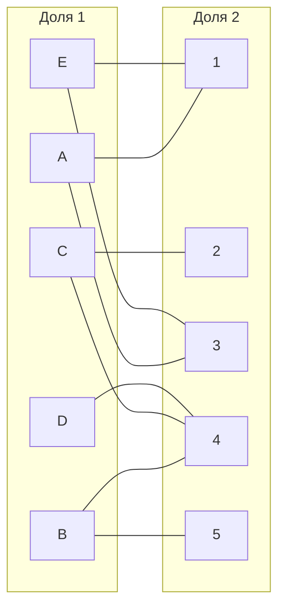
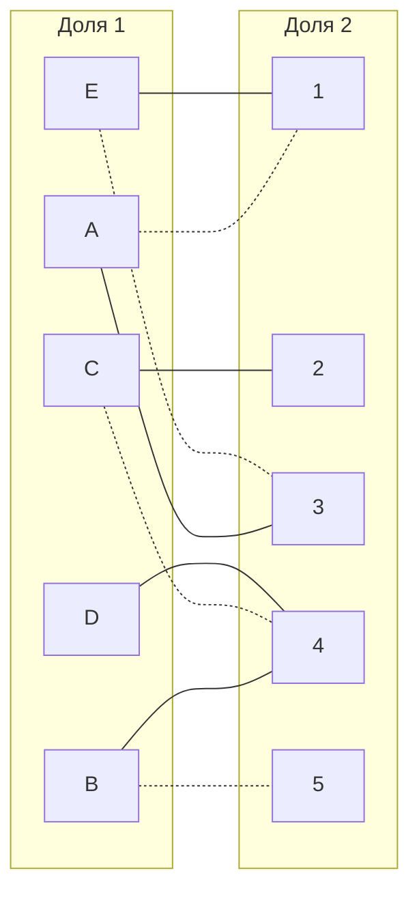
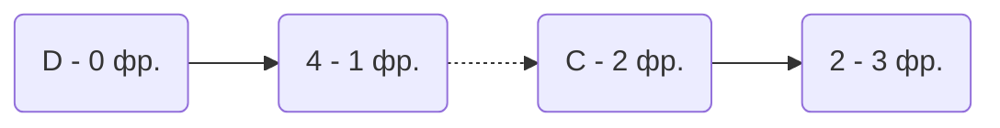
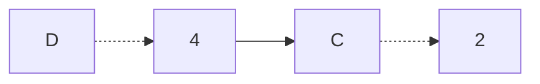
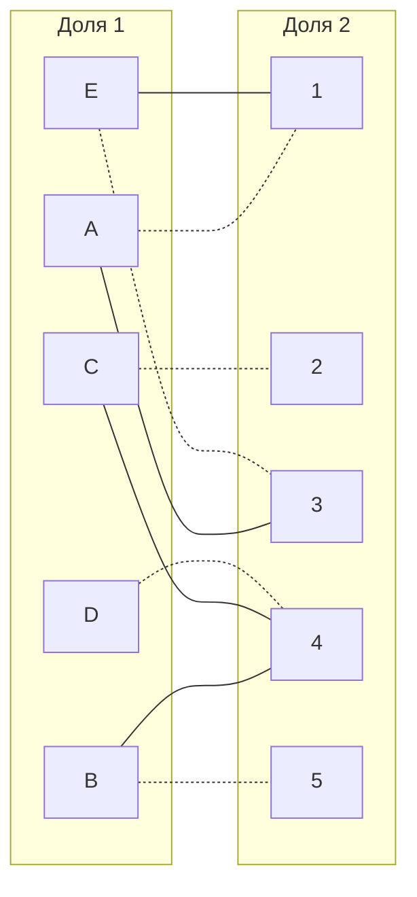

# Задача о назначениях. Венгерский алгоритм.

# Задание №13

1. В условиях задачи для каждой команды указан полный двудольный граф, в котором каждое ребро имеет определенную стоимость. Вершины первой доли представляют задачи, вершины второй доли исполнителей. Стоимость ребра определяет затраты при выполнении соответствующей задачи соответствующим исполнителем.
2. Затраты неотрицательны и представлены в виде матрицы затрат, в которой на пересечении i-й строки и j-го столбца указаны затраты j-го исполнителя на выполнение i-го задания.
3. Необходимо назначить исполнителей на задачи таким образом, чтобы общая стоимость затрат была минимальной.
4. Для решения задачи требуется найти совершенное паросочетание с минимальной суммарной стоимостью в двудольном графе.

## Условия задачи для команд:
### 1.KLA$ Team:

|       | **1** | **2** | **3** | **4** | **5** |
|-------|:-----:|:-----:|:-----:|:-----:|:-----:|
| **A** |   6   |  20   |   9   |  14   |  15   |
| **B** |  15   |  20   |  13   |   6   |   6   |
| **C** |  12   |  14   |  14   |   8   |  11   |
| **D** |  12   |  16   |  19   |   7   |  16   |
| **E** |   5   |  19   |   8   |  10   |  17   |

## Решение

Дана матрица затрат для задач A, B, C, D, E и исполнителей 1, 2, 3, 4, 5:

|       | **1** | **2** | **3** | **4** | **5** |
|-------|:-----:|:-----:|:-----:|:-----:|:-----:|
| **A** |   6   |  20   |   9   |  14   |  15   |
| **B** |  15   |  20   |  13   |   6   |   6   |
| **C** |  12   |  14   |  14   |   8   |  11   |
| **D** |  12   |  16   |  19   |   7   |  16   |
| **E** |   5   |  19   |   8   |  10   |  17   |

1. Проведем редукцию матрицы затрат. Вычтем из каждой строки минимальное значение, представленное в этой строке.

|       | **1** | **2** | **3** | **4** | **5** | **min** |
|-------|:-----:|:-----:|:-----:|:-----:|:-----:|:-----:|
| **A** |   0   |  14   |   3   |   8   |   9   |	-6	|
| **B** |   9   |  14   |   7   |   0   |   0   |	-6	|
| **C** |   4   |   6   |   6   |   0   |   3   |	-8	|
| **D** |   5   |   9   |  12   |   0   |   9   |	-7	|
| **E** |   0   |  14   |   3   |   5   |  12   |	-5	|

После чего вычтем из каждого столбца минимальное значение, представленное в этом столбце.

|       | **1** | **2** | **3** | **4** | **5** | 
|-------|:-----:|:-----:|:-----:|:-----:|:-----:|
| **A** |   0   |   8   |   3   |   8   |   9   |
| **B** |   9   |   8   |   7   |   0   |   0   |
| **C** |   4   |   0   |   6   |   0   |   3   |
| **D** |   5   |   3   |  12   |   0   |   9   |
| **E** |   0   |   8   |   3   |   5   |  12   |
|**min**|   0   |  -6   |  -3   |   0   |   0   |

Получим редуцированную матрицу, где нули обозначают наименее затратные варианты назначений.

|       | **1** | **2** | **3** | **4** | **5** | 
|-------|:-----:|:-----:|:-----:|:-----:|:-----:|
| **A** |   0   |   8   |   3   |   8   |   9   |
| **B** |   9   |   8   |   7   |   0   |   0   |
| **C** |   4   |   0   |   6   |   0   |   3   |
| **D** |   5   |   3   |  12   |   0   |   9   |
| **E** |   0   |   8   |   3   |   5   |  12   |

2. Построим двудольный граф, вынесем на него те ребра, для которых в редуцированной матрице указаны нули.

Выберем произвольное паросочетание A --- 1, B --- 5, C --- 4 , E--- 3 и попытаемся построить совершенное паросочетание с помощью чередующихся деревьев.

Построить дерево из оставшейся непокрытой вершины D.

"Перекрасим" найденную цепь и проверим полученное паросочетание.

Полученное расписание является совершенным. Выпишем полученные назначения и их стоимости из исходной матрицы:
- A1 - 6
- B5 - 6
- C2 - 14
- D4 - 7
- E3 - 8

Общая стоимость затрат = 6 + 6 + 14 + 7 + 8 = 41.

## Ответ
Минимальная стоимость затрат 41, при следующих назначениях:
- задача A, исполнитель 1,
- задача B, исполнитель 5,
- задача C, исполнитель 2,
- задача D, исполнитель 4.
- задача E, исполнитель 3.
