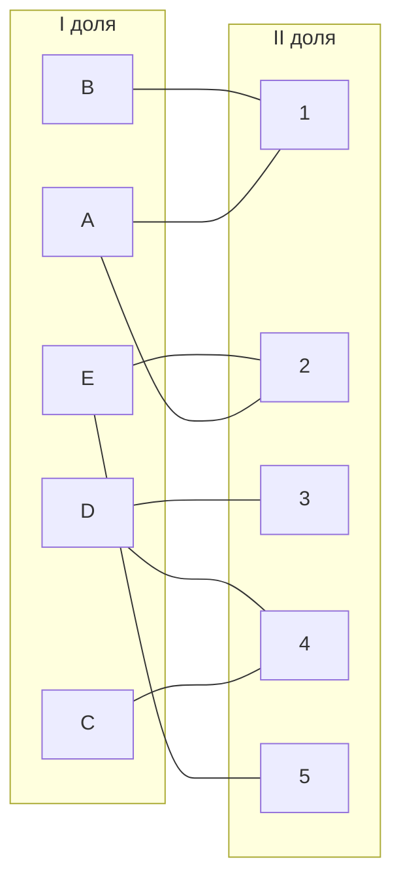
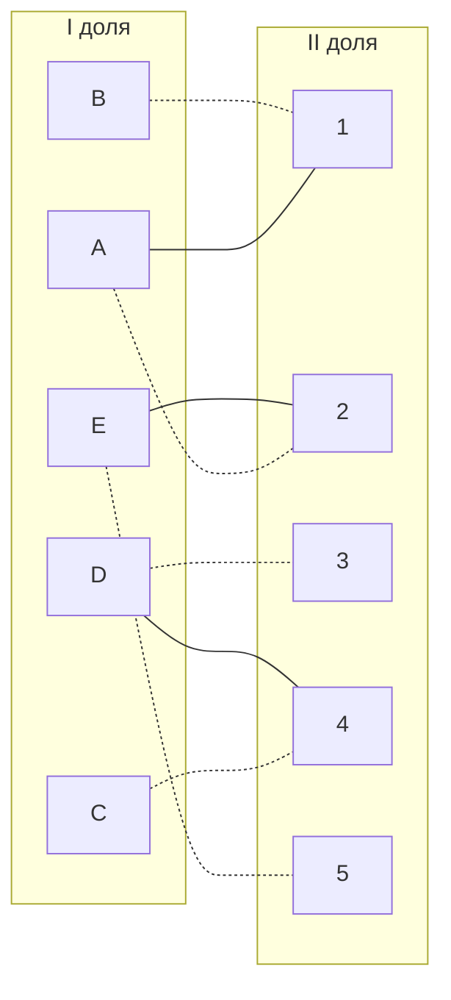

# Задача о назначениях. Венгерский алгоритм.
1. В условиях задачи для каждой команды указан полный двудольный граф, в котором каждое ребро имеет определенную стоимость. Вершины первой доли представляют задачи, вершины второй доли исполнителей. Стоимость ребра определяет затраты при выполнении соответствующей задачи соответствующим исполнителем.
2. Затраты неотрицательны и представлены в виде матрицы затрат, в которой на пересечении i-й строки и j-го столбца указаны затраты j-го исполнителя на выполнение i-го задания.
3. Необходимо назначить исполнителей на задачи таким образом, чтобы общая стоимость затрат была минимальной.
4. Для решения задачи требуется найти совершенное паросочетание с минимальной суммарной стоимостью в двудольном графе.

## Дана матрица затрат для задач A-E и исполнителей 1-5
### AlgoWizards Team:

|        | **1** | **2** | **3** | **4** | **5** |
|--------|:-----:|:-----:|:-----:|:-----:|:-----:|
| **A**  |   5   |   6   |  14   |  14   |  20   |
| **B**  |   5   |  20   |  15   |   9   |  12   |
| **C**  |   8   |  19   |  16   |   7   |  12   |
| **D**  |  17   |   7   |   5   |   5   |   9   |
| **E**  |  10   |  10   |  11   |  13   |   9   |

## Решение:
### 1.1 Проведем редукцию матрицы по строкам
Для этого вычтем минимальное значение строки
|        | **1** | **2** | **3** | **4** | **5** | **Min** |
|--------|:-----:|:-----:|:-----:|:-----:|:-----:|:-----:|
| **A**  |   5   |   6   |  14   |  14   |  20   |  5   |
| **B**  |   5   |  20   |  15   |   9   |  12   |  5   |
| **C**  |   8   |  19   |  16   |   7   |  12   |  7   |
| **D**  |  17   |   7   |   5   |   5   |   9   |   5   |
| **E**  |  10   |  10   |  11   |  13   |   9   |   9   |

### 1.2 Проведем редукцию матрицы по столбцам
Аналогично, вычтем минимальное значение столбца 2. Остальные столбцы и так содержат нули
|        | **1** | **2** | **3** | **4** | **5** |
|--------|:-----:|:-----:|:-----:|:-----:|:-----:|
| **A**  |   0   |   1   |  9    |  9    |  15   |
| **B**  |   0   |  15   |  10   |   4   |  7    |
| **C**  |   1   |  12   |  9    |   0   |  5    |
| **D**  |  12   |   2   |   0   |   0   |   4   |
| **E**  |  1    |  1    |  2    |  4    |   0   |
| **Min**  |     |  -1   |       |       |       |

#### Получившаяся матрица:
|        | **1** | **2** | **3** | **4** | **5** |
|--------|:-----:|:-----:|:-----:|:-----:|:-----:|
| **A**  |   0   |   0   |  9    |  9    |  15   |
| **B**  |   0   |  14   |  10   |   4   |  7    |
| **C**  |   1   |  11   |  9    |   0   |  5    |
| **D**  |  12   |   1   |   0   |   0   |   4   |
| **E**  |  1    |  0    |  2    |  4    |   0   |

### 2.1 Построим двудольный граф из ребер, содержащих нули

### 2.2 Попробуем выбрать произвольное парасочетание
Пусть это будет  B --> 1, A --> 2, D --> 3, C --> 4, E --> 5

Все вершины оказались покрытыми, значит текущее парасочетание является совершенным.

### ОТВЕТ: сумма минимальных затрат на оплату работы исполителей составляет 5 + 6 + 5 + 7 + 9 = 32 ед.
