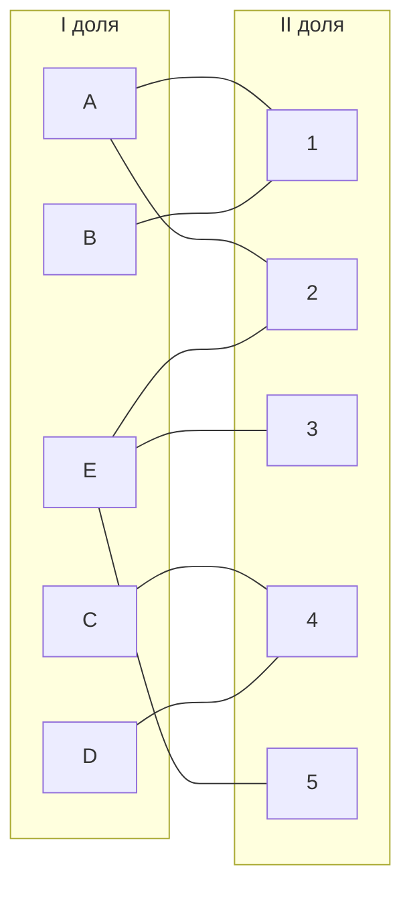
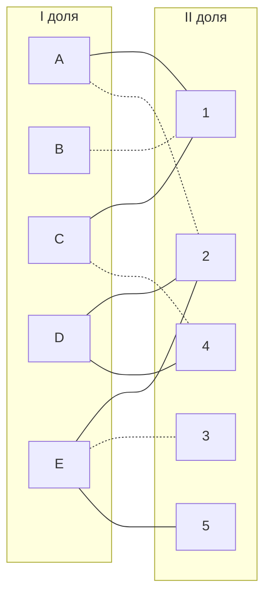
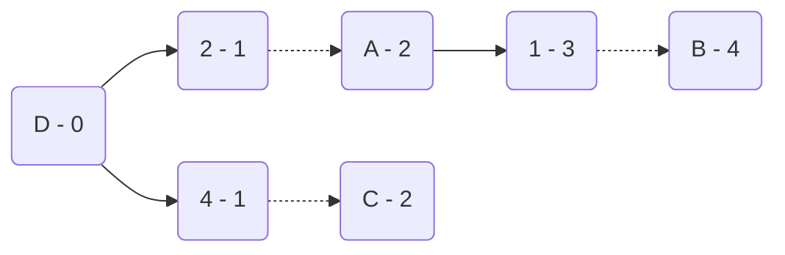
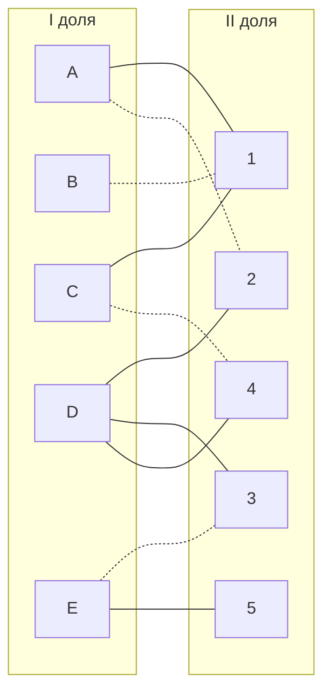
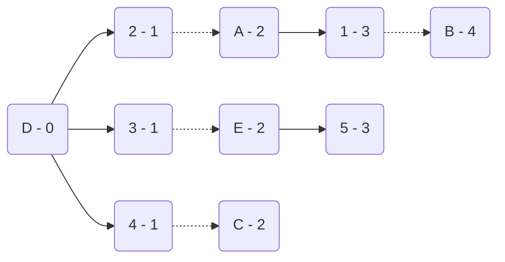
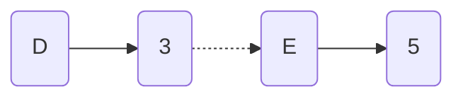
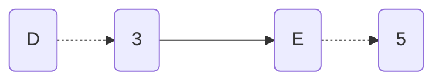
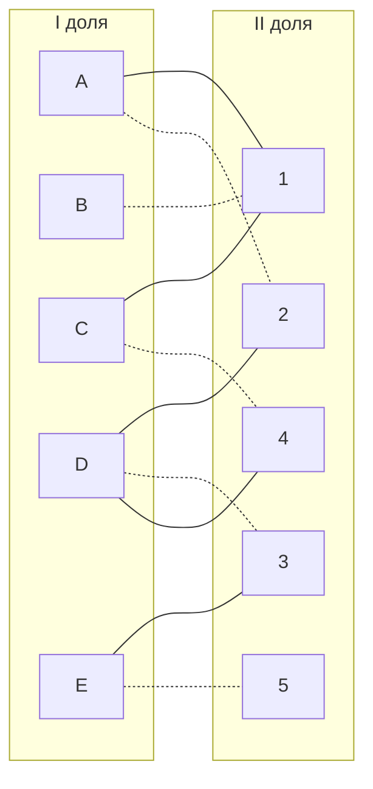

# Задача о назначениях. Венгерский алгоритм.
1. В условиях задачи для каждой команды указан полный двудольный граф, в котором каждое ребро имеет определенную стоимость. Вершины первой доли представляют задачи, вершины второй доли исполнителей. Стоимость ребра определяет затраты при выполнении соответствующей задачи соответствующим исполнителем.
2. Затраты неотрицательны и представлены в виде матрицы затрат, в которой на пересечении i-й строки и j-го столбца указаны затраты j-го исполнителя на выполнение i-го задания.
3. Необходимо назначить исполнителей на задачи таким образом, чтобы общая стоимость затрат была минимальной.
4. Для решения задачи требуется найти совершенное паросочетание с минимальной суммарной стоимостью в двудольном графе.

## Дана матрица затрат для задач A-E и исполнителей 1-5
### AlgoWizards Team:

|        | **1** | **2** | **3** | **4** | **5** |
|--------|:-----:|:-----:|:-----:|:-----:|:-----:|
| **A**  |   5   |   6   |  14   |  14   |  20   |
| **B**  |   5   |  20   |  15   |   9   |  12   |
| **C**  |   8   |  19   |  16   |   7   |  12   |
| **D**  |  17   |   7   |  10   |   5   |   9   |
| **E**  |  10   |  10   |  11   |  13   |   9   |

## Решение:
### 1.1 Проведем редукцию матрицы по строкам
Для этого вычтем минимальное значение из каждой строки
|        | **1** | **2** | **3** | **4** | **5** | **Min** |
|--------|:-----:|:-----:|:-----:|:-----:|:-----:|:-------:|
| **A**  |   5   |   6   |  14   |  14   |  20   |   5     |
| **B**  |   5   |  20   |  15   |   9   |  12   |   5     |
| **C**  |   8   |  19   |  16   |   7   |  12   |   7     |
| **D**  |  17   |   7   |  10   |   5   |   9   |   5     |
| **E**  |  10   |  10   |  11   |  13   |   9   |   9     |

### 1.2 Проведем редукцию матрицы по столбцам
Теперь вычтем минимальное значение из каждого столбца
|        | **1** | **2** | **3** | **4** | **5** |
|--------|:-----:|:-----:|:-----:|:-----:|:-----:|
| **A**  |   0   |   1   |  9    |   9   |  15   |
| **B**  |   0   |  15   |  10   |   4   |   7   |
| **C**  |   1   |  12   |  9    |   0   |   5   |
| **D**  |  12   |   2   |   5   |   0   |   4   |
| **E**  |   1   |   1   |  2    |   4   |   0   |
| **Min**  |     |   1   |  2    |       |       |

#### Получившаяся матрица:
|        | **1** | **2** | **3** | **4** | **5** |
|--------|:-----:|:-----:|:-----:|:-----:|:-----:|
| **A**  |   0   |   0   |  7    |   9   |  15   |
| **B**  |   0   |  14   |  8    |   4   |   7   |
| **C**  |   1   |  11   |  7    |   0   |   5   |
| **D**  |  12   |   1   |  3    |   0   |   4   |
| **E**  |   1   |   0   |  0    |   4   |   0   |

### 2.1 Построим двудольный граф из ребер, содержащих нули

### 2.2 Выберем произвольное парасочетание
Пусть это будет  A --> 2, B --> 1, C --> 4, E --> 3

Парасочетание не является совершенным, т.к. не покрыта вершина D. Для увеличения парасочетания построим чередующееся дерево с корнем в D.

В построенном дереве не оказалось цепей, которые чередуются относительно этого парасочетания. Ветка закончилась в покрытой вершине. В графе отсутствует совершенное парасочетание.

### 3.1 Проведем диагональную редукции матрицы затрат
Во множество X запишем все покрытые вершины I доли, а во множество Y все покрытые вершины II доли графа
#### X= {С, D} Y = {4} 

Теперь нам необходимо вычесть минимальное значение из строк множества X и прибавить к столбцам множества Y:

|        | **1** | **2** | **3** | **4** | **5** | **Sub** |
|--------|:-----:|:-----:|:-----:|:-----:|:-----:|:-------:|
| **A**  |   0   |   0   |  7    |   9   |  15   |         |
| **B**  |   0   |  14   |  8    |   4   |   7   |         |
| **C**  |   1   |  11   |  7    |   0   |   5   |    1    |
| **D**  |  12   |   1   |  3    |   0   |   4   |    1    |
| **E**  |   1   |   0   |  0    |   4   |   0   |         |
| **Add**  |     |       |       |   1   |       |         |

#### Получившаяся матрица:
|        | **1** | **2** | **3** | **4** | **5** |
|--------|:-----:|:-----:|:-----:|:-----:|:-----:|
| **A**  |   0   |   0   |  7    |   10   |  15   |         
| **B**  |   0   |  14   |  8    |   5   |   7   |        
| **C**  |   0   |  10   |  6    |   0   |   4   |    
| **D**  |  11   |   0   |  2    |   0   |   3   |   
| **E**  |   1   |   0   |  0    |   5   |   0   | 

Добавляем новые ребра C-1 и D-2 в двудольный граф:

Парасочетание все еще не совершенное, т.к. не покрыта вершина D. Строим чередующееся дерево с корнем в D.

В данном дереве нет чередующихся цепей, т.к. концы не покрыты парасочетанием. Проводим повторную диагональную редукцию матрицы

### 3.2 Проведем повторную диагональную редукции матрицы затрат
Во множество X запишем все покрытые вершины I доли, а во множество Y все покрытые вершины II доли графа
#### X = {A, B, C, D} Y = {1,2,4}

Теперь нам необходимо вычесть минимальное значение из строк множества X и прибавить к столбцам множества Y:

|        | **1** | **2** | **3** | **4** | **5** | **Sub** |
|--------|:-----:|:-----:|:-----:|:-----:|:-----:|:-------:|
| **A**  |   0   |   0   |  7    |   9   |  15   |    2    |
| **B**  |   0   |  14   |  8    |   4   |   7   |    2    |
| **C**  |   1   |  11   |  7    |   0   |   5   |    2    |
| **D**  |  12   |   1   |  3    |   0   |   4   |    2    |
| **E**  |   1   |   0   |  0    |   4   |   0   |         |
| **Add**  | 2   |   2   |       |   2   |   2   |         |

#### Получившаяся матрица после диагональной редукции:
|        | **1** | **2** | **3** | **4** | **5** |
|--------|:-----:|:-----:|:-----:|:-----:|:-----:|
| **A**  |   0   |   0   |  5    |   10  |  15   |         
| **B**  |   0   |  14   |  6    |   5   |   7   |        
| **C**  |   0   |  10   |  4    |   0   |   4   |    
| **D**  |  11   |   0   |  0    |   0   |   3   |   
| **E**  |   3   |   2   |  0    |   7   |   2   | 

Матрицу можно редуцировать по 5 столбцу

#### Получившаяся матрица после редукции по столбцу:
|        | **1** | **2** | **3** | **4** | **5** |
|--------|:-----:|:-----:|:-----:|:-----:|:-----:|
| **A**  |   0   |   0   |  5    |   10  |  13   |         
| **B**  |   0   |  14   |  6    |   5   |   5   |        
| **C**  |   0   |  10   |  4    |   0   |   2   |    
| **D**  |  11   |   0   |  0    |   0   |   1   |   
| **E**  |   3   |   2   |  0    |   7   |   0   | 

Удаляем ребро E-2 из дерева и добавляем D-3 в двудольный граф:

Строим чередующееся дерево с корнем в вершине D:

#### Чередующаяся цепь найдена! 

#### Перекрашиваем:

Получившийся двудольный граф:

Т.к. все вершины покрыты, совершенное парасочетание найдено: A --> 2, B --> 1, C --> 4, D --> 3, E --> 5

### ОТВЕТ: сумма минимальных затрат на оплату работы исполителей составляет 6 + 5 + 7 + 10 + 9 = 37 ед.
