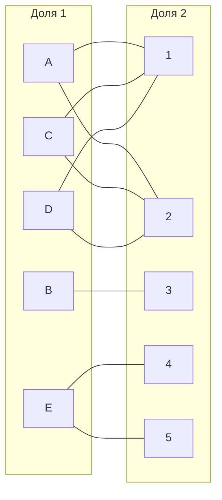
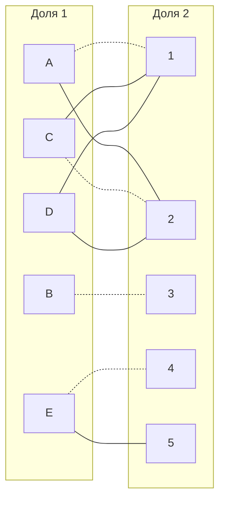
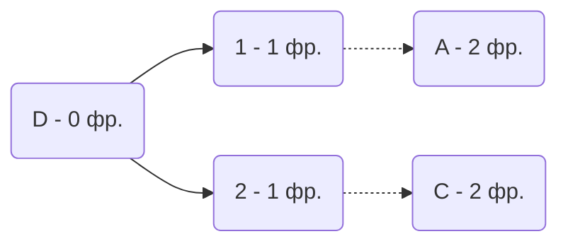
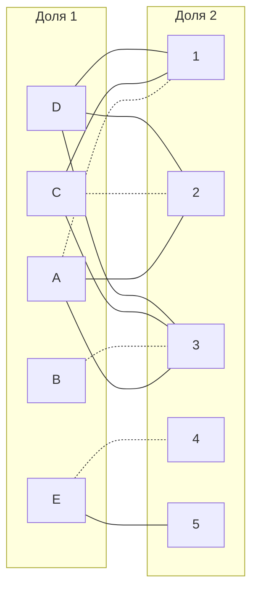
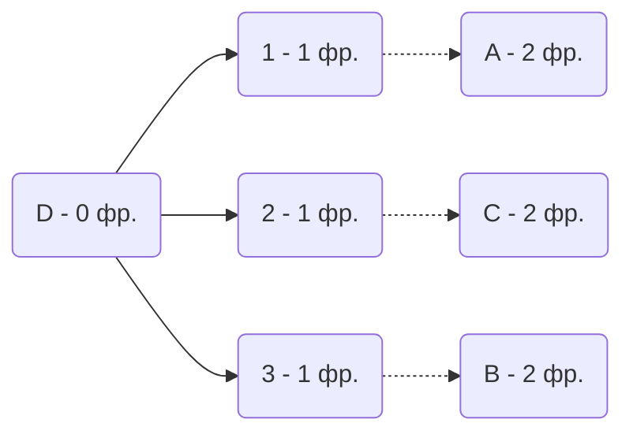
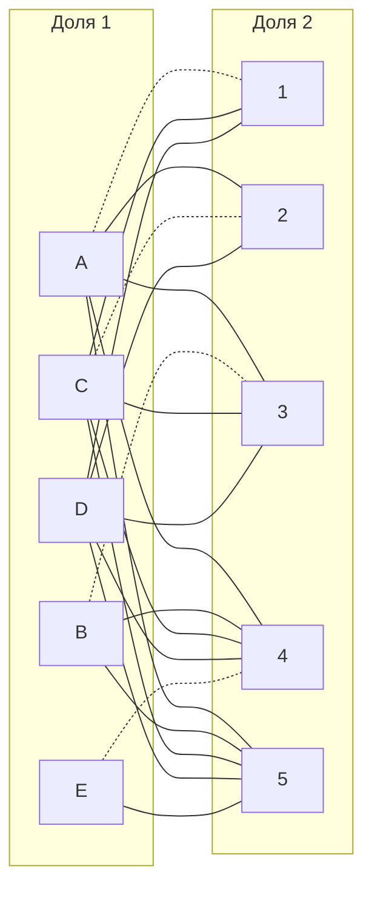
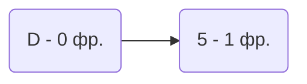
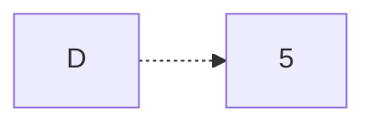
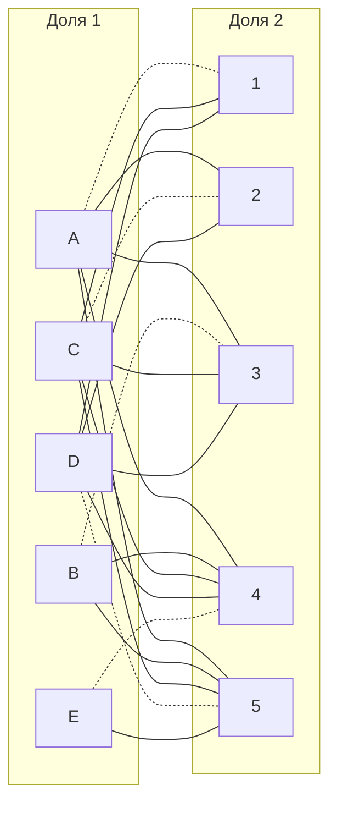

# Задание №13
## Постановка задачи
1. Дан полный двудольный граф, в котором каждое ребро имеет определенную стоимость. Вершины первой доли представляют задачи, вершины второй доли исполнителей. Стоимость ребра определяет затраты при выполнении соответствующей задачи соответствующим исполнителем. 
2. Затраты неотрицательны и представлены в виде матрицы затрат, в которой на пересечении i-й строки и j-го столбца указаны затраты j-го исполнителя на выполнение i-го задания.
3. Необходимо назначить исполнителей на задачи таким образом, чтобы общая стоимость затрат была минимальной.
4. Задача сводится к нахождению совершенного паросочетания с минимальной суммарной стоимостью в двудольном графе.

## Условия задачи:
### All ca$h Team: 

|       | **1** | **2** | **3** | **4** | **5** |
|-------|:-----:|:-----:|:-----:|:-----:|:-----:|
| **A** |  14   |  15   |  16   |  17   |  18   |
| **B** |  19   |  20   |   5   |   6   |   7   |
| **C** |   8   |   9   |  10   |  11   |  12   |
| **D** |  13   |  14   |  15   |  16   |  17   |
| **E** |  18   |  19   |  20   |   5   |   6   |

## Решение

1.  Вычтем из каждой строки минимальное значение, представленное в этой строке.

|       | **1** | **2** | **3** | **4** | **5** |
|-------|:-----:|:-----:|:-----:|:-----:|:-----:|
| **A** |   0   |   1   |   2   |   3   |   4   |
| **B** |  14   |  15   |   0   |   1   |   2   |
| **C** |   0   |   1   |   2   |   3   |   4   |
| **D** |   0   |   1   |   2   |   3   |   4   |
| **E** |  13   |  14   |  15   |   0   |   1   |

После чего вычтем из каждого столбца минимальное значение, представленное в этом столбце.
Получим редуцированную матрицу, где нули обозначают наименее затратные варианты назначений.

|       | **1** | **2** | **3** | **4** | **5** |
|-------|:-----:|:-----:|:-----:|:-----:|:-----:|
| **A** |   0   |   0   |   2   |   3   |   3   |
| **B** |  14   |  14   |   0   |   1   |   1   |
| **C** |   0   |   0   |   2   |   3   |   3   |
| **D** |   0   |   0   |   2   |   3   |   3   |
| **E** |  13   |  13   |  15   |   0   |   0   |

2. Построим двудольный граф, вынесем на него те ребра, для которых в редуцированной матрице указаны нули.

Выберем произвольное паросочетание A --- 1, В --- 3 , С --- 2, E--- 4 и попытаемся построить совершенное паросочетание с помощью чередующихся деревьев.

Построить дерево из оставшейся непокрытой вершины D.

В построенном дереве нет цепей, чередующееся относительно текущего паросочетания, обе ветки закончились в покрытых вершинах, то есть в указанном графе нет совершенного паросочетания.
3. Проведем повторную редукцию матрицы затрат.
Во множество X выпишем все покрытые построенным деревом вершины первой доли графа, во множество Y все покрытые построенным деревом вершины из второй доли графа.

$$ 
X = {A, C, D}
Y = {1, 2 } 
$$
Вычтем минимальное значение (2) из диапазона (X, не Y - работы A,C,D и исполнители 3, 4, 5) из этого же диапазона, к диапазону (не X, Y - работы B, E и исполнители 1, 2) прибавим найденное число(2):

|       | **1** | **2** | **3** | **4** | **5** |
|-------|:-----:|:-----:|:-----:|:-----:|:-----:|
| **A** |   0   |   0   |   0   |   1   |   1   |
| **B** |  16   |  16   |   0   |   1   |   1   |
| **C** |   0   |   0   |   0   |   1   |   1   |
| **D** |   0   |   0   |   0   |   1   |   1   |
| **E** |  15   |  15   |  15   |   0   |   0   |
Добавим новые ребра A3, C3, D3 в граф

Попытаемся построить совершенное паросочетание с помощью чередующихся деревьев.

В построенном дереве нет цепей, чередующееся относительно текущего паросочетания, обе ветки закончились в покрытых вершинах, то есть в указанном графе нет совершенного паросочетания.
4. Проведем повторную редукцию матрицы затрат.
Во множество X выпишем все покрытые построенным деревом вершины первой доли графа, во множество Y все покрытые построенным деревом вершины из второй доли графа.

$$ 
X = {A,B, C, D}
Y = {1, 2, 3 } 
$$
Вычтем минимальное значение (1) из диапазона (X, не Y - работы A, B, C, D и исполнители 4, 5) из этого же диапазона, к диапазону (не X, Y - работы E и исполнители 1, 2, 3) прибавим найденное число(1):

|       | **1** | **2** | **3** | **4** | **5** |
|-------|:-----:|:-----:|:-----:|:-----:|:-----:|
| **A** |   0   |   0   |   0   |   0   |   0   |
| **B** |  16   |  16   |   0   |   0   |   0   |
| **C** |   0   |   0   |   0   |   0   |   0   |
| **D** |   0   |   0   |   0   |   0   |   0   |
| **E** |  16   |  16   |  16   |   0   |   0   |

Добавим новые ребра A4, A5, C4, C5, D4, D5, B4, B5 в граф

Попытаемся построить совершенное паросочетание с помощью чередующихся деревьев.

Цепь начинается и заканчивается в непокрытых вершинах, все ребра в цепи чередуются по вхождению в текущее паросочетание.
"Перекрасим" найденную цепь и проверим полученное паросочетание.

Полученное расписание является совершенным. Выпишем полученные назначения и их стоимости из исходной матрицы:
A1 - 14
C2 - 9
B3 - 5
E4 - 5
D5- 17

## Ответ
Минимальная стоимость затрат 50, при следующих назначениях:
- задача A, исполнитель 1,
- задача B, исполнитель 3,
- задача C, исполнитель 2,
- задача D, исполнитель 5.
- задача E, исполнитель 4.
