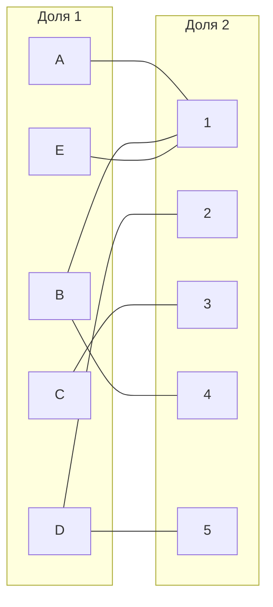
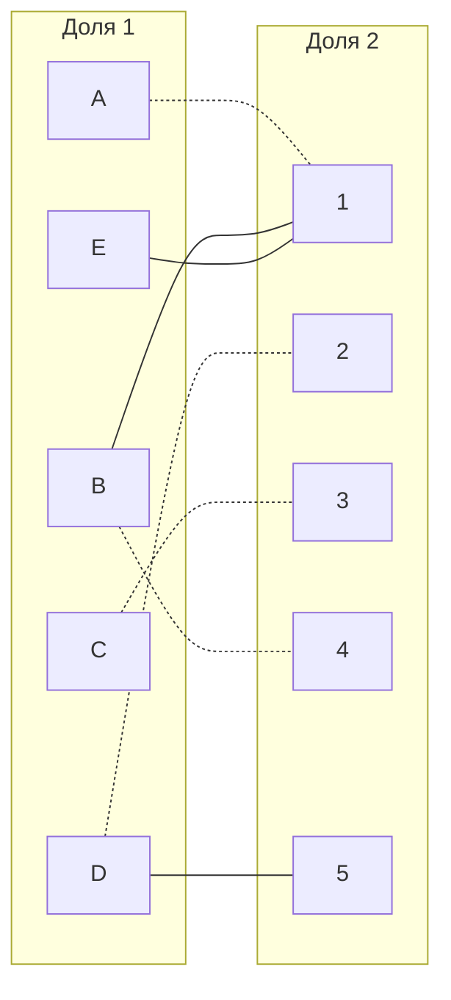
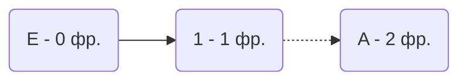
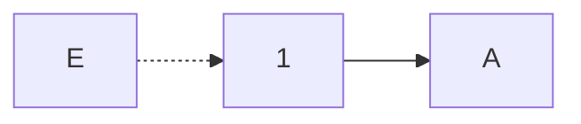
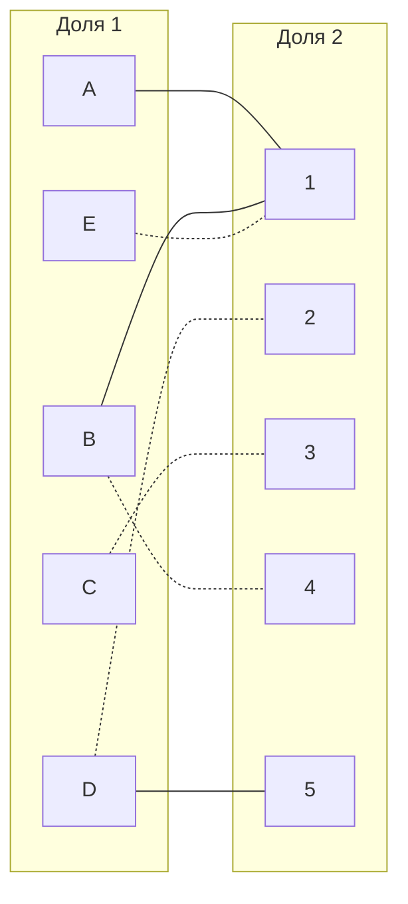

# Задача о назначениях. Венгерский алгоритм.
1. В условиях задачи для каждой команды указан полный двудольный граф, в котором каждое ребро имеет определенную стоимость. Вершины первой доли представляют задачи, вершины второй доли исполнителей. Стоимость ребра определяет затраты при выполнении соответствующей задачи соответствующим исполнителем.
2. Затраты неотрицательны и представлены в виде матрицы затрат, в которой на пересечении i-й строки и j-го столбца указаны затраты j-го исполнителя на выполнение i-го задания.
3. Необходимо назначить исполнителей на задачи таким образом, чтобы общая стоимость затрат была минимальной.
4. Для решения задачи требуется найти совершенное паросочетание с минимальной суммарной стоимостью в двудольном графе.

## Условия задачи для BB Team:
Матрица затрат для задач A, B, C, D, E и исполнителей 1, 2, 3, 4, 5:

|       | **1** | **2** | **3** | **4** | **5** |
|-------|:-----:|:-----:|:-----:|:-----:|:-----:|
| **A** |   5   |  15   |   7   |  16   |  15   |
| **B** |  20   |  12   |  16   |   7   |  14   |
| **C** |   7   |  19   |   8   |  19   |  16   |
| **D** |   8   |   7   |  19   |   8   |   9   |
| **E** |   6   |   7   |  16   |  19   |  14   |

## Решение
1. Редукция матрицы затрат. Вычитаем из каждой строки минимальное значение(мин. строка),а затем вычтем из каждого столбца минимальное значение(мин. столбец)

|       | **1** | **2** | **3** | **4** | **5** | **Мин** |
|-------|:-----:|:-----:|:-----:|:-----:|:-----:|:-----:|
| **A** |   0   |  10   |   2   |   11  |   10  |	-5	|
| **B** |   13  |  5    |   9   |   0   |   7   |	-7	|
| **C** |   0   |   12  |   1   |   12  |   9   |	-7	|
| **D** |   1   |   0   |  12   |   1   |   2   |	-7	|
| **E** |   0   |  1    |   10  |   13  |  8    |	-6	|

|       | **1** | **2** | **3** | **4** | **5** | 
|-------|:-----:|:-----:|:-----:|:-----:|:-----:|
| **A** |   0   |   10  |   1   |   11  |   8   |
| **B** |   13  |   5   |   8   |   0   |   5   |
| **C** |   0   |   12  |   0   |   12  |   7   |
| **D** |   1   |   0   |  11   |   1   |   0   |
| **E** |   0   |   1   |   9   |   13  |  6    |
|**Мин**|   0   |  0    |  -1   |   0   |   -2  |

### Реукционная матрица:

|       | **1** | **2** | **3** | **4** | **5** | 
|-------|:-----:|:-----:|:-----:|:-----:|:-----:|
| **A** |   0   |   10  |   1   |   11  |   8   |
| **B** |   13  |   5   |   8   |   0   |   5   |
| **C** |   0   |   12  |   0   |   12  |   7   |
| **D** |   1   |   0   |  11   |   1   |   0   |
| **E** |   0   |   1   |   9   |   13  |  6    |

(нули обозначают наименее затратные варианты назначений)

2. Строим двудольный граф, вынеся на него те ребра с нулями

Выберем произвольные паросочетания A --- 1, B --- 4, C --- 3 , D --- 2 и  построим совершенное паросочетание с помощью чер. деревьев

Построим дерево из оставшейся непокрытой вершины E

"Перекрасим" найденную цепь и проверим полученное паросочетание.

Максимальное паросочетание: [A,1], [B,4], [C,3], [D,2]. Совершенного паросочетания нет, так как из А и Е идет только один путь в одно и тоже значение. Тогда возьмем оставшиеся непокрытые вершины [Е, 5]

Выпишем полученные назначения и их стоимости из исходной матрицы:
- A1 - 5
- B4 - 7
- C3 - 8
- D2 - 7
- E5 - 14

Общая стоимость затрат = 5 + 7 + 8 + 7 + 14 = 41

## Ответ
Минимальная стоимость затрат 41, при следующих назначениях:
- задача A, исполнитель 1,
- задача B, исполнитель 4,
- задача C, исполнитель 3,
- задача D, исполнитель 2,
- задача E, исполнитель 5.
