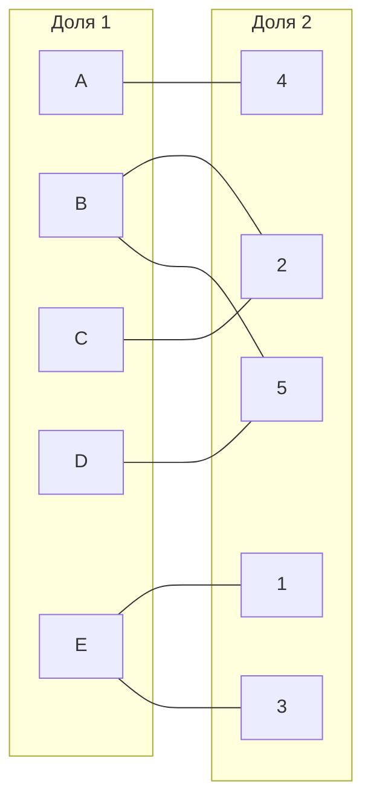
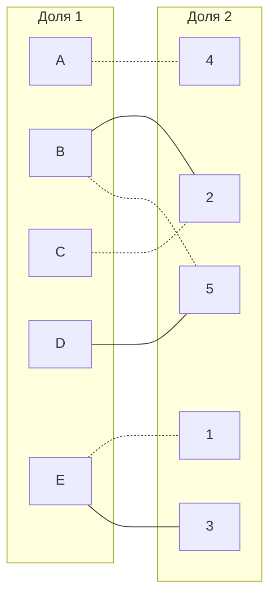
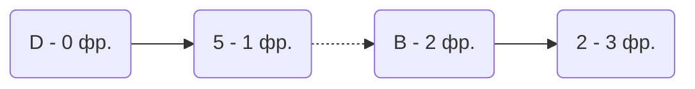
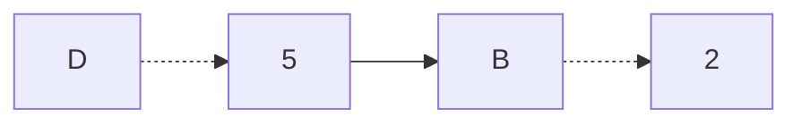
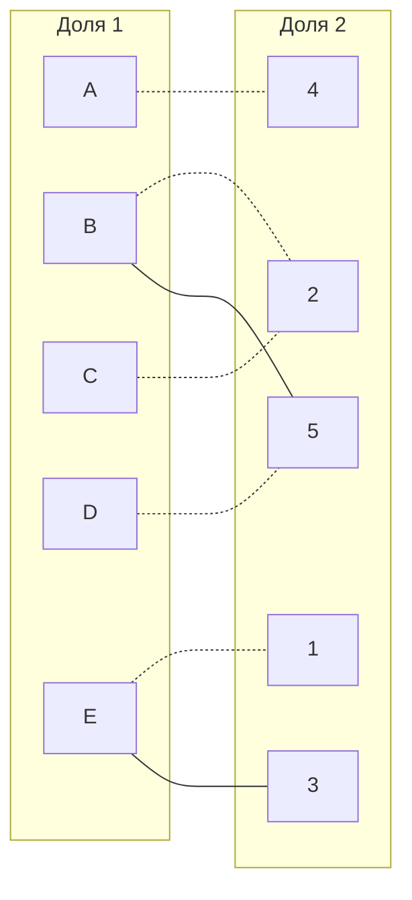
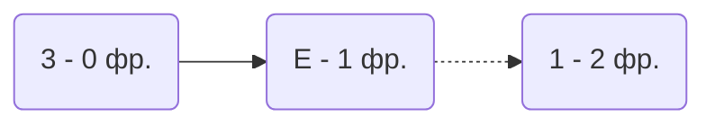

# Задача о назначениях. Венгерский алгоритм.
1. В условиях задачи для каждой команды указан полный двудольный граф, в котором каждое ребро имеет определенную стоимость. Вершины первой доли представляют задачи, вершины второй доли исполнителей. Стоимость ребра определяет затраты при выполнении соответствующей задачи соответствующим исполнителем.
2. Затраты неотрицательны и представлены в виде матрицы затрат, в которой на пересечении i-й строки и j-го столбца указаны затраты j-го исполнителя на выполнение i-го задания.
3. Необходимо назначить исполнителей на задачи таким образом, чтобы общая стоимость затрат была минимальной.
4. Для решения задачи требуется найти совершенное паросочетание с минимальной суммарной стоимостью в двудольном графе.

## Условия задачи для команд:
### TwoPizza Team:

|       | **1** | **2** | **3** | **4** | **5** |
|-------|:-----:|:-----:|:-----:|:-----:|:-----:|
| **A** |  17   |  20   |  10   |   5   |   8   |
| **B** |  16   |   8   |  12   |  14   |   8   |
| **C** |  10   |   7   |   9   |  12   |  11   |
| **D** |  13   |  13   |  17   |  15   |   6   |
| **E** |  11   |  12   |  12   |  19   |  13   |

## Решение

Дана матрица затрат для задач A, B, C, D, E и исполнителей 1, 2, 3, 4, 5:

|       | **1** | **2** | **3** | **4** | **5** |
|-------|:-----:|:-----:|:-----:|:-----:|:-----:|
| **A** |  17   |  20   |  10   |   5   |   8   |
| **B** |  16   |   8   |  12   |  14   |   8   |
| **C** |  10   |   7   |   9   |  12   |  11   |
| **D** |  13   |  13   |  17   |  15   |   6   |
| **E** |  11   |  12   |  12   |  19   |  13   |

1. Проведем редукцию матрицы затрат. Вычтем из каждой строки минимальное значение, представленное в этой строке.

|       | **1** | **2** | **3** | **4** | **5** | **min** |
|-------|:-----:|:-----:|:-----:|:-----:|:-----:|:-------:|
| **A** |  12   |  15   |   5   |   0   |   3   |  	-5	   |
| **B** |   8   |   0   |   4   |   6   |   0   |  	-8	   |
| **C** |   3   |   0   |   2   |   5   |   4   |  	-7	   |
| **D** |   7   |   7   |  11   |   9   |   0   |  	-6	   |
| **E** |   0   |   1   |   1   |   8   |   2   |  	-11	  |

После чего вычтем из каждого столбца минимальное значение, представленное в этом столбце.

|       | **1** | **2** | **3** | **4** | **5** |
|-------|:-----:|:-----:|:-----:|:-----:|:-----:|
| **A** |  12   |  15   |   4   |   0   |   3   |
| **B** |   8   |   0   |   3   |   6   |   0   |
| **C** |   3   |   0   |   1   |   5   |   4   |
| **D** |   7   |   7   |  10   |   9   |   0   |
| **E** |   0   |   1   |   0   |   8   |   2   |
|**min**|   0   |   0   |  -1   |   0   |   0   |

Получим редуцированную матрицу, где нули обозначают наименее затратные варианты назначений.

|       | **1** | **2** | **3** | **4** | **5** | 
|-------|:-----:|:-----:|:-----:|:-----:|:-----:|
| **A** |  12   |  15   |   4   |   0   |   3   |
| **B** |   8   |   0   |   3   |   6   |   0   |
| **C** |   3   |   0   |   1   |   5   |   4   |
| **D** |   7   |   7   |  10   |   9   |   0   |
| **E** |   0   |   1   |   0   |   8   |   2   |

2. Построим двудольный граф, вынесем на него те ребра, для которых в редуцированной матрице указаны нули.

Выберем произвольное паросочетание A --- 4, B --- 5, C --- 2, E--- 1 и попытаемся построить совершенное паросочетание с помощью чередующихся деревьев.

Построить дерево из оставшейся непокрытой вершины D.

"Перекрасим" найденную цепь и проверим полученное паросочетание.

Построить дерево из оставшейся непокрытой вершины 3.

Нельзя "перекрашивать" найденную цепь, так как она не чередуется по принципу светлое - темное - светлое, а следовательно и не является чередующейся цепью. Алгоритм завершает свою работу.
"Перекрасим" найденную цепь и проверим полученное паросочетание.

## Ответ
Невозможно применить к исходным данным Венгерский алгоритм из-за структуры дерева.