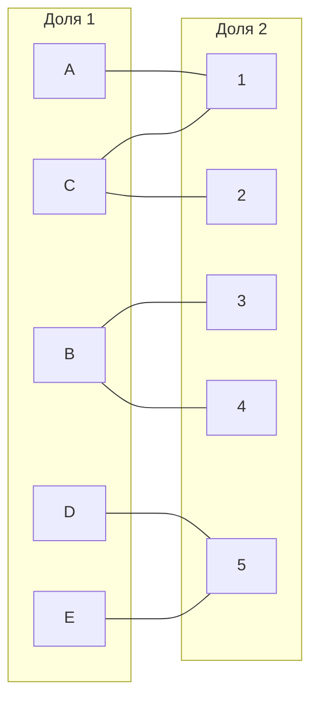
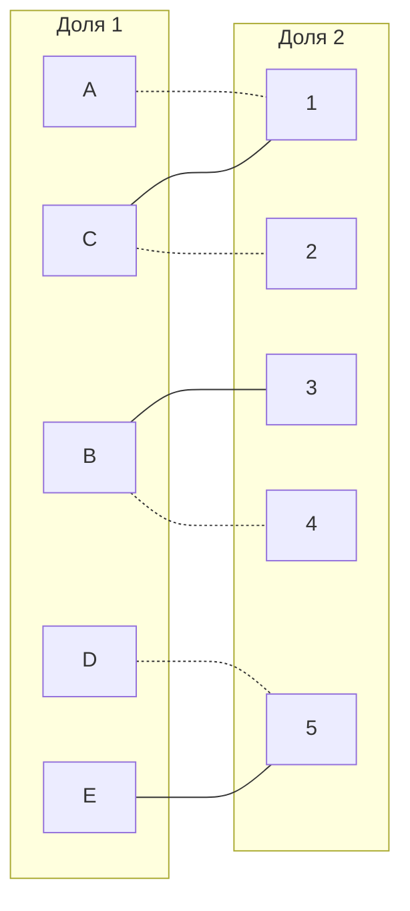
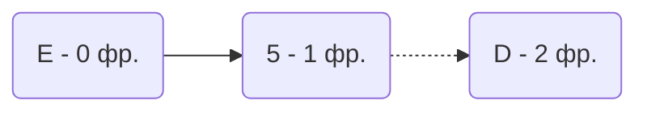
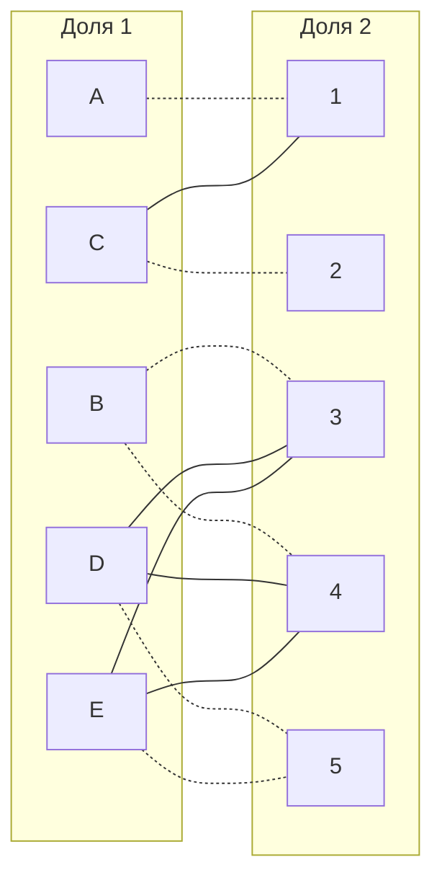
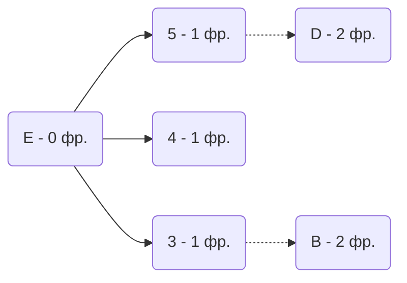
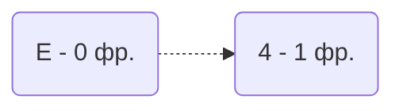

|       | **1** | **2** | **3** | **4** | **5** |
|-------|:-----:|:-----:|:-----:|:-----:|:-----:|
| **A** |  15   |  20   |  18   |  16   |  17   |
| **B** |  19   |  14   |  13   |  12   |  15   |
| **C** |  16   |  17   |  18   |  19   |  20   |
| **D** |  15   |  14   |  13   |  12   |  11   |
| **E** |  10   |   9   |   8   |   7   |   6   |
1. Вычтем из каждой строки минимальное значение и получим следующую матрицу:

|       | **1** | **2** | **3** | **4** | **5** | min  |
|-------|:-----:|:-----:|:-----:|:-----:|:-----:|------|
| **A** |   0   |   5   |   3   |   1   |   2   | - 15 |
| **B** |   7   |   2   |   1   |   0   |   3   | - 12 |
| **C** |   0   |   1   |   2   |   3   |   4   | - 16 |
| **D** |   4   |   3   |   2   |   1   |   0   | - 11 |
| **E** |   4   |   3   |   2   |   1   |   0   | - 6  | 

После чего вычтем из каждого столбца минимальное значение, представленное в этом столбце.

|       | **1** | **2** | **3** | **4** | **5** | 
|-------|:-----:|:-----:|:-----:|:-----:|:-----:|
| **A** |   0   |   4   |   2   |   1   |   2   |
| **B** |   7   |   1   |   0   |   0   |   3   |
| **C** |   0   |   0   |   1   |   3   |   4   |
| **D** |   4   |   2   |   1   |   1   |   0   |
| **E** |   4   |   2   |   1   |   1   |   0   |
| min   |  -0   |  -1   |  -1   |  -0   |  -0   |
2. Построим двудольный граф, вынесем на него те ребра, для которых в редуцированной матрице указаны нули.

Выберем произвольное паросочетание A --- 1, C --- 2, B --- 3, D --- 5 и попытаемся построить совершенное паросочетание с помощью чередующихся деревьев.

Попытаемся построить дерево из оставшейся непокрытой вершины E.

В построенном дереве нет цепей, чередующееся относительно текущего паросочетания, обе ветки закончились в покрытых вершинах, то есть в указанном графе нет совершенного паросочетания.

Проведем повторную редукцию матрицы затрат.
Во множество X выпишем все покрытые построенным деревом вершины первой доли графа, во множество Y все покрытые построенным деревом вершины из второй доли графа.

$$ 
X = {D, E} - 1

Y = {5} + 1 
$$

Необходимо найти минимальный элемент из строк, включенных во множество X и столбцов, не включенных во множество Y. В нашем случае это будут строки D,E и столбец 5. Минимальный элемент 1, расположен в строках D и E и столбцах 3 и 4.

Вычтем найденное значение из строк множества X и прибавим к столбцам множества Y:

|       | **1** | **2** | **3** | **4** | **5** |    |
|-------|:-----:|:-----:|:-----:|:-----:|:-----:|----|
| **A** |   0   |   4   |   2   |   1   |   3   |    |
| **B** |   7   |   1   |   0   |   0   |   4   |    |
| **C** |   0   |   0   |   1   |   3   |   5   |    |
| **D** |   3   |   1   |   0   |   0   |   0   | -1 |
| **E** |   3   |   1   |   0   |   0   |   0   | -1 |
|       |       |       |       |       |  +1   |    |

В ячейках D3, D4, E3, E4 получились новые нулевые значения, добавим соответствующие рёбра в граф

Совершенным паросочетанием является Е -> 4, следовательно перекрашиваем и получаем 

### Ответ:
а) В данном случае мы имеем следующие назначения:
(A,1), (B,3), (C,2), (D,5), (E,4)
б) Минимальная стоимость затрат 15+13+17+11+7 = 63
