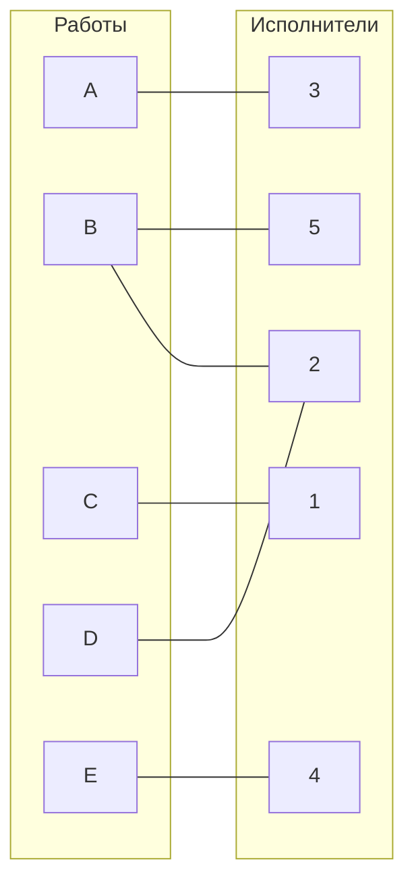
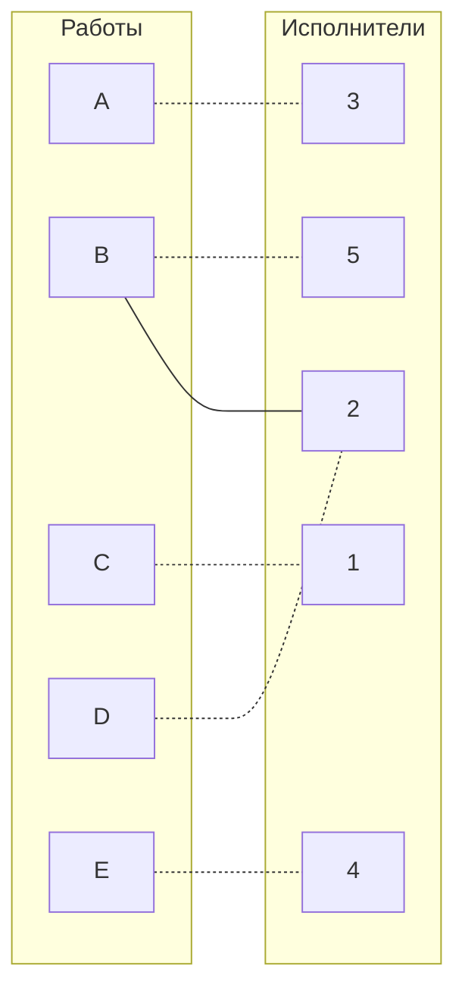

# Задача о назначениях. Венгерский алгоритм.
1. В условиях задачи для каждой команды указан полный двудольный граф, в котором каждое ребро имеет определенную стоимость. Вершины первой доли представляют задачи, вершины второй доли исполнителей. Стоимость ребра определяет затраты при выполнении соответствующей задачи соответствующим исполнителем.
2. Затраты неотрицательны и представлены в виде матрицы затрат, в которой на пересечении i-й строки и j-го столбца указаны затраты j-го исполнителя на выполнение i-го задания.
3. Необходимо назначить исполнителей на задачи таким образом, чтобы общая стоимость затрат была минимальной.
4. Для решения задачи требуется найти совершенное паросочетание с минимальной суммарной стоимостью в двудольном графе.

## Постановка задачи
1. Дан полный двудольный граф, в котором каждое ребро имеет определенную стоимость. Вершины первой доли представляют задачи, вершины второй доли исполнителей. Стоимость ребра определяет затраты при выполнении соответствующей задачи соответствующим исполнителем. 
2. Затраты неотрицательны и представлены в виде матрицы затрат, в которой на пересечении i-й строки и j-го столбца указаны затраты j-го исполнителя на выполнение i-го задания.
3. Необходимо назначить исполнителей на задачи таким образом, чтобы общая стоимость затрат была минимальной.
4. Задача сводится к нахождению совершенного паросочетания с минимальной суммарной стоимостью в двудольном графе.

Дана матрица затрат для задач A, B, C, D, E и исполнителей 1, 2, 3, 4, 5:

|       | **1** | **2** | **3** | **4** | **5** |
|-------|:-----:|:-----:|:-----:|:-----:|:-----:|
| **A** |   7   |  12   |   3   |  14   |  10   |
| **B** |  11   |   5   |   8   |  12   |   7   |
| **C** |   6   |   9   |  13   |   7   |  12   |
| **D** |  10   |   4   |  15   |   7   |   9   |
| **E** |   8   |   6   |  11   |   5   |  13   |

1. Проведем редукцию матрицы затрат. Вычтем из каждой строки минимальное значение, представленное в этой строке.

|       | **1** | **2** | **3** | **4** | **5** | **Min** |
|-------|:-----:|:-----:|:-----:|:-----:|:-----:|:-------:|
| **A** |   4   |   9   |   0   |  11   |   7   |    3    |
| **B** |   6   |   0   |   3   |   7   |   2   |    5    |
| **C** |   0   |   3   |   7   |   1   |   6   |    6    |
| **D** |   6   |   0   |  11   |   3   |   5   |    4    |
| **E** |   3   |   1   |   6   |   0   |   8   |    5    |

2. Проведем редукцию матрицы затрат. Вычтем из столбца без нулей минимальное значение, представленное в этом столбце.

|       | **1** | **2** | **3** | **4** | **5** |
|-------|:-----:|:-----:|:-----:|:-----:|:-----:|
| **A** |   4   |   9   |   0   |  11   |   5   |
| **B** |   6   |   0   |   3   |   7   |   0   |
| **C** |   0   |   3   |   7   |   1   |   4   |
| **D** |   6   |   0   |  11   |   3   |   3   |
| **E** |   3   |   1   |   6   |   0   |   6   |

Min в 5 = 2

2. Построим двудольный граф, вынесем на него те ребра, для которых в редуцированной матрице указаны нули.

Выберем произвольное паросочетание A --- 3, B --- 5, C --- 1, D --- 2, E --- 4 и попытаемся построить совершенное паросочетание с помощью чередующихся деревьев.

Так как каждой работе уже соответствует исполнитель с минимальными затратами на эту работу, можно получить ответ, не прибегая к построению чередующихся деревьев.
A - 3
B - 5
C - 1
D - 2
E - 4
3. Посчитаем сумму минимальных затрат на работу исполнителей

SUM = 3 + 7 + 6 + 4 + 5 = 25

# Ответ: 25
