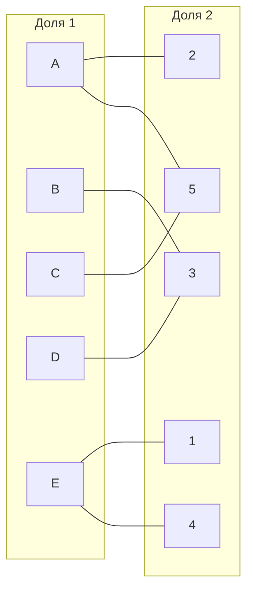
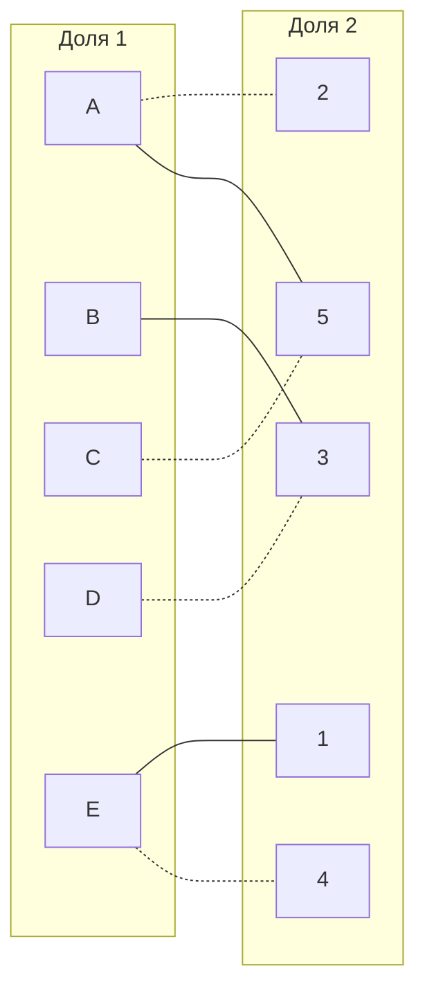
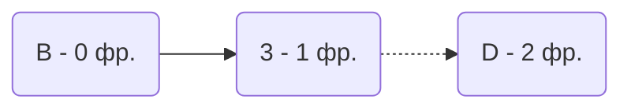
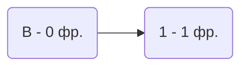
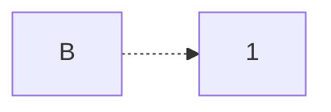
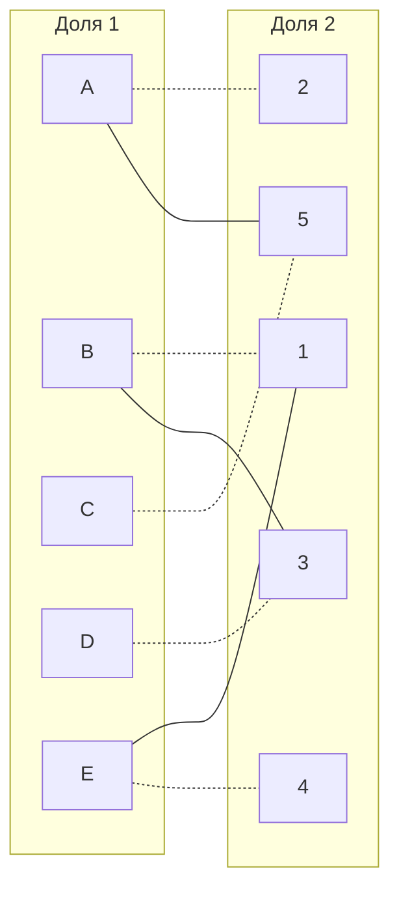

# Задание №13
## Постановка задачи
1. Дан полный двудольный граф, в котором каждое ребро имеет определенную стоимость. Вершины первой доли представляют задачи, вершины второй доли исполнителей. Стоимость ребра определяет затраты при выполнении соответствующей задачи соответствующим исполнителем. 
2. Затраты неотрицательны и представлены в виде матрицы затрат, в которой на пересечении i-й строки и j-го столбца указаны затраты j-го исполнителя на выполнение i-го задания.
3. Необходимо назначить исполнителей на задачи таким образом, чтобы общая стоимость затрат была минимальной.
4. Задача сводится к нахождению совершенного паросочетания с минимальной суммарной стоимостью в двудольном графе.

## Условия задачи:
### zavod_dao Team: 

|       | **1** | **2** | **3** | **4** | **5** |
|-------|:-----:|:-----:|:-----:|:-----:|:-----:|
| **A** |  16   |  12   |  13   |  15   |  10   |
| **B** |  12   |  14   |   7   |   9   |   9   |
| **C** |  12   |  10   |   9   |  11   |   6   |
| **D** |  13   |  13   |   5   |  13   |  11   |
| **E** |  14   |  13   |  11   |  10   |  15   |

## Решение

1.  Вычтем из каждой строки минимальное значение, представленное в этой строке.

|       | **1** | **2** | **3** | **4** | **5** |
|-------|:-----:|:-----:|:-----:|:-----:|:-----:|
| **A** |   6   |   2   |   3   |   5   |   0   |
| **B** |   5   |   7   |   0   |   2   |   2   |
| **C** |   6   |   4   |   3   |   5   |   0   |
| **D** |   8   |   8   |   0   |   8   |   6   |
| **E** |   4   |   3   |   1   |   0   |   5   |

После чего вычтем из каждого столбца минимальное значение, представленное в этом столбце.
Получим редуцированную матрицу, где нули обозначают наименее затратные варианты назначений.

|       | **1** | **2** | **3** | **4** | **5** |
|-------|:-----:|:-----:|:-----:|:-----:|:-----:|
| **A** |   2   |   0   |   3   |   5   |   0   |
| **B** |   1   |   5   |   0   |   2   |   2   |
| **C** |   2   |   2   |   3   |   5   |   0   |
| **D** |   4   |   6   |   0   |   8   |   6   |
| **E** |   0   |   1   |   1   |   0   |   5   |

2. Построим двудольный граф, вынесем на него те ребра, для которых в редуцированной матрице указаны нули.

Выберем произвольное паросочетание A --- 2, D --- 3 , С --- 5, E--- 1 и попытаемся построить совершенное паросочетание с помощью чередующихся деревьев.

Построить дерево из оставшейся непокрытой вершины B.

В построенном дереве нет цепей, чередующееся относительно текущего паросочетания, ветка закончилась в покрытой вершине, то есть в указанном графе нет совершенного паросочетания.

3. Проведем повторную редукцию матрицы затрат.
Во множество X выпишем все покрытые построенным деревом вершины первой доли графа, во множество Y все покрытые построенным деревом вершины из второй доли графа.

$$ X = {D, B}

Y = {3} $$

Необходимо найти минимальный элемент из строк, включенных во множество X и столбцов, не включенных во множество Y. В нашем случае это будут строки D, B и столбец 3. Минимальный элемент 1, расположен в строке B и столбце 1.

Вычтем найденное значение из строк множества X и прибавим к столбцам множества Y:

|       | **1** | **2** | **3** | **4** | **5** |
|-------|:-----:|:-----:|:-----:|:-----:|:-----:|
| **A** |   2   |   0   |   4   |   5   |   0   |
| **B** |   0   |   4   |   0   |   1   |   1   |
| **C** |   2   |   2   |   4   |   5   |   0   |
| **D** |   3   |   5   |   0   |   7   |   5   |
| **E** |   0   |   1   |   2   |   0   |   5   |

Добавим новое ребро B1

Попытаемся построить совершенное паросочетание с помощью чередующихся деревьев.

Построенное дерево содержит чередующуюся, относительно текущего паросочетания, цепь B->1, цепь начинается и заканчивается в непокрытых вершинах, все ребра в цепи чередуются по вхождению в текущее паросочетание.

"Перекрасим" найденную цепь и проверим полученное паросочетание.

Полученное расписание является совершенным. Выпишем полученные назначения и их стоимости из исходной матрицы:
A2 - 12
B1 - 12
C5 - 6
D3 - 5
E4- 10

## Ответ
Минимальная стоимость затрат 45, при следующих назначениях:
- задача A, исполнитель 2,
- задача B, исполнитель 1,
- задача C, исполнитель 5,
- задача D, исполнитель 3.
- задача E, исполнитель 4.
