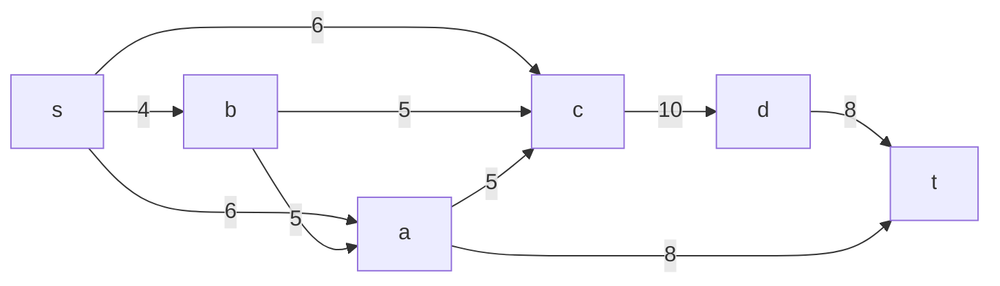
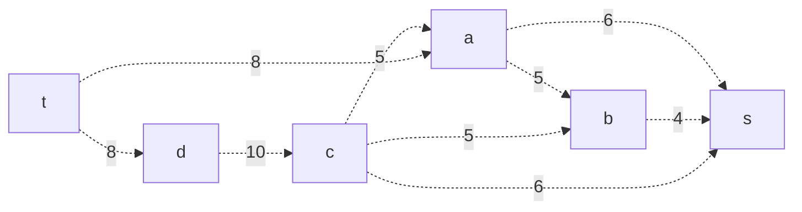
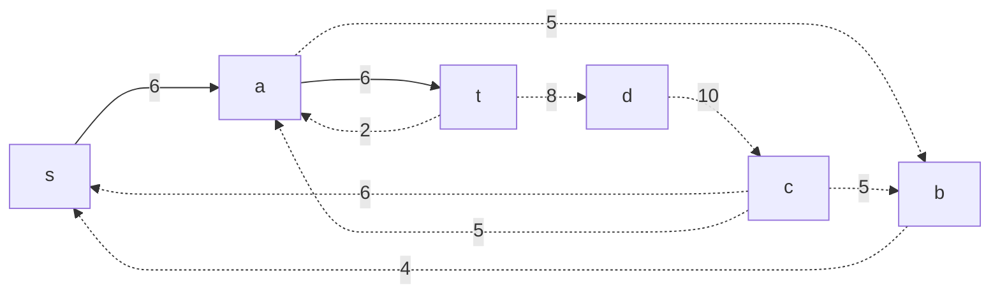
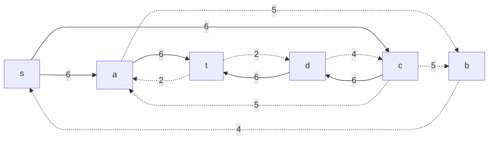
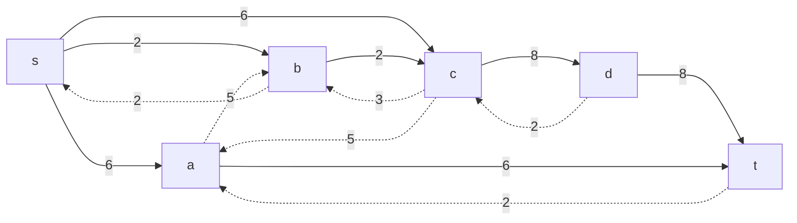
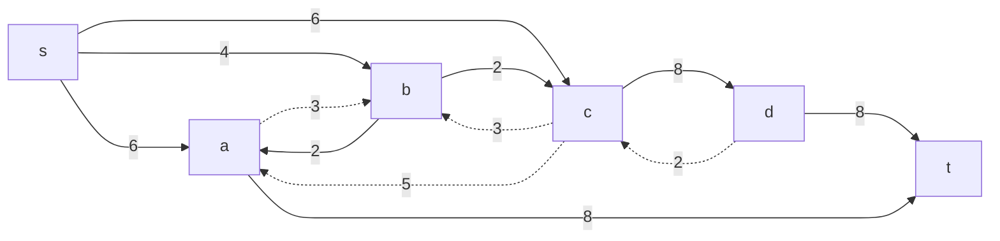
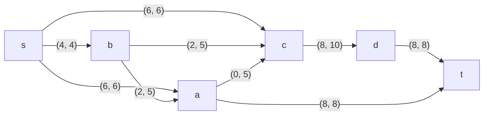

### Вариант 5: 

|          Дуги          | sa | sb | sc | ba | bc | cd | dt | ac | at |
|:----------------------:|:--:|:--:|:--:|:--:|:--:|:--:|:--:|:--:|:--:|
| Пропускная способность | 6  | 4  | 6  | 5  | 5  | 10 | 8  | 5  | 8  |

## 1. Построим сеть с источником s и стоком t на основе информации из таблицы:

Т.к. локальный поток равен нулю, строим остаточную сеть, состоящую из обратных дуг

### 1.1 Остаточная сеть:

## 2. Найдем увеличивающий путь (из стока в источник) в остаточной сети:
Путь найден: t -> a -> s. Минимальный вес дуги: min(8,6) = 6

### 2.1 Уменьшим вес дуг:

### 2.2 Скорректируем локальные потоки в исходной сети: 
Первое число - локальный поток, второе - пропускная способность

## 3. Найдем увеличивающий путь в остаточной сети:

Путь найден: t -> d -> c -> s. Минимальный вес дуги: min(8,10,6) = 6

### 3.1 Уменьшим вес дуг:

### 3.2 Скорректируем локальные потоки в исходной сети: 

## 4. Найдем увеличивающий путь:

Путь найден: t -> d -> c -> b -> s. Минимальный вес дуги: min(2,4,5,4) = 2

### 4.1 Уменьшим вес дуг:

### 4.2 Скорректируем локальные потоки в исходной сети: 

## 5. Найдем увеличивающий путь:

Путь найден: t -> a -> b -> s. Минимальный вес дуги: min(2,5,2) = 2

### 5.1 Уменьшим вес дуг:

### 5.2 Скорректируем локальные потоки в исходной сети: 

В остаточной цепи отсутствуют увеличивающие пути, значит алгоритм завершает работу. Величина максимального потока: 16.

### 6. Проведем проверка методом перебором всех разрезов сети:
Построим разрез сети, то есть разобъем множества на подмножества V1 и V2. 
Источник входит во множество V1
Сток входит во множество V2

По формуле для сети из _n_ вершин существует 2n - 2 разрезов.

Для данной сети из 6 вершин существует 26 - 2 = 24 = 16 вариантов 

| №  | V1                   | V2 | Пропускная способность разреза |
|----|:--------------------------------|:--------------|:------------------------------:|
| 1  | s                               | a, b, c, d, t |         6 + 6 + 4 = 16         |
|    | **s + {a, b, c, d} x1**         |               |                                |
| 2  | s, a                            | b, c, d, t    |         4 + 6 + 5 + 8 = 23     |
| 3  | s, b                            | a, c, d, t    |         6 + 5 + 6 + 5 = 22     |
| 4  | s, c                            | a, b, d, t    |         4 + 6 + 10 = 20        |
| 5  | s, d                            | a, b, c, t    |         4 + 6 + 6 + 8 = 24     |
|    | **s + {a, b, c, d} x2**         |               |                                |
| 6  | s, a, b                         | c, d, t       |         6 + 5 + 5 + 8 = 24     |
| 7  | s, a, c                         | b, d, t       |         4 + 8 + 10 = 22        |
| 8  | s, a, d                         | b, c, t       |         4 + 5 + 6 + 8 + 8 = 31 |
| 9  | s, b, c                         | a, d, t       |         6 + 5 + 10 = 21        |
| 10 | s, b, d                         | a, c, t       |         6 + 5 + 6 + 5 + 8 = 30 |
| 11 | s, c, d                         | a, b, t       |         4 + 6 + 8 = 18         |
|    | **s + {a, b, c, d} x3**         |               |                                |
| 12 | s, a, b, c                      | d, t          |         10 + 8 = 18            |
| 13 | s, a, c, d                      | b, t          |         4 + 8 + 8 = 20         |
| 14 | s, b, c, d                      | a, t          |         6 + 5 + 8 = 19         |
| 15 | s, a, b, d                      | c, t          |         5 + 5 + 6 + 8 + 8 = 32 |
|    | **s + {a, b, c, d} x4**         |               |                                |
| 16 | s, a, b, c, d                   | t             |         8 + 8 = 16             |

Минимальная пропускная способность, исходя из таблицы, равна 16. Это соответствует величине максимального потока.

### Ответ: максимальный поток равен 16, сеть с конфигурациями представлена ниже

