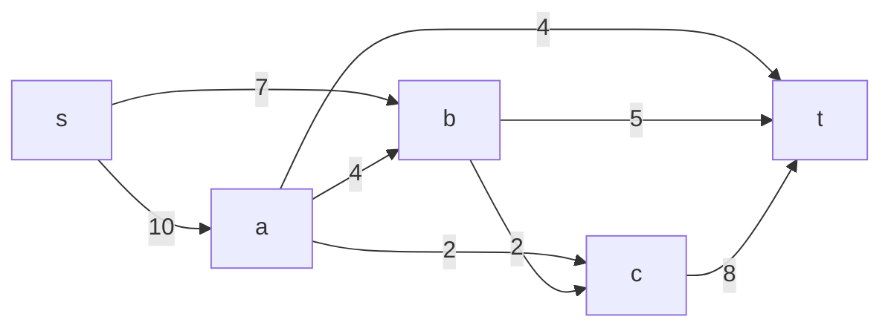
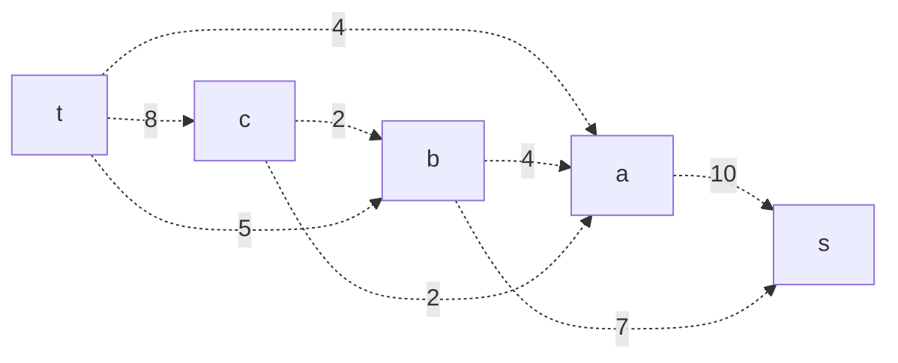
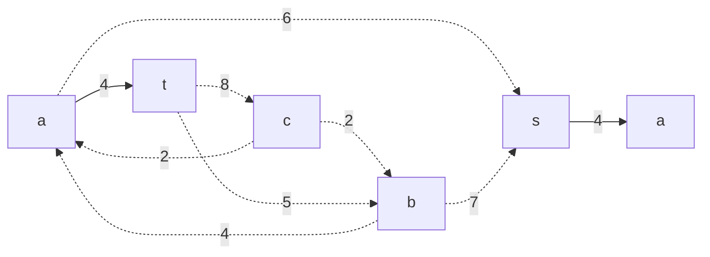
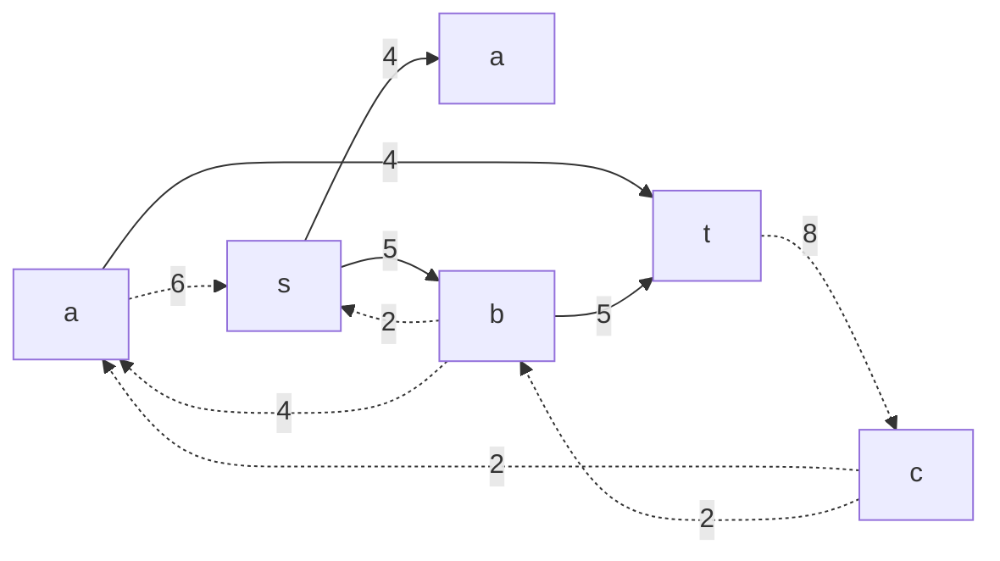
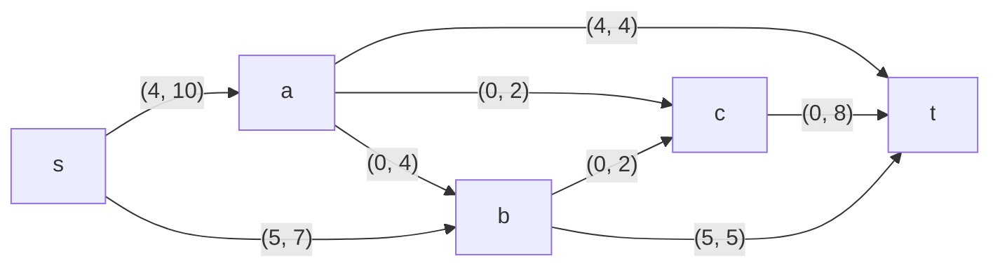
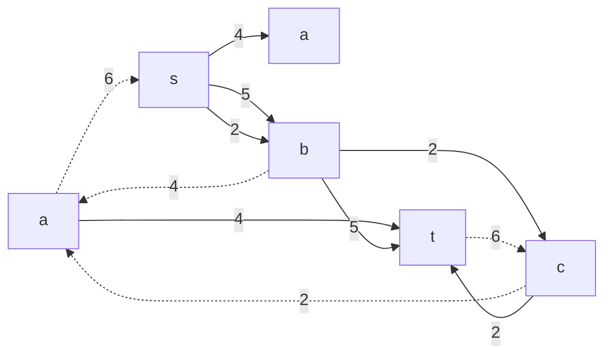
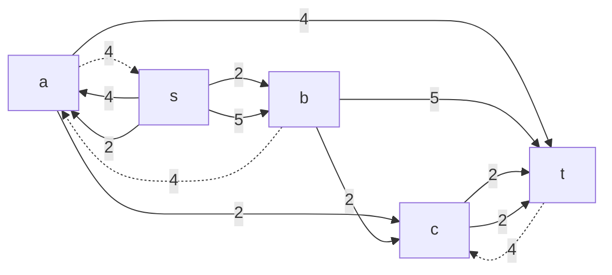

# Задача о максимальном потоке.
Для каждого варианта представлены условия задачи, в соответствии с которыми необходимо: 
1. Построить сеть с указанием пропускной способности дуг.
2. Построить остаточную сеть.
3. Определить максимальный поток методом поиска увеличивающих путей в остаточной сети.
4. Проверить величину максимального потока через поиск минимальной пропускной способности разрезов сети.
5. Оформить решение задачи по шагам с подробными комментариями, таблицами и диаграммами.
6. В ответе указать максимальную величину потока и сеть с указанием соответствующих локальных потоков.

### Вариант 2:

|          Дуги          | sa  | sb | at | ab | ac | bc | bt | ct |
|:----------------------:|:---:|:--:|:--:|:--:|:--:|:--:|:--:|:--:|
| Пропускная способность | 10  | 7  | 4  | 4  | 2  | 2  | 5  | 8  |

### 1. Построим сеть с источником **s**, стоком **t** b указанными пропускными способностями дуг.

Построим остаточную сеть. Так как изначально поток в сети не задан, все дуги сети являются пустыми (локальный поток равен нулю), соответственно в остаточную сеть необходимо вынести обратную дугу с весом равным пропускной способности. 

### 2. Проведем поиск увеличивающего пути в остаточной сети
В остаточной сети найден увеличивающий путь t -> a -> s. Минимальный вес дуг на этом пути равен 4.

Уменьшим вес дуг на найденном пути, дуги для которых вес стал нулевым удалим из остаточной сети.

Скорректируем соответствующим образом локальные потоки в исходной сети. Первым числом будем указывать локальный поток, вторым пропускную способность дуги. 

### 3. Продолжим поиск увеличивающего пути в остаточной сети
В остаточной сети найден увеличивающий путь t ->  b -> s. Минимальный вес дуг на этом пути равен 5.
Уменьшим вес дуг на найденном пути, дуги для которых вес стал нулевым удалим из остаточной сети.

Скорректируем соответствующим образом локальные потоки в исходной сети.

### 4. Продолжим поиск увеличивающего пути в остаточной сети
В остаточной сети найден увеличивающий путь t -> c -> b -> s. Минимальный вес дуг на этом пути равен 2.
Уменьшим вес дуг на найденном пути, дуги для которых вес стал нулевым удалим из остаточной сети.

Скорректируем соответствующим образом локальные потоки в исходной сети.

### 5. Продолжим поиск увеличивающего пути в остаточной сети
В остаточной сети найден увеличивающий путь t -> c -> a -> s. Минимальный вес дуг на этом пути равен 2.
Уменьшим вес дуг на найденном пути, дуги для которых вес стал нулевым удалим из остаточной сети.

Скорректируем соответствующим образом локальные потоки в исходной сети.

### 6. Продолжим поиск увеличивающего пути в остаточной сети
В остаточной сети не найдено увеличивающих путей, следовательно, алгоритм завершил работу и найденный поток величиной 13 является максимальным для данной сети.

### 7. Проверим значение максимального потока перебором всех разрезов сети.
Разрез сети - разбиение множества вершин на два подмножества V1 и V2, где во множество V1 входит источник, а в V2 входит сток.

Пропускная способность разреза - сумма пропускной способности дуг, начинающихся в вершинах из множества V1 и оканчивающихся в вершинах из V2.

Для сети из _n_ вершин существует 2n - 2 различных разрезов, так как две вершины из множества (источник и сток) "зафиксированы" в V1 и V2, остальные вершины можно различными способами распределять между множествами V1 и V2.

Для сети из 5 вершин нужно найти 25 - 2 = 23 = 8 разрезов. 

| № | V1                   | V2 | Пропускная способность разреза |
|---|:--------------------------------|:--------------|:------------------------------:|
| 1 | s                               | a, b, c, t    |          10 + 7 = 17           |
|   | **s + одна вершина из a, b, c** |               |                                |
| 2 | s, a                            | b, c, t       |         7 + 4 + 4 = 15         |
| 3 | s, b                            | a, c, t       |        10 + 2 + 5 = 17         |
| 4 | s, c                            | a, b, t       |        10 + 7 + 8 = 25         |
|   | **s + пара вершин из a, b, c**  |               |                                |
| 5 | s, a, b                         | c, t          |       2 + 2 + 4 + 5 = 13       |
| 6 | s, a, c                         | b, t          |       7 + 4 + 4 + 5 = 20       |
| 7 | s, b, c                         | a, t          |        10 + 5 + 8 = 23         |
|   | **s + три вершины из a, b, c**  |               |                                |
| 8 | s, a, b, c                      | t             |         4 + 5 + 8 = 17         |

Минимальная пропускная способность разреза равна 13 ( {s, a, b, } / {t} ), что совпадает с найденной величиной максимального потока в сети.
### Ответ:
Максимальный поток в сети равен 13, он реализуется следующим локальными потоками:

