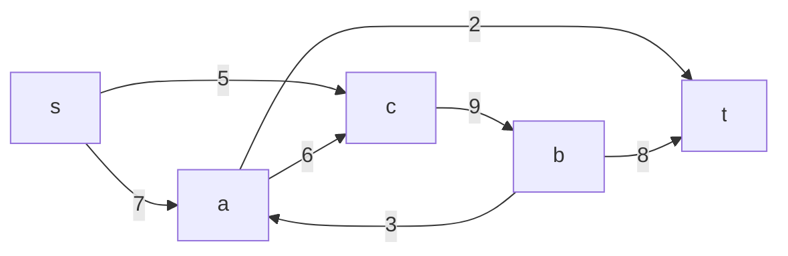
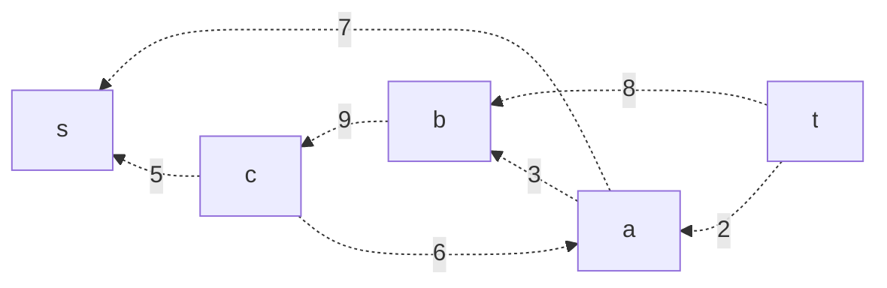
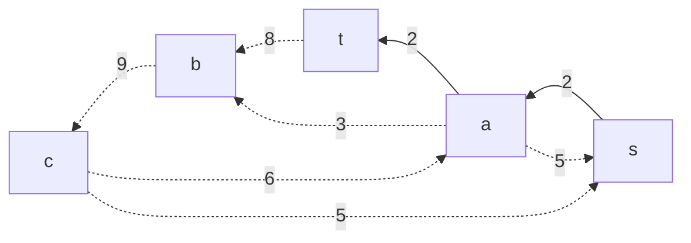
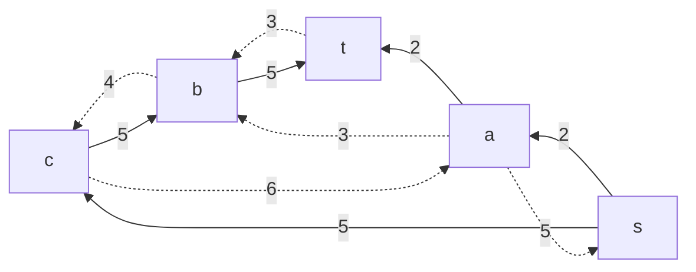
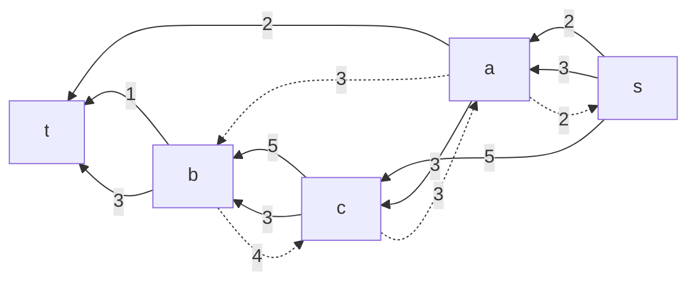
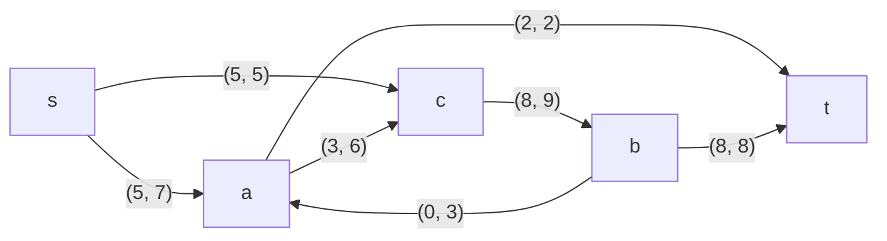

# Задача о максимальном потоке.
Для каждого варианта представлены условия задачи, в соответствии с которыми необходимо: 
1. Построить сеть с указанием пропускной способности дуг.
2. Построить остаточную сеть.
3. Определить максимальный поток методом поиска увеличивающих путей в остаточной сети.
4. Проверить величину максимального потока через поиск минимальной пропускной способности разрезов сети.
5. Оформить решение задачи по шагам с подробными комментариями, таблицами и диаграммами.
6. В ответе указать максимальную величину потока и сеть с указанием соответствующих локальных потоков.

### Вариант 8:

|          Дуги          | sa | sс | aс | ba | cb | at | bt |
|:----------------------:|:--:|:--:|:--:|:--:|:--:|:--:|:--:|
| Пропускная способность | 7  | 5  | 6  | 3  | 9  | 2  | 8  |

### 1. Построим сеть с источником **s**, стоком **t** и указанными пропускными способностями дуг.


Построим остаточную сеть. 


## 2. Проведем поиск увеличивающего пути в остаточной сети
В остаточной сети найден увеличивающий путь t 2-> a 7-> s . Минимальный вес дуг на этом пути равен 2.

Уменьшим вес дуг на найденном пути, дуги для которых вес стал нулевым удалим из остаточной сети.


Скорректируем соответствующим образом локальные потоки в исходной сети. Первым числом будем указывать локальный поток, вторым пропускную способность дуги. 


### 3. Продолжим поиск увеличивающего пути в остаточной сети


В остаточной сети найден увеличивающий путь t 8-> b 9-> c 5-> s. Минимальный вес дуг на этом пути равен 5.

Уменьшим вес дуг на найденном пути, дуги для которых вес стал нулевым удалим из остаточной сети.


Скорректируем соответствующим образом локальные потоки в исходной сети.


 ### 4. Продолжим поиск увеличивающего пути в остаточной сети
 и еще раз повторяем операцию

 ```mermaid
graph RL
    s-->|2|a
	  a-.->|5|s
    s-->|5|c
    c-.->|6|a
    a-->|2|t
    b-->|5|t
    t-.->|3|b
    a-.->|3|b
    c-->|5|b
    b-.->|4|c
```
В остаточной сети найден увеличивающий путь t 3-> b 4-> c 6-> a 5-> s . Минимальный вес дуг на этом пути равен 3.

Уменьшим вес дуг на найденном пути, дуги для которых вес стал нулевым удалим из остаточной сети.


Скорректируем соответствующим образом локальные потоки в исходной сети.


### 5. Продолжим поиск увеличивающего пути в остаточной сети
В остаточной сети не найдено увеличивающих путей, следовательно, алгоритм завершил работу и найденный поток величиной 10 является максимальным для данной сети.
### 6. Проверим значение максимального потока перебором всех разрезов сети.

Для сети из _n_ вершин существует 2<sup>n - 2</sup> различных разрезов, так как две вершины из множества (источник и сток) "зафиксированы" в V<sub>1</sub> и V<sub>2</sub>, остальные вершины можно различными способами распределять между множествами V<sub>1</sub> и V<sub>2</sub>.

Для сети из 5 вершин нужно найти 2<sup>5 - 2</sup> = 2<sup>3</sup> = 8 разрезов. 

| № | V<sub>1</sub>                   | V<sub>2</sub> | Пропускная способность разреза |
|---|:--------------------------------|:--------------|:------------------------------:|
| 1 | s                               | a, b, c, t    |           5 + 7 = 12           |
|   | **s + одна вершина из a, b, c** |               |                                |
| 2 | s, a                            | b, c, t       |           5 + 2 + 6 = 13       |
| 3 | s, b                            | a, c, t       |         7 + 5 + 3 + 8 = 23     |
| 4 | s, c                            | a, b, t       |         7 + 9 = 16             |
|   | **s + пара вершин из a, b, c**  |               |                                |
| 5 | s, a, b                         | c, t          |         5 + 6 + 2 + 8 = 21     |
| 6 | s, a, c                         | b, t          |         9 + 2 = 11             |
| 7 | s, b, c                         | a, t          |         7 + 3 + 8 = 18      |
|   | **s + три вершины из a, b, c**  |               |                                |
| 8 | s, a, b, c                      | t             |           2 + 8 = 10           |

Минимальная пропускная способность разреза равна 10 ( {s, a, b, c} / {t} ), что совпадает с найденной величиной максимального потока в сети.
### Ответ:
Максимальный поток в сети равен 10, он реализуется следующим локальными потоками:


