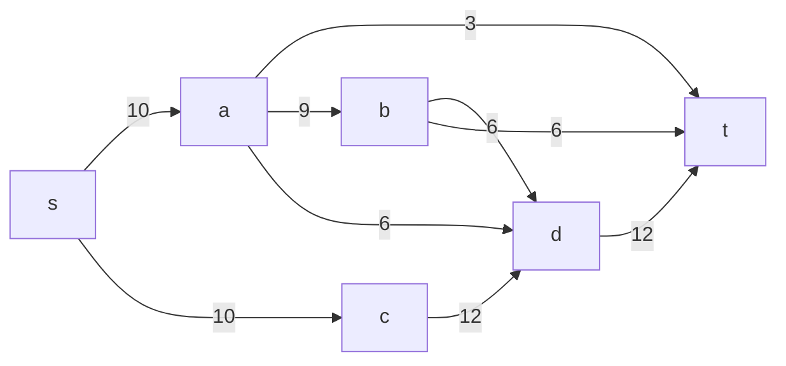
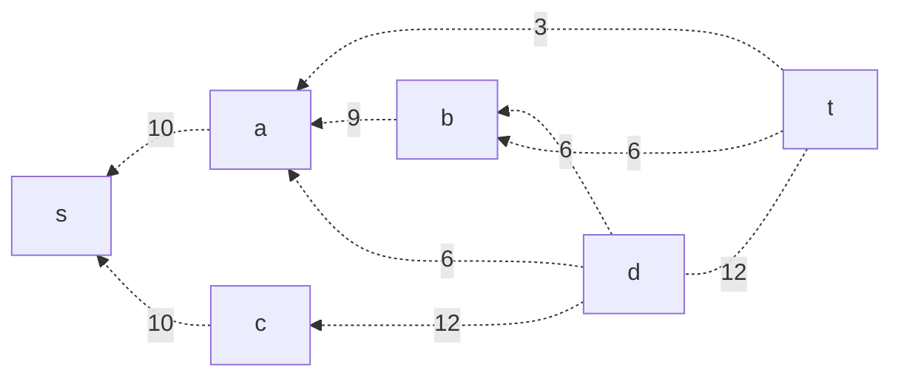
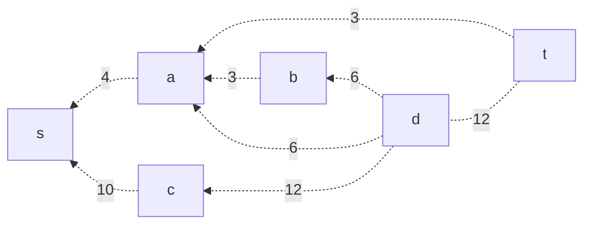
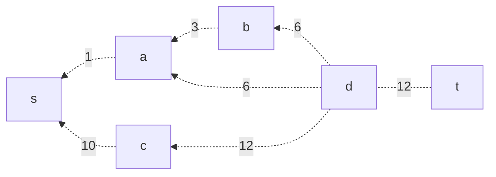
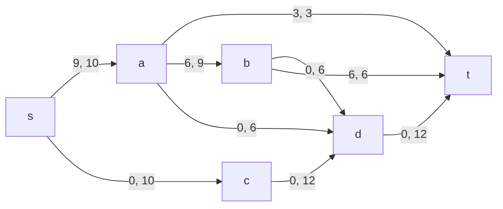
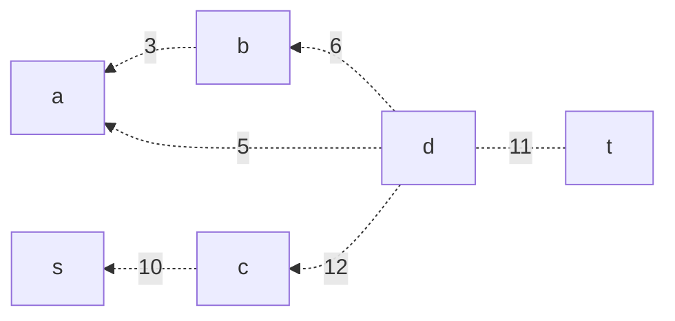
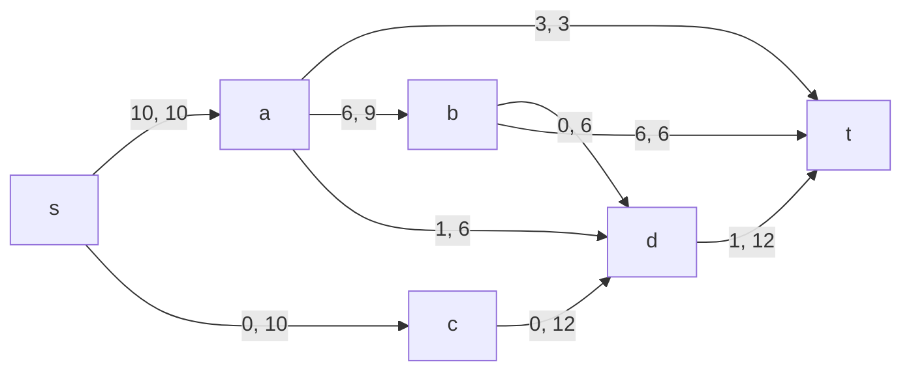
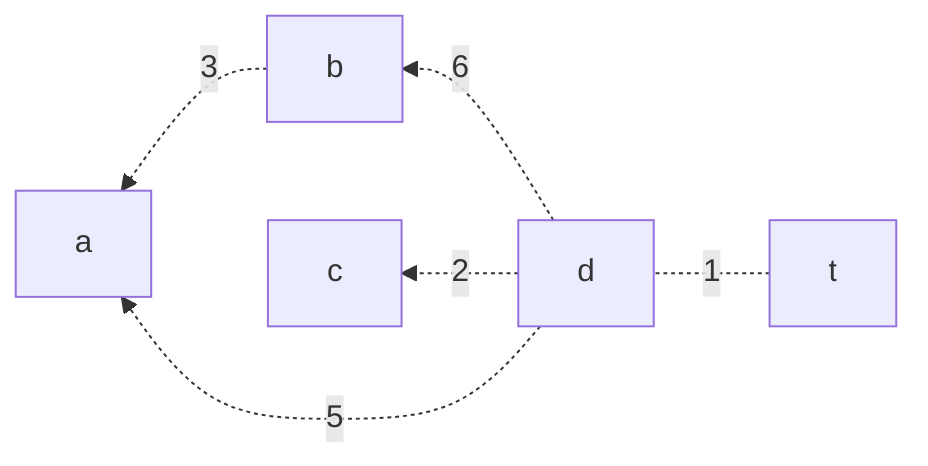

### Вариант 7:

|          Дуги          | sa | sc | at | ab | ad | cd | bd | bt | dt |
|:----------------------:|:--:|:--:|:--:|:--:|:--:|:--:|:--:|:--:|:--:|
| Пропускная способность | 10 | 10 | 3  | 9  | 6  | 12 | 6  | 6  | 12 |
#### 1. Построим сеть с источником S, стоком t и пропускными способностями дуг из таблицы выше

Построим остаточную сеть, так как изначальный поток равен нулю все дуги являются пустыми, соответственно в остаточную сеть необходимо внести обратные дуги с весом, который равен пропускной способности изначальной сети

#### 2. Найдём увеличивающий путь в остаточной сети
Возьмём увеличивающий путь t -> b -> a -> S
Минимальная длина дуг на этом пути равна 6
Уменьшим вес дуг на полученном пути. Дуги которые стали нулевыми удаляем из остаточной сети.

Скорректируем локальные потоки в исходной сети, первое число - локальный поток, второе - пропускная способность

#### 3. Продолжим поиск увеличивающего пути в остаточной сети
Возьмём увеличивающий путь t -> a -> S Минимальная длина дуг на этом пути равна 3 Уменьшим вес дуг на полученном пути. Дуги которые стали нулевыми удаляем из остаточной сети.

Скорректируем локальные потоки в исходной сети, первое число - локальный поток, второе - пропускная способность

#### 4. Продолжим поиск увеличивающего пути в остаточной сети
Возьмём увеличивающий путь t -> d -> a -> S Минимальная длина дуг на этом пути равна 1 Уменьшим вес дуг на полученном пути. Дуги которые стали нулевыми удаляем из остаточной сети.

Скорректируем локальные потоки в исходной сети, первое число - локальный поток, второе - пропускная способность

#### 5. Продолжим поиск увеличивающего пути в остаточной сети
Возьмём увеличивающий путь t -> d -> c -> S Минимальная длина дуг на этом пути равна 10 Уменьшим вес дуг на полученном пути. Дуги которые стали нулевыми удаляем из остаточной сети.

Скорректируем локальные потоки в исходной сети, первое число - локальный поток, второе - пропускная способность

#### 6. Продолжим поиск увеличивающего пути в остаточной сети
Так как в остаточной сети больше нет увеличивающих путей, работу алгоритма можно считать завершённой. Найденный поток имеет величину 20 и является максимальным для данной сети.
#### 7. Проверим значение максимального потока перебором всех срезов сети
| №  | I         |      II      | Пропускная способность разреза |
|----|-----------|:------------:|--------------------------------|
| 1  | S         | t, a, b, c d | 10+10 = 20                     | 
| 2  | S,a       |   t,b,c,d    | 3 + 9 + 6 + 10 = 28            |
| 3  | S,b       |   t,a,c,d    | 10 + 6 + 6 = 22                |
| 4  | S,c       |   t,a,b,d    | 10 + 12 = 22                   |
| 5  | S,d       |   t,a,b,c    | 10 + 10 + 12 = 32              |
| 6  | S,a,b     |    t,c,d     | 3 + 6 + 10 + 6 + 6 = 31        |
| 7  | S,a,c     |    t,b,d     | 9 + 3 + 6 + 12 = 30            |
| 8  | S,a,d     |    t,b,c     | 10 + 3 + 9 + 12 = 34           |
| 9  | S,b,c     |    t,a,d     | 10 + 12 + 6 + 6 = 34           |
| 10 | S,b,d     |    t,a,c     | 10 + 10 + 6 + 12 = 38          |
| 11 | S,c,d     |    t,a,b     | 10 + 12 = 22                   |
| 12 | S,a,b,c   |     t,d      | 3 + 6 + 6 + 12 = 27            |
| 13 | S,a,b,d   |     t,c      | 10 + 3 + 6 + 12 = 31           |
| 14 | S,a,c,d   |     t,b      | 3 + 12 + 9 = 24                |
| 15 | S,b,c,d   |     t,a      | 3 + 6 + 12 + 10 = 31           |
| 16 | S,a,b,c,d |      t       | 3 + 6 + 12 = 21                |
Минимальная пропускная способность разрезов равна 20 (S)/(t,a,b,c,d), что совпадает с найденной величиной максимального потока в сети.
#### Ответ
Максимальный поток в сети равен 20, он реализуется следующими локальными потоками:

