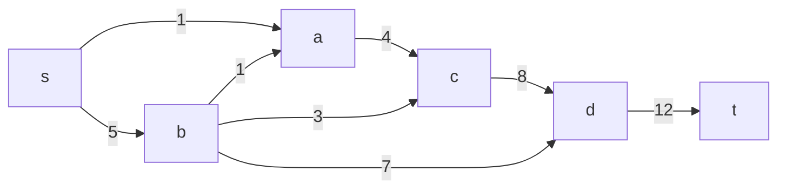
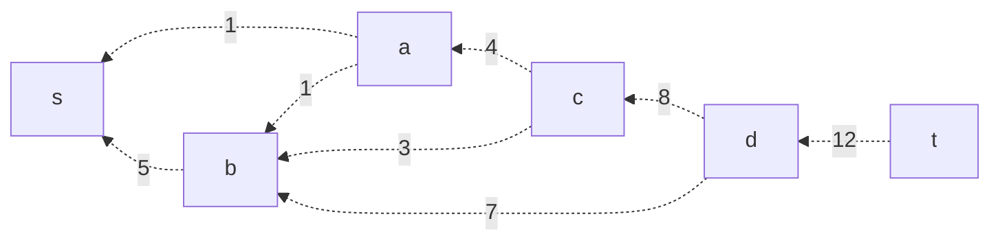
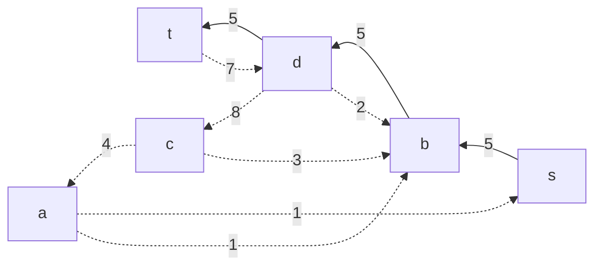
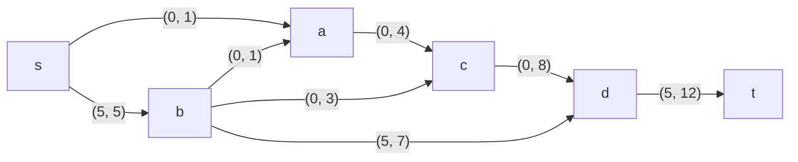
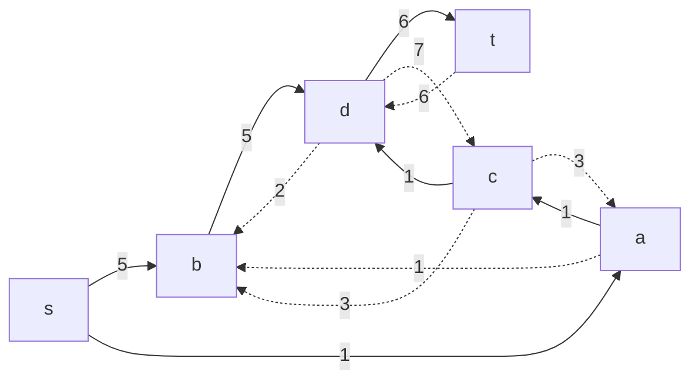

# Задание №14
# Задача о максимальном потоке.
Для каждого варианта представлены условия задачи, в соответствии с которыми необходимо: 
1. Построить сеть с указанием пропускной способности дуг.
2. Построить остаточную сеть.
3. Определить максимальный поток методом поиска увеличивающих путей в остаточной сети.
4. Проверить величину максимального потока через поиск минимальной пропускной способности разрезов сети.
5. Оформить решение задачи по шагам с подробными комментариями, таблицами и диаграммами.
6. В ответе указать максимальную величину потока и сеть с указанием соответствующих локальных потоков.

## Решения задачи на поиск максимального потока в сети

Пропускная способность дуг сети указана в таблице.

### Вариант 3: 

|          Дуги          | sa | sb | ac | ba | bc | bd | cd | dt |
|:----------------------:|:--:|:--:|:--:|:--:|:--:|:--:|:--:|:--:|
| Пропускная способность | 1  | 5  | 4  | 1  | 3  | 7  | 8  | 12 |

### 1. Построим сеть с источником **s**, стоком **t** и указанными пропускными способностями дуг.

Построим остаточную сеть. Так как изначально поток в сети не задан, все дуги сети являются пустыми (локальный поток равен нулю), соответственно в остаточную сеть необходимо вынести обратную дугу с весом равным пропускной способности. 

### 2. Проведем поиск увеличивающего пути в остаточной сети
В остаточной сети найден увеличивающий путь t -> d -> b -> s c пропускной способностью 12, 7 и 5 соответственно. Минимальный вес дуг на этом пути равен 5.

Уменьшим вес дуг на найденном пути, дуги для которых вес стал нулевым удалим из остаточной сети.

Скорректируем соответствующим образом локальные потоки в исходной сети. Первым числом будем указывать локальный поток, вторым пропускную способность дуги. 

### 3. Продолжим поиск увеличивающего пути в остаточной сети

В остаточной сети найден увеличивающий путь t -> d -> c -> a -> s c пропускной способность 12, 8, 4 и 1 соответственно. Минимальный вес дуг на этом пути равен 1.

Уменьшим вес дуг на найденном пути, дуги для которых вес стал нулевым удалим из остаточной сети.

Скорректируем соответствующим образом локальные потоки в исходной сети.

### 4. Продолжим поиск увеличивающего пути в остаточной сети
В остаточной сети не найдено увеличивающих путей, следовательно, алгоритм завершил работу и найденный поток величиной 6 является максимальным для данной сети.

### 5. Проверим значение максимального потока перебором всех разрезов сети.

Для сети из _n_ вершин существует 2n - 2 различных разрезов, так как две вершины из множества (источник и сток) "зафиксированы" в V1 и V2, остальные вершины можно различными способами распределять между множествами V1 и V2.

Для сети из 6 вершин нужно найти 26 - 2 = 24 = 16 разрезов. 

| №  | V1                        | V2 | Пропускная способность разреза |
|----|:-------------------------------------|:--------------|:------------------------------:|
| 1  | s                                    | a, b, c, d, t |           1 + 5 = 6            |
|    | **s + одна вершина из a, b, c, d**   |               |                                |
| 2  | s, a                                 | b, c, d, t    |           5 + 4 = 9            |
| 3  | s, b                                 | a, c, d, t    |       1 + 1 + 3 + 7 = 12       |
| 4  | s, c                                 | a, b, d, t    |         1 + 5 + 8 = 14         |
| 5  | s, d                                 | a, b, c, t    |        1 + 5 + 12 = 16         |
|    | **s + пара вершин из a, b, c, d**    |               |                                |
| 6  | s, a, b                              | c, d, t       |         4 + 3 + 7 = 14         |
| 7  | s, a, c                              | b, d, t       |           5 + 8 = 13           |
| 8  | s, a, d                              | c, b, t       |        5 + 4 + 12 = 21         |
| 9  | s, b, c                              | a, d, t       |       1 + 1 + 7 + 8 = 17       |
| 10 | s, b, d                              | a, c, t       |      1 + 1 + 3 + 12 = 17       |
| 11 | s, c, d                              | a, b, t       |        1 + 5 + 12 = 18         |
|    | **s + три вершины из a, b, c, d**    |               |                                |
| 12 | s, a, b, c                           | d, t          |           7 + 8 = 15           |
| 13 | s, a, b, d                           | c, t          |        4 + 3 + 12 = 19         |
| 14 | s, b, c, d                           | a, t          |        1 + 1 + 12 = 14         |
| 15 | s, a, c, d                           | b, t          |          5 + 12 = 17           |
|    | **s + четыре вершины из a, b, c, d** |               |                                |
| 16 | s, a, b, c, d                        | t             |               12               |

Минимальная пропускная способность разреза равна 6 ( {s} / {a, b, c, d, t} ), что совпадает с найденной величиной максимального потока в сети.

### Ответ:
Максимальный поток в сети равен 6, он реализуется следующим локальными потоками:

