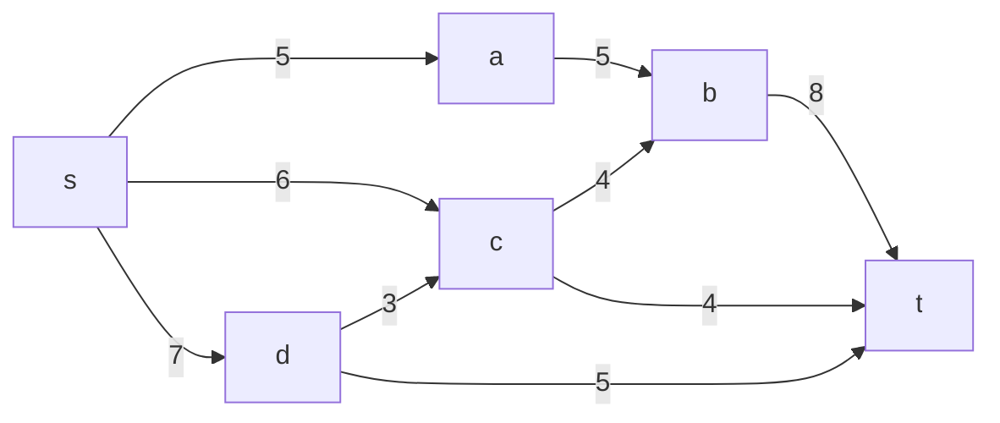
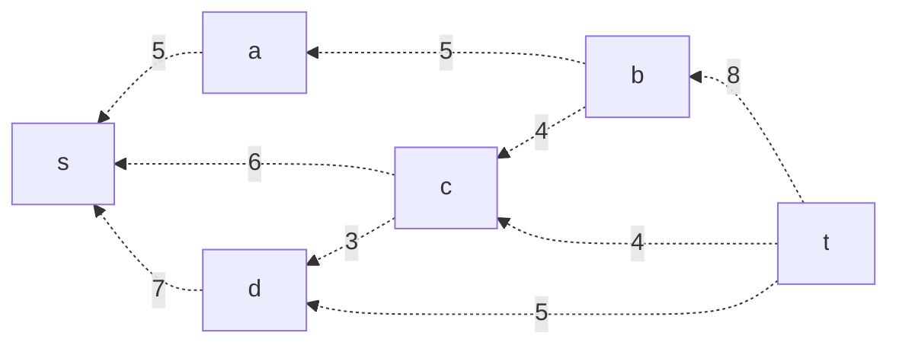
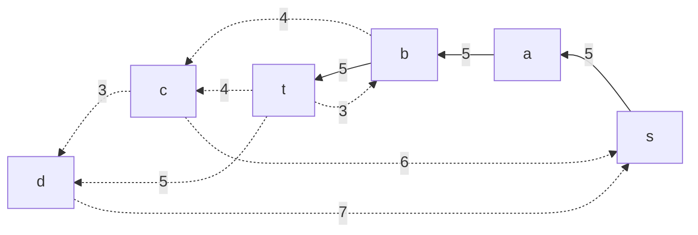
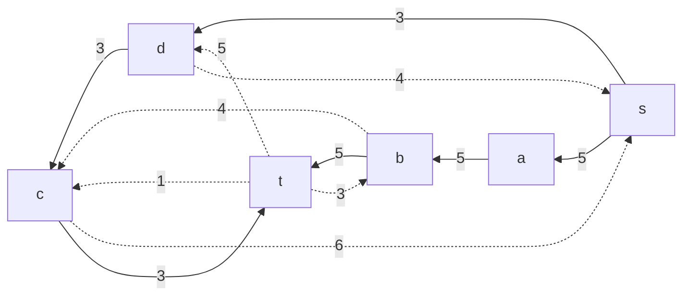
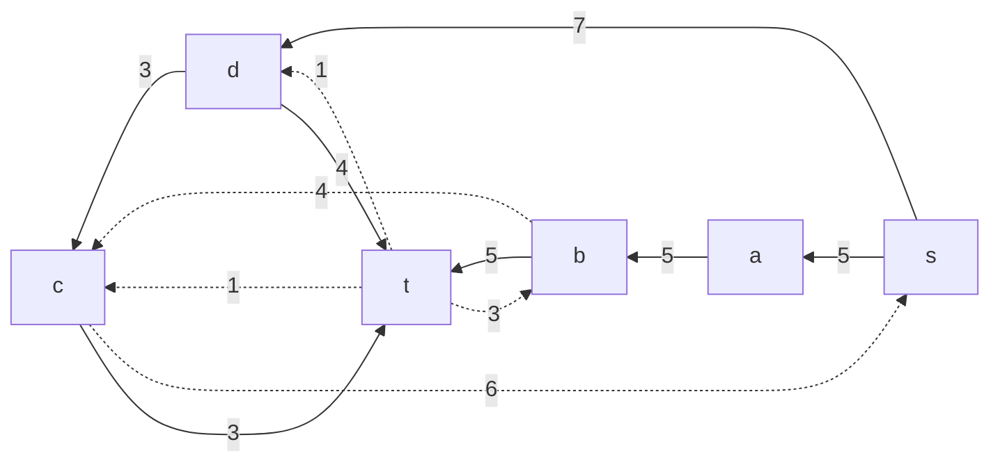
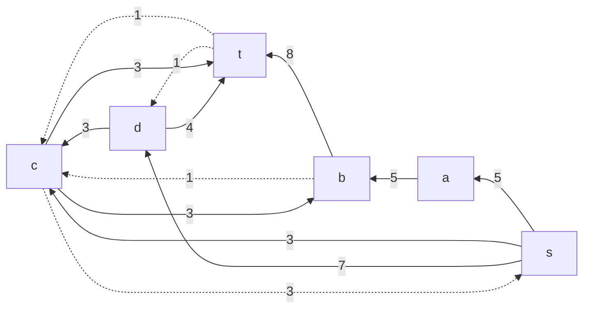
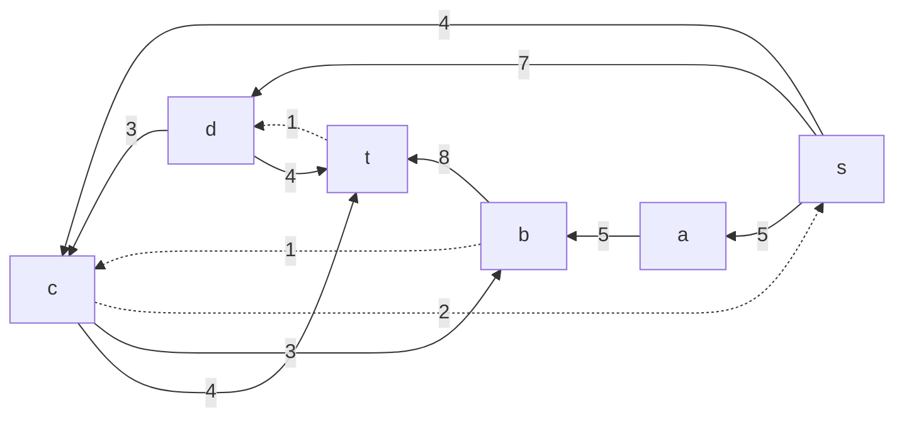
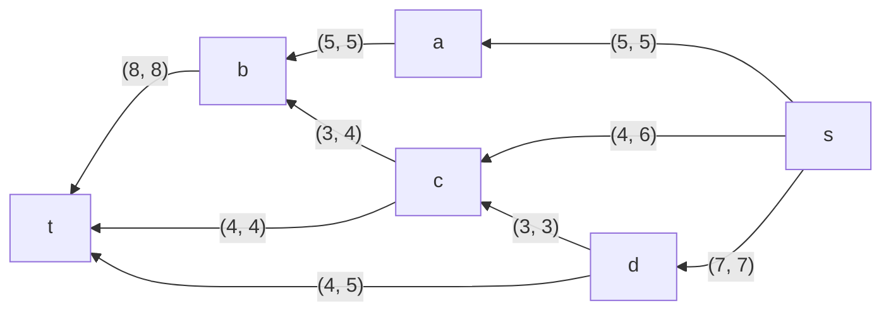

# Задача о максимальном потоке.
Для каждого варианта представлены условия задачи, в соответствии с которыми необходимо: 
1. Построить сеть с указанием пропускной способности дуг.
2. Построить остаточную сеть.
3. Определить максимальный поток методом поиска увеличивающих путей в остаточной сети.
4. Проверить величину максимального потока через поиск минимальной пропускной способности разрезов сети.
5. Оформить решение задачи по шагам с подробными комментариями, таблицами и диаграммами.
6. В ответе указать максимальную величину потока и сеть с указанием соответствующих локальных потоков.

### Вариант 4: 

Пропускная способность дуг сети указана в таблице.

|          Дуги          | sa | sc | sd | ab | cb | dc | bt | ct | dt |
|:----------------------:|:--:|:--:|:--:|:--:|:--:|:--:|:--:|:--:|:--:|
| Пропускная способность | 5  | 6  | 7  | 5  | 4  | 3  | 8  | 4  | 5  |

### 1. Построим сеть с источником **s**, стоком **t** b указанными пропускными способностями дуг.

Построим остаточную сеть. Так как изначально поток в сети не задан, все дуги сети являются пустыми (локальный поток равен нулю), соответственно в остаточную сеть необходимо вынести обратную дугу с весом равным пропускной способности. 

### 2. Проведем поиск увеличивающего пути в остаточной сети
В остаточной сети найден увеличивающий путь t -> b -> a -> s. Минимальный вес дуг на этом пути равен 5.

Уменьшим вес дуг на найденном пути, дуги для которых вес стал нулевым удалим из остаточной сети.

Скорректируем соответствующим образом локальные потоки в исходной сети. Первым числом будем указывать локальный поток, вторым пропускную способность дуги. 

### 3. Продолжим поиск увеличивающего пути в остаточной сети

В остаточной сети найден увеличивающий путь t -> c -> d -> s. Минимальный вес дуг на этом пути равен 3.

Уменьшим вес дуг на найденном пути, дуги для которых вес стал нулевым удалим из остаточной сети.

Скорректируем соответствующим образом локальные потоки в исходной сети. Первым числом будем указывать локальный поток, вторым пропускную способность дуги. 

В остаточной сети найден увеличивающий путь t -> d -> s. Минимальный вес дуг на этом пути равен 4.

Уменьшим вес дуг на найденном пути, дуги для которых вес стал нулевым удалим из остаточной сети.

Скорректируем соответствующим образом локальные потоки в исходной сети. Первым числом будем указывать локальный поток, вторым пропускную способность дуги. 

В остаточной сети найден увеличивающий путь t -> b -> c -> s. Минимальный вес дуг на этом пути равен 3.

Уменьшим вес дуг на найденном пути, дуги для которых вес стал нулевым удалим из остаточной сети.

Скорректируем соответствующим образом локальные потоки в исходной сети. Первым числом будем указывать локальный поток, вторым пропускную способность дуги. 

В остаточной сети найден увеличивающий путь t -> c -> s. Минимальный вес дуг на этом пути равен 1.

Уменьшим вес дуг на найденном пути, дуги для которых вес стал нулевым удалим из остаточной сети.

Скорректируем соответствующим образом локальные потоки в исходной сети. Первым числом будем указывать локальный поток, вторым пропускную способность дуги. 

### 3. Продолжим поиск увеличивающего пути в остаточной сети
В остаточной сети не найдено увеличивающих путей, следовательно, алгоритм завершил работу и найденный поток величиной 16 является максимальным для данной сети.

### 6. Проверим значение максимального потока перебором всех разрезов сети.
Разрез сети - разбиение множества вершин на два подмножества V1 и V2, где во множество V1 входит источник, а в V2 входит сток.

Пропускная способность разреза - сумма пропускной способности дуг, начинающихся в вершинах из множества V1 и оканчивающихся в вершинах из V2.

Для сети из _n_ вершин существует 2n - 2 различных разрезов, так как две вершины из множества (источник и сток) "зафиксированы" в V1 и V2, остальные вершины можно различными способами распределять между множествами V1 и V2.

Для сети из 5 вершин нужно найти 26 - 2 = 24 = 16 разрезов. 

| №  | V1                       | V2 | Пропускная способность разреза |
|----|:------------------------------------|:--------------|:------------------------------:|
| 1  | s                                   | a, b, c, d,t  |         5 + 6 + 7 = 18         |
|    | **s + одна вершина из a, b, c,d**   |               |                                |
| 2  | s, a                                | b, c, d, t    |         7 + 6 + 5 = 18         |
| 3  | s, d                                | a,b, c, t     |         5 + 6 + 5 = 16         |
| 4  | s, c                                | a, b, d, t    |       5 + 7 + 4 + 4 = 16       |
| 5  | s, b                                | a, d, c, t    |       5 + 7 + 8 + 6 = 26       |
|    | **s + пара вершин из a, b, c,d**    |               |                                |
| 6  | s, a, b                             | c, d, t       |         6 + 7 + 8 = 21         |
| 7  | s, a, c                             | b, d, t       |       7 + 5 + 4 + 4 = 16       |
| 8  | s, b, c                             | a, d, t       |       8 + 5 + 7 + 4 = 24       |
| 9  | s, a, d                             | c, b, t       |         5 + 6 + 5 = 16         |
| 10 | s, d, c                             | b, a, t       |       5 + 5 + 4 + 4 = 18       |
| 11 | s, b, d                             | a, c, t       |       8 + 5 + 5 + 6 = 24       |
|    | **s + три вершины из a, b, c,d**    |               |                                |
| 12 | s, a, b, c                          | d,t           |         7 + 8 + 4 = 19         |
| 13 | s, d, b, c                          | a,t           |       5 + 5 + 8 + 4 = 22       |
| 14 | s, a, b, d                          | c,t           |       5 + 6 + 8 + 3 = 22       |
| 15 | s, a, d, c                          | b,t           |       5 + 5 + 4 + 4 = 18       |
|    | **s + четыре вершины из a, b, c,d** |               |                                |
| 16 | s, a, b, c, d                       | t             |         8 + 4 + 5 = 17         |
Минимальная пропускная способность разреза равна 16 ( {s, d} / {a,b, c, t} ), что совпадает с найденной величиной максимального потока в сети.
