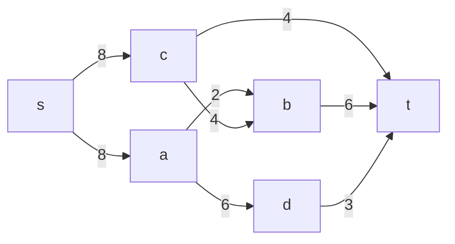
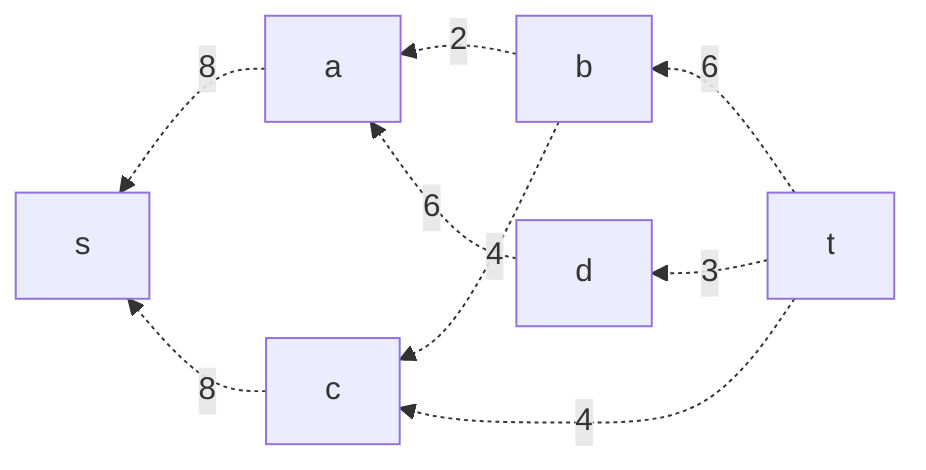
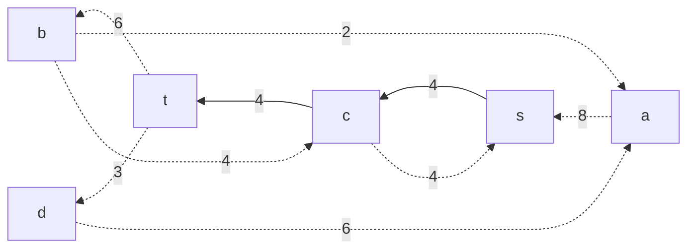
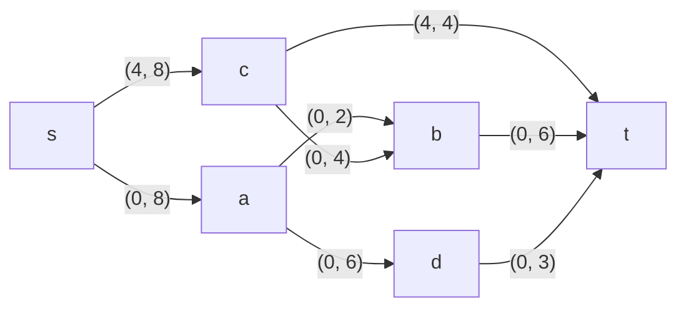
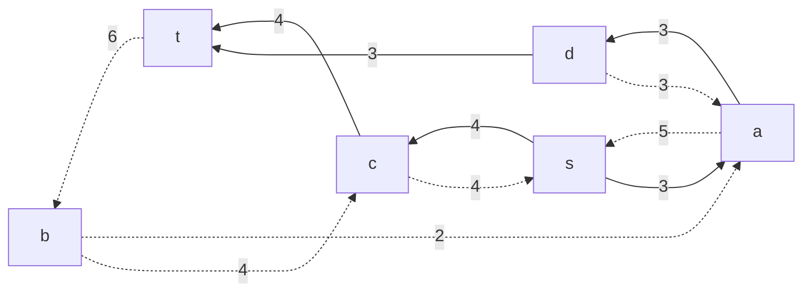
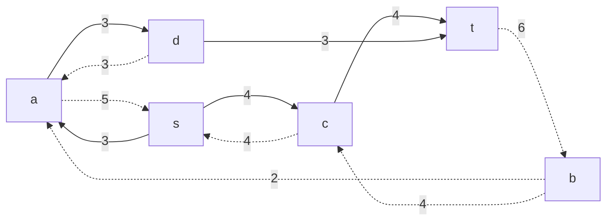
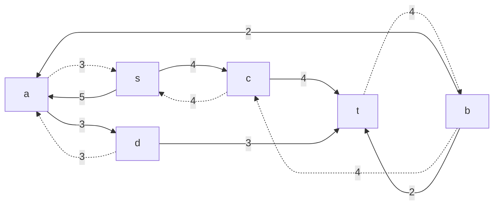
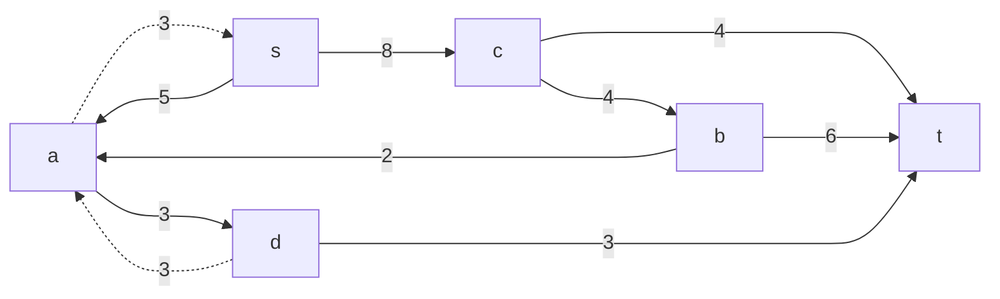

# Задание №14
# Задача о максимальном потоке.
Пропускная способность дуг сети указана в таблице.
### Вариант 6:
|          Дуги          | sa | sc | ab | ad | cb | ct | bt | dt |
|:----------------------:|:--:|:--:|:--:|:--:|:--:|:--:|:--:|:--:|
| Пропускная способность | 8  | 8  | 2  | 6  | 4  | 4  | 6  | 3  |
### 1. Построим сеть с источником **s**, стоком **t** b указанными пропускными способностями дуг.

Построим остаточную сеть. Так как изначально поток в сети не задан, все дуги сети являются пустыми (локальный поток равен нулю), соответственно в остаточную сеть необходимо вынести обратную дугу с весом равным пропускной способности. 

### 2. Проведем поиск увеличивающего пути в остаточной сети
В остаточной сети найден увеличивающий путь t -> c -> s. Минимальный вес дуг на этом пути равен 4.
Уменьшим вес дуг на найденном пути, дуги для которых вес стал нулевым удалим из остаточной сети.

Скорректируем соответствующим образом локальные потоки в исходной сети. Первым числом будем указывать локальный поток, вторым пропускную способность дуги. 

### 3. Продолжим поиск увеличивающего пути в остаточной сети

В остаточной сети найден увеличивающий путь t -> d -> a -> s. Минимальный вес дуг на этом пути равен 3.
Уменьшим вес дуг на найденном пути, дуги для которых вес стал нулевым удалим из остаточной сети.

Скорректируем соответствующим образом локальные потоки в исходной сети.

### 4. Продолжим поиск увеличивающего пути в остаточной сети

В остаточной сети найден увеличивающий путь t -> b -> a -> s. Минимальный вес дуг на этом пути равен 2.
Уменьшим вес дуг на найденном пути, дуги для которых вес стал нулевым удалим из остаточной сети.

Скорректируем соответствующим образом локальные потоки в исходной сети.

### 5. Продолжим поиск увеличивающего пути в остаточной сети

В остаточной сети найден увеличивающий путь t -> b -> c -> s. Минимальный вес дуг на этом пути равен 4.
Уменьшим вес дуг на найденном пути, дуги для которых вес стал нулевым удалим из остаточной сети.

Скорректируем соответствующим образом локальные потоки в исходной сети.

### 6. Продолжим поиск увеличивающего пути в остаточной сети
В остаточной сети не найдено увеличивающих путей, следовательно, алгоритм завершил работу и найденный поток величиной 13 является максимальным для данной сети.
### 7. Проверим значение максимального потока перебором всех разрезов сети.
Разрез сети - разбиение множества вершин на два подмножества V1 и V2, где во множество V1 входит источник, а в V2 входит сток.
Пропускная способность разреза - сумма пропускной способности дуг, начинающихся в вершинах из множества V1 и оканчивающихся в вершинах из V2.
Для сети из _n_ вершин существует 2n - 2 различных разрезов, так как две вершины из множества (источник и сток) "зафиксированы" в V1 и V2, остальные вершины можно различными способами распределять между множествами V1 и V2.
Для сети из 6 вершин нужно найти 26 - 2 = 24 = 16 разрезов. 
| № | V1                   | V2 | Пропускная способность разреза |
|---|:--------------------------------|:--------------|:------------------------------:|
| 1 | s                               | a, b, c, d, t |           8 + 8 = 16           |
| 2 | s, a                            | b, c, d, t    |         8 + 2 + 6 = 16         |
| 3 | s, b                            | a, c, d, t    |         8 + 8 + 6 + 6 = 28     |
| 4 | s, c                            | a, b, d, t    |         8 + 4 + 4 = 16         |
| 5 | s, d                            | a, b, c, t    |         8 + 8 + 9 = 25         |
| 6 | s, a, b                         | c, d, t       |         9 + 9 + 6 = 24         |
| 7 | s, a, c                         | b, d, t       |         6 + 4 + 6 = 16         |
| 8 | s, a, d                         | b, c, t       |         8 + 2 + 3 = 13         |
| 9 | s, b, c                         | a, d, t       |         8 + 6 + 6 = 20         |
| 10 | s, b, d                         | a, c, t       |         9 + 9 + 9 +10 = 37     |
| 11 | s, c, d                         | b, a, t       |         9 + 9 + 7 = 25         |
| 12 | s, a, b, c                      | d, t          |         6 + 6 + 7 = 19         |
| 13 | s, a, b, d                      | c, t          |         8 + 6 + 7 = 21         |
| 14 | s, b, c, d                      | a, t          |         9 + 9 + 9 + 2 = 29     |
| 15 | s, a, c, d                      | b, t          |         5 + 4 + 4 = 13         |
| 16 | s, a, b, c, d                   | t             |         4 + 6 + 3 = 13         |
Минимальная пропускная способность разреза равна 13 ( {s, a, b, c, d} / {t} ), что совпадает с найденной величиной максимального потока в сети.
### Ответ:
Максимальный поток в сети равен 13, он реализуется следующим локальными потоками:

