# 1.KLA$ Team
# Задание №15
# Задача о максимальном потоке минимальной стоимости.

## Постановка задачи
1. Дана сеть (взвешенный ориентированный граф) с источником s и стоком t.
2. Для каждой дуги определена пропускная способность и стоимость транспортировки.
3. Необходимо найти для указанной сети максимальный поток минимальной стоимости. 

## Решение

Пропускная способность дуг сети и стоимость транспортировки указана в таблице.

### Вариант 7:

| Дуги                      | sa | sc | ab | ad | ac | cd | bd | dt |
|:--------------------------|:--:|:--:|:--:|:--:|:--:|:--:|:--:|:--:|
| Пропускная способность    | 10 | 10 | 6  | 6  | 6  | 12 | 6  | 12 |
| Стоимость транспортировки | 1  | 1  | 1  | 3  | 1  | 5  | 1  | 1  |

### 1. Построим сеть с источником **s**, стоком **t** и указанными пропускными способностями дуг для поиска максимального потока.

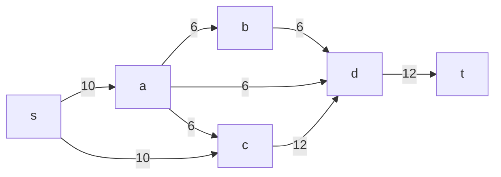
Укажем начальный поток величиной 6 **s -> a -> c -> d -> t**. Построим соответствующую остаточную сеть.

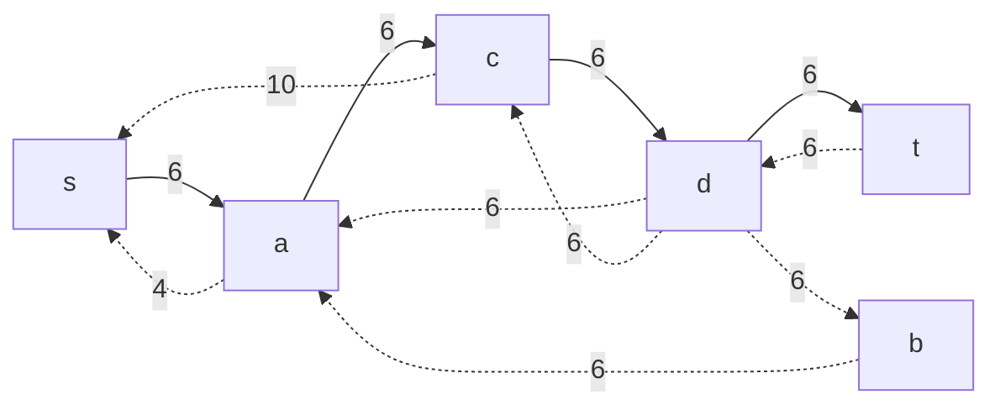

### 2. Проведем поиск увеличивающего пути в остаточной сети
В остаточной сети найден увеличивающий путь t -> d -> c -> s. Минимальный вес дуг на этом пути равен 6.

Уменьшим вес дуг на найденном пути, дуги для которых вес стал нулевым удалим из остаточной сети.

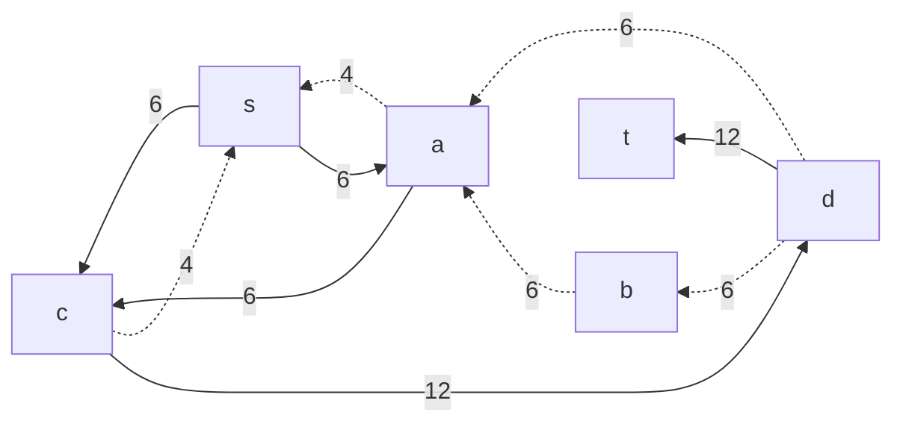

### 3. Продолжим поиск увеличивающего пути в остаточной сети

В остаточной сети не найдено увеличивающих путей, следовательно, алгоритм завершил работу и найденный поток величиной 12 является максимальным для данной сети.

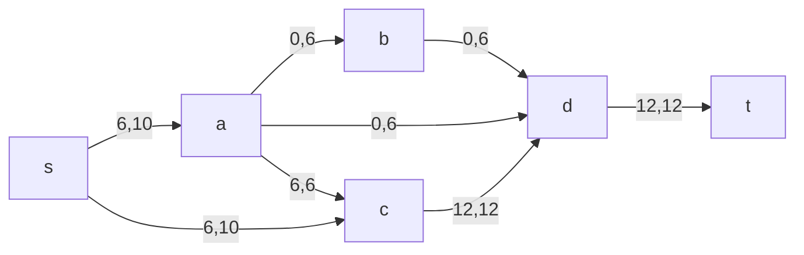

### 4. Рассчитаем стоимость полученного максимального потока.

| Дуги                                          | sa | sc | ab | ad | ac | cd | bd | dt | Итого |
|:----------------------------------------------|:--:|:--:|:--:|:--:|:--:|:--:|:--:|:--:|:-----:|
| Пропускная способность p(e)                   | 10 | 10 | 6  | 6  | 6  | 12 | 6  | 12 |       |
| Локальный поток f(e)                          | 6  | 6  | 0  | 0  | 6  | 12 | 0  | 12 |       |
| Стоимость транспортировки единицы потока c(e) | 1  | 1  | 1  | 3  | 1  | 5  | 1  | 1  |       |
| Суммарная стоимость f(e)*c(e)                 | 6  | 6  | 0  | 0  | 6  | 60 | 0  | 12 | **90**|

Стоимость полученного потока составляет 90. 

### 5. Попробуем уменьшить стоимость потока для чего построим остаточную сеть.
Для каждого ребра остаточной сети укажем стоимость транспортировки единицы потока.

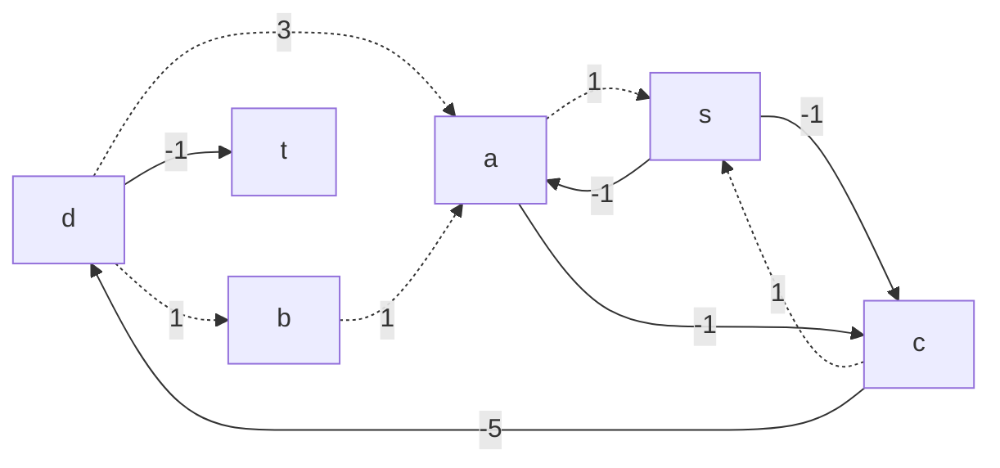

В остаточной сети найден ориентированный цикл отрицательной стоимости d -> b -> a -> c ->  d ( 1 + 1 - 1 - 5  = -4). 

Найдем минимальный вес ребра в указанном цикле, изображенном **в остаточной сети с указанием величины потока**.  

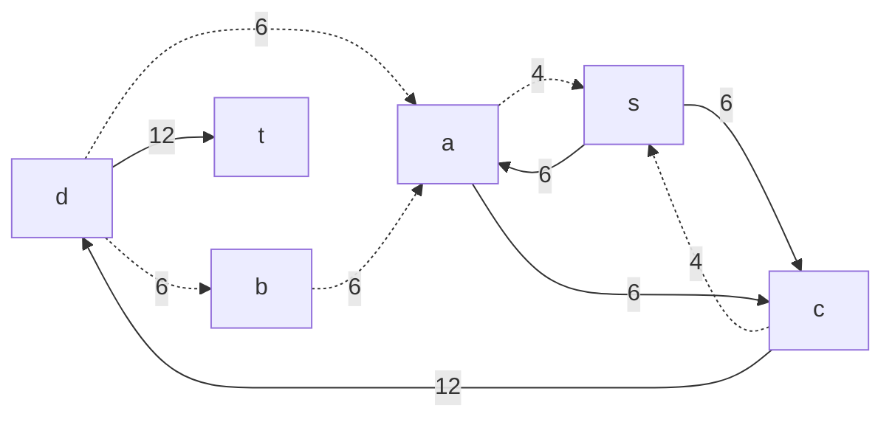

Минимальный вес ребра в цикле 6 - это неиспользованный резерв ребра d -> b и b -> a.

Удалим найденный цикл - уменьшим на 6 вес всех ребер, входящих в цикл.

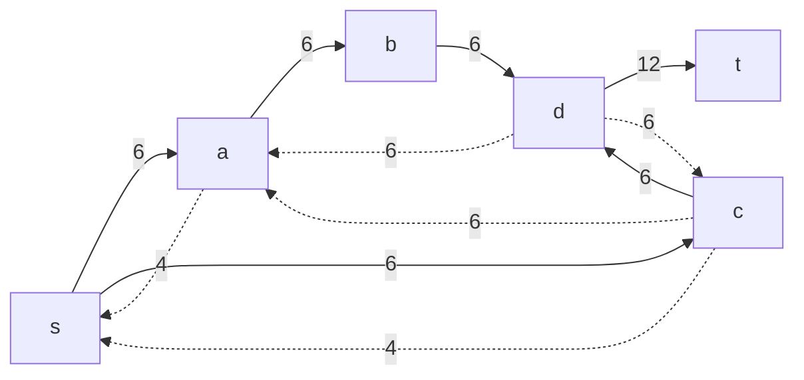

### 6. Проведем повторный поиск цикла отрицательной стоимости в остаточной сети.
Скорректируем остаточную сеть с указанием стоимости транспортировки единицы потока.

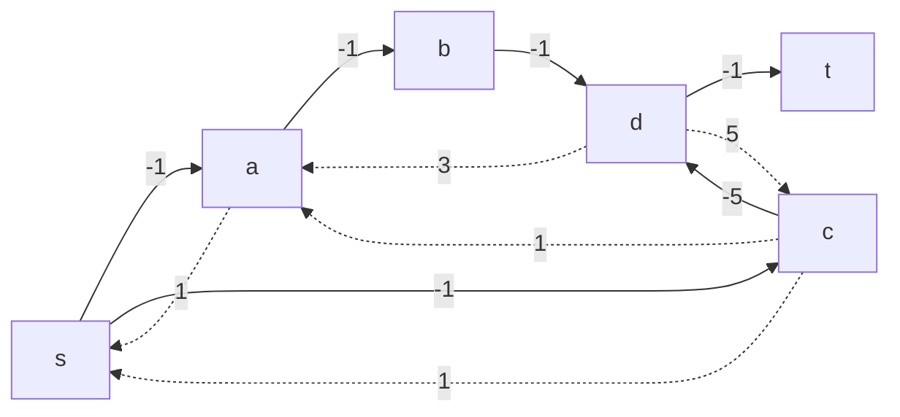

В остаточной сети найден ориентированный цикл отрицательной стоимости s -> c -> d -> a -> s (- 1 - 5 + 3 - 1 = -4). 

Найдем минимальный вес ребра в указанном цикле, изображенном **в остаточной сети с указанием величины потока**.  

Минимальный вес ребра в цикле 4 - это неиспользованный резерв ребер a -> s.

Удалим найденный цикл - уменьшим на 4 вес всех ребер, входящих в цикл.

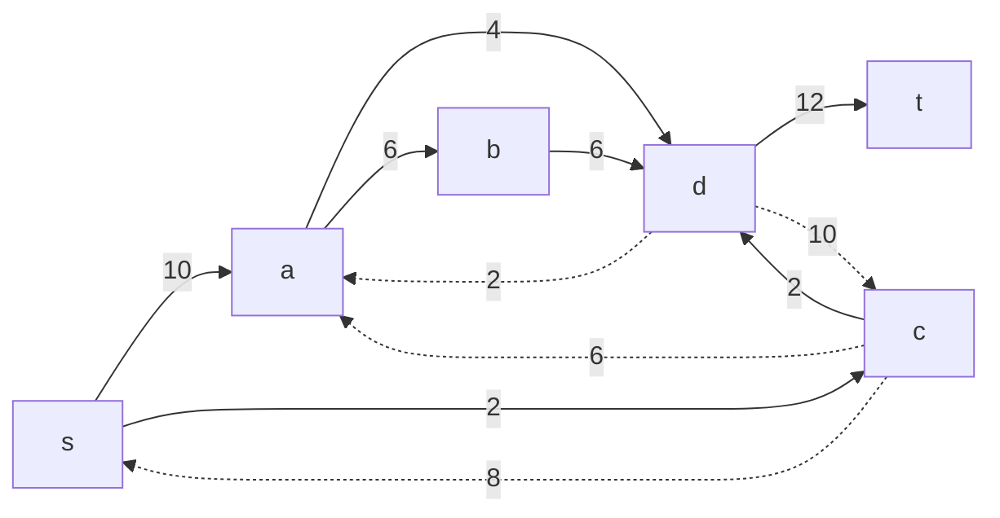

### 7. Проведем повторный поиск цикла отрицательной стоимости в остаточной сети.
Скорректируем остаточную сеть с указанием стоимости транспортировки единицы потока.

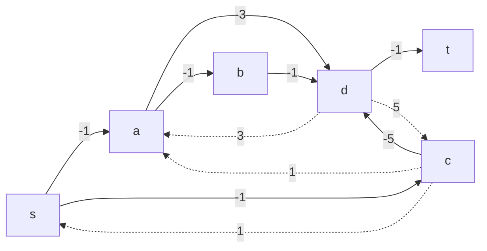
В остаточной сети отсутствуют циклы отрицательной стоимости, следовательно, стоимость потока минимальна.

### 8. Рассчитаем стоимость полученного максимального потока.

Получившаяся сеть:

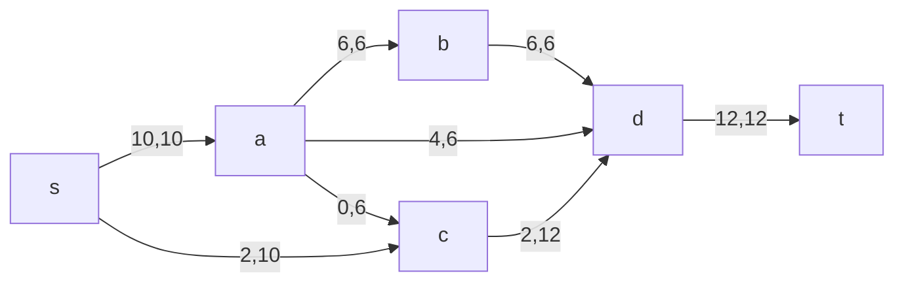
Расчет стоимости:

| Дуги                                          | sa | sc | ab | ad | ac | cd | bd | dt | Итого |
|:----------------------------------------------|:--:|:--:|:--:|:--:|:--:|:--:|:--:|:--:|:-----:|
| Пропускная способность p(e)                   | 10 | 10 | 6  | 6  | 6  | 12 | 6  | 12 |       |
| Локальный поток f(e)                          | 10 | 2  | 6  | 4  | 0  | 2  | 6  | 12 |       |
| Стоимость транспортировки единицы потока c(e) | 1  | 1  | 1  | 3  | 1  | 5  | 1  | 1  |       |
| Суммарная стоимость f(e)*c(e)                 | 10 | 2  | 6  | 12 | 0  | 10 | 6  | 12 | **58**|

Стоимость полученного потока составляет 58. 

### Ответ:
Максимальный поток в сети равен 12, минимальная стоимость потока 58, она реализуется следующим локальными потоками:

