### Задачи:
1. Построить сеть с указанием пропускной способности дуг.
2. Построить остаточную сеть.
3. Определить максимальный поток методом поиска увеличивающих путей в остаточной сети.
4. инимизировать стоимость максимального потока посредством поиска циклов отрицательной стоимости.
5. Оформить решение задачи по шагам с подробными комментариями, таблицами и диаграммами.
В ответе указать максимальную величину потока, минимальную стоимость и сеть с указанием соответствующих локальных потоков.

### Вариант 5: 

| Дуги                      | sa | sb | sc | ba | bc | cd | ac | ad | dt |
|:--------------------------|:--:|:--:|:--:|:--:|:--:|:--:|:--:|:--:|:--:|
| Пропускная способность    | 6  | 6  | 6  | 6  | 5  | 10 | 5  | 8  | 12 |
| Стоимость транспортировки | 1  | 1  | 3  | 1  | 1  | 1  | 3  | 4  | 1  |

### 1. Построим сеть с источником **s**, стоком **t** для поиска максимального потока на основе данных из таблицы:

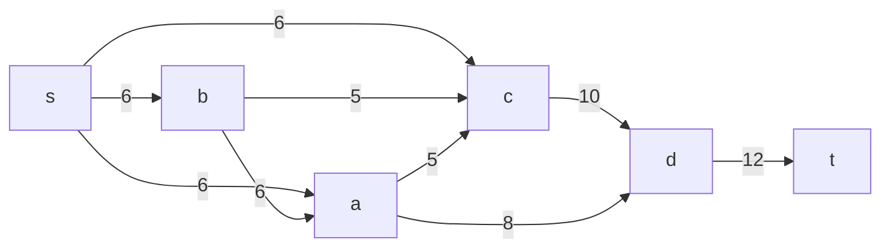

#### 1.1 Построим остаточную сеть, т.к. локальный поток равен нулю:

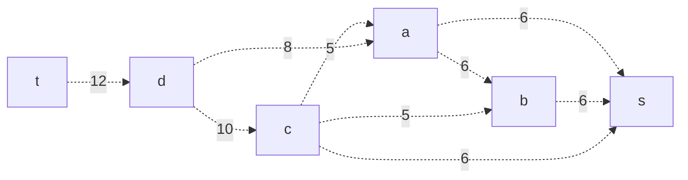

### 2. Найдем увеличивающий путь в остаточной сети:
Путь найден: t -> d -> a -> s. Минимальный вес дуги: min(12, 8, 6) = 6. 
Уменьшим вес дуг и удалим нулевые:

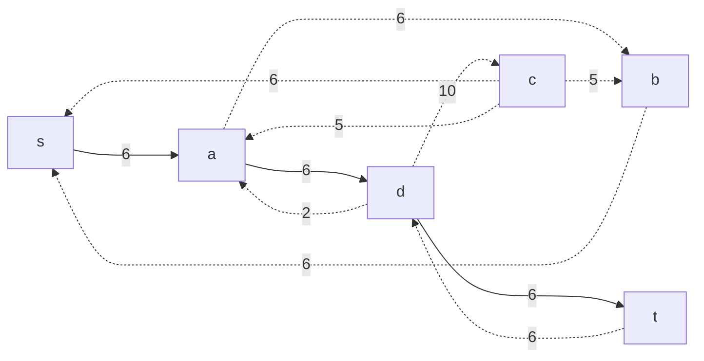

### 3. Продолжим поиск увеличивающего пути в остаточной сети:
Путь найден: t -> d -> a -> b -> s. Минимальный вес дуги: min(6, 2, 6, 6) = 2. 
Уменьшим вес дуг и удалим нулевые дуги:

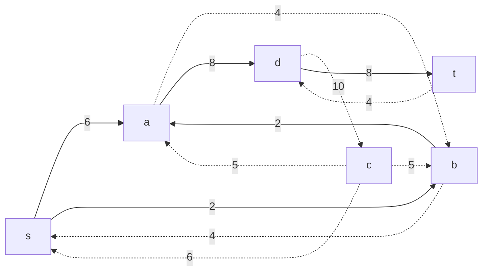

### 4. Продолжим поиск увеличивающего пути в остаточной сети:
Путь найден: t -> d -> c -> s. Минимальный вес дуги: min(4, 10, 6) = 4. 
Уменьшим вес дуг и удалим нулевые дуги:

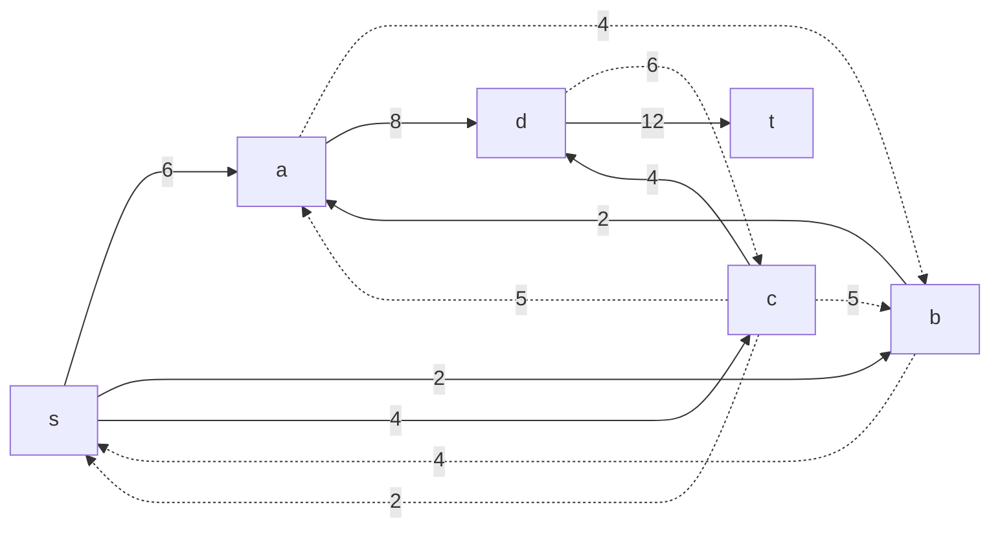

### 5. Продолжим поиск увеличивающего пути в остаточной сети:
В остаточной сети больше нет увеличивающих путей, т.к. сток не имеет резерва, следовательно алгоритм завершает работу.
Скорректируем локальные потоки: 

#### Максимальный поток в сети равен 12

### 6. Рассчитаем стоимость полученного максимального потока.

| Дуги                                          | sa | sb | sc | ba | bc | cd | ac | ad | dt | Итого  |
|:----------------------------------------------|:--:|:--:|:--:|:--:|:--:|:--:|:--:|:--:|:--:|:------:|
| Пропускная способность p(e)                   | 6  | 6  | 6  | 6  | 5  | 10 | 5  | 8  | 12 |        |
| Локальный поток f(e)                          | 6  | 2  | 4  | 2  | 0  | 4  | 0  | 8  | 12 |        |
| Стоимость транспортировки единицы потока c(e) | 1  | 1  | 3  | 1  | 1  | 1  | 3  | 4  | 1  |        |
| Суммарная стоимость f(e)*c(e)                 | 6  | 2  | 12 | 2  | 0  | 4  | 0  | 32 | 12 | **70** |

### 7. Попытаемся уменьшить стоимость потока
Для этого построим остаточную сеть и для каждого ребра укажем стоимость транспортировки единицы потока

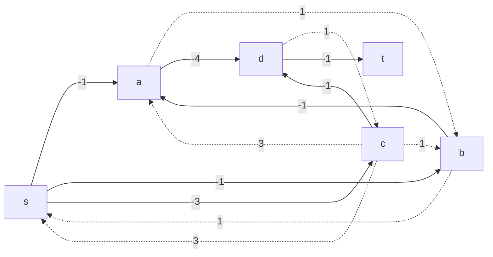
### 7.1 В остаточной сети найдем цикл отрицательной стоимости
Цикл найден: d -> c -> s -> a -> d (1 + 3 - 1 - 4 = -1) 

### 7.2 Найдем минимальный вес ребра в цикле, изображенном в остаточной сети с указанием величины потока:

Минимальный вес ребра в цикле: 2 (резерв ребра sc)

### 7.3 Удалим найденный цикл методом уменьшения веса ребер на 2, входящих в цикл:

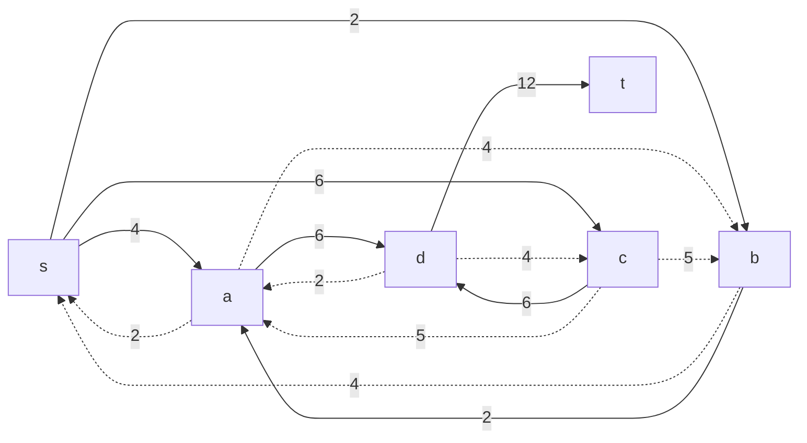

### 8. Проведем повторный поиск цикла отрицательной стоимости
Также скорректируем остаточную сеть с указанием стоимости транспортировки единицы потока

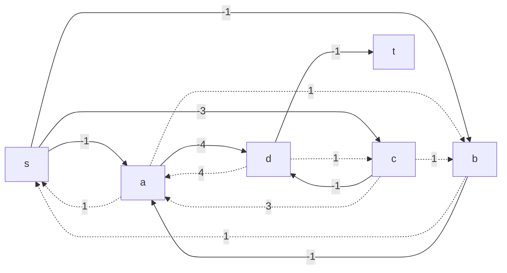

### 8.1 В остаточной сети найдем цикл отрицательной стоимости
Цикл найден: s -> b -> a -> s (-1 - 1 + 1 = -1) 

### 8.2 Найдем минимальный вес ребра в цикле, изображенном в остаточной сети с указанием величины потока:

Минимальный вес ребра в цикле: 2 

### 8.3 Удалим найденный цикл методом уменьшения веса ребер на 2, входящих в цикл:

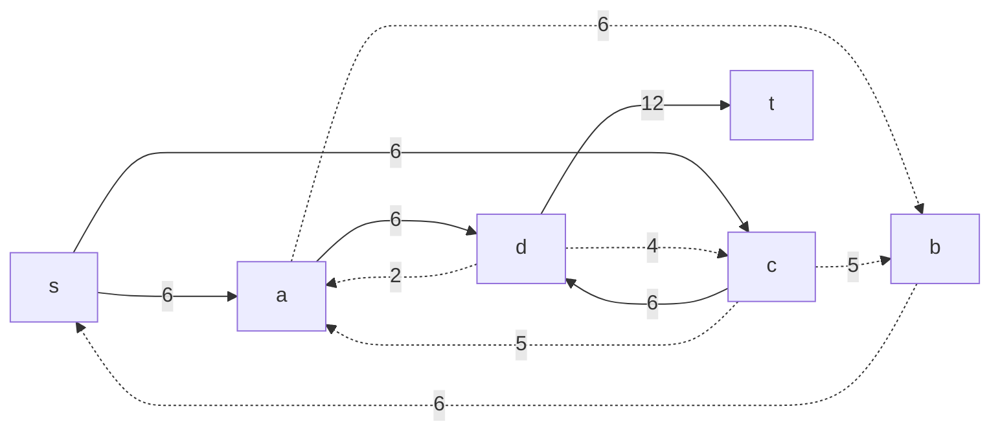

### 9. Проведем повторный поиск цикла отрицательной стоимости
Также скорректируем остаточную сеть, укажем стоимость транспортировки единицы потока

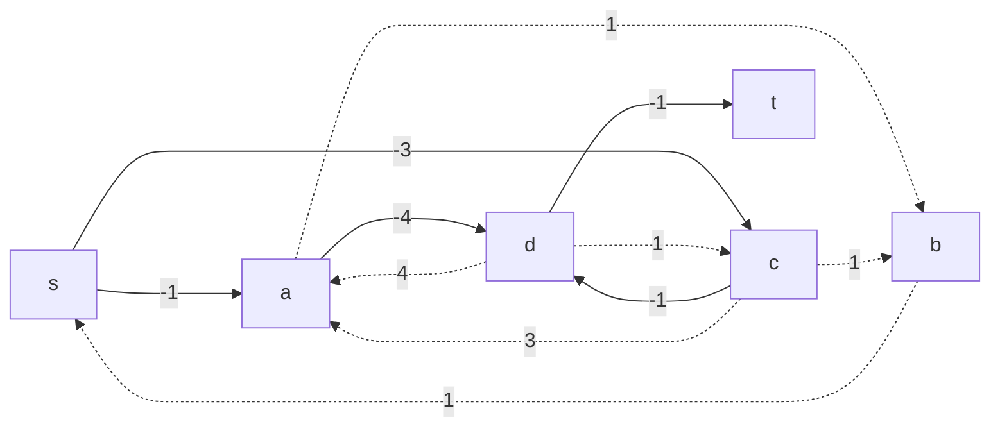

### 9.1 В остаточной сети найдем цикл отрицательной стоимости
Цикл найден: s -> c -> b -> s (-3 + 1 + 1 = -1) 

### 9.2 Найдем минимальный вес ребра в цикле, изображенном в остаточной сети с указанием величины потока:

Минимальный вес ребра в цикле: 5 (резерв bc) 

### 9.3 Удалим найденный цикл методом уменьшения веса ребер на 5, входящих в цикл:

### 10. Проведем повторный поиск цикла отрицательной стоимости

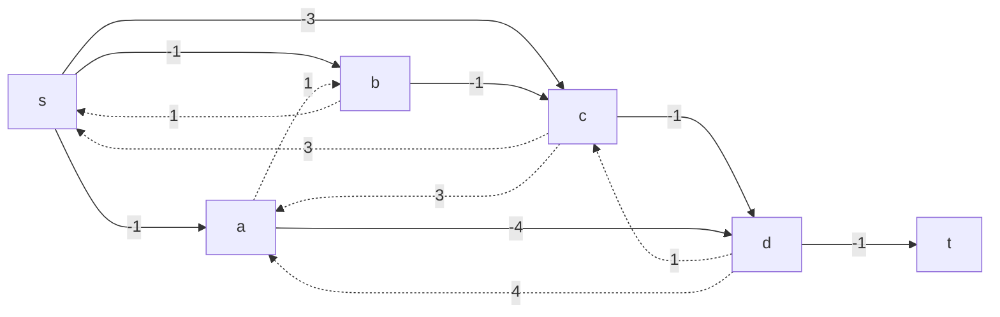

### 10.1 В остаточной сети найдем цикл отрицательной стоимости
В остаточной сети отсутствуют циклы отрицательной стоимости, а значит стоимость потока минимальна.

### 11 Вычислим стоимость полученного максимального потока

| Дуги                                          | sa | sb | sc | ba | bc | cd | ac | ad | dt | Итого  |
|:----------------------------------------------|:--:|:--:|:--:|:--:|:--:|:--:|:--:|:--:|:--:|:------:|
| Пропускная способность p(e)                   | 6  | 6  | 6  | 6  | 5  | 10 | 5  | 8  | 12 |        |
| Локальный поток f(e)                          | 6  | 5  | 1  | 0  | 5  | 6  | 0  | 6  | 12 |        |
| Стоимость транспортировки единицы потока c(e) | 1  | 1  | 3  | 1  | 1  | 1  | 3  | 4  | 1  |        |
| Суммарная стоимость f(e)*c(e)                 | 6  | 5  | 3  | 0  | 5  | 6  | 0  | 24 | 12 | **61** |

#### Получившаяся минимальная стоимость максимального потока: 61

#### ОТВЕТ: максимальный поток в сети равен 12, минимальная стоимость - 61. Реализация представлена ниже.

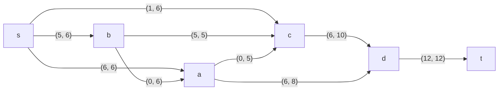
