# Задача о максимальном потоке минимальной стоимости.
Для каждого варианта представлены условия задачи, в соответствии с которыми необходимо: 
1. Построить сеть с указанием пропускной способности дуг.
2. Построить остаточную сеть.
3. Определить максимальный поток методом поиска увеличивающих путей в остаточной сети.
4. Минимизировать стоимость максимального потока посредством поиска циклов отрицательной стоимости.
5. Оформить решение задачи по шагам с подробными комментариями, таблицами и диаграммами.
6. В ответе указать максимальную величину потока, минимальную стоимость и сеть с указанием соответствующих локальных потоков.

### Вариант 9:

| Дуги                      | sa | sс | ab | ac | cb | bd | de | be | ce | et |
|:--------------------------|:--:|:--:|:--:|:--:|:--:|:--:|:--:|:--:|:--:|:--:|
| Пропускная способность    | 8  | 8  | 7  | 3  | 6  | 6  | 5  | 5  | 12 | 12 |
| Стоимость транспортировки | 1  | 1  | 2  | 1  | 1  | 2  | 2  | 5  | 7  | 1  |

### 1. Построим сеть с источником **s**, стоком **t** и указанными пропускными способностями дуг для поиска максимального потока.

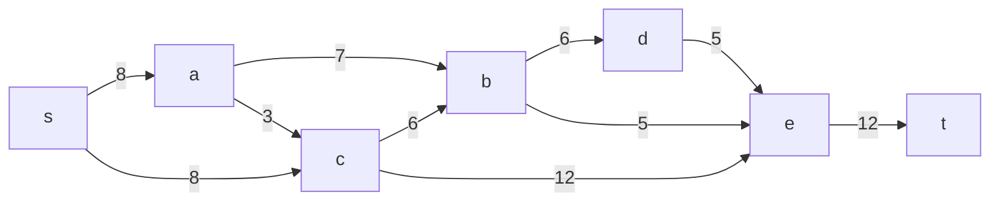
Построим остаточную сеть
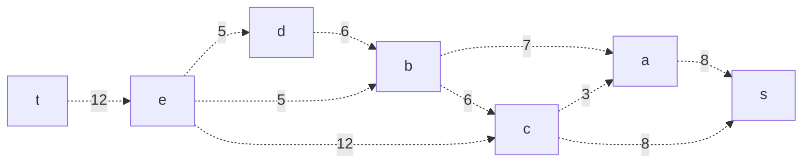
Возьмем увеличивающий путь t->e->d->b->a->s. Минимальный вес по пути составляет 5. Вычтем его из пути и составим остаточную сеть
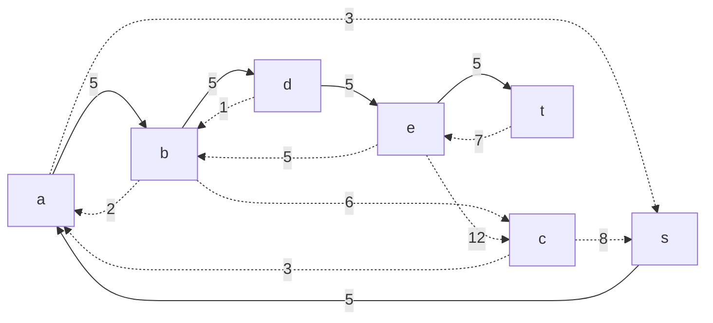
Возьмем увеличивающий путь t->e->->c->s. Минимальный вес составляет по пути 7. Вычтем его из пути и составим остаточную сеть
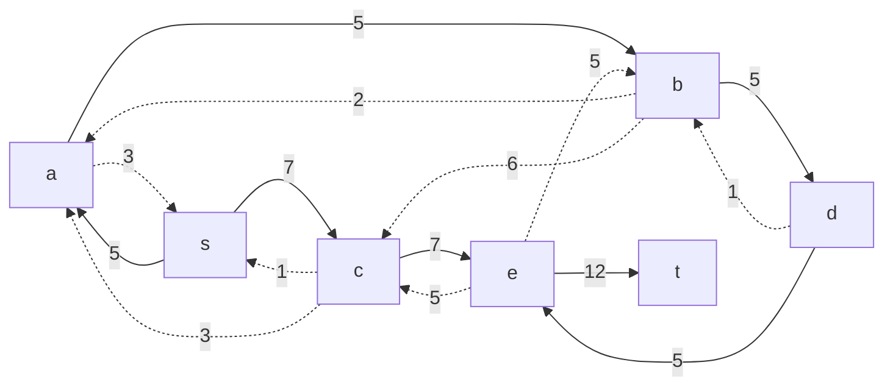
### 2. Продолжим поиск увеличивающего пути в остаточной сети

В остаточной сети не найдено увеличивающих путей, следовательно, алгоритм завершил работу и найденный поток величиной 7 является максимальным для данной сети.

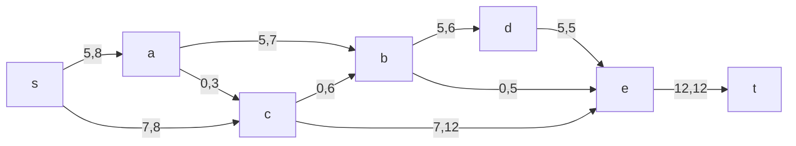

### 3. Рассчитаем стоимость полученного максимального потока.

| Дуги                                          | sa | sс | ab | ac | cb | bd | de | be | ce | et | Итого   |
|:----------------------------------------------|:--:|:--:|:--:|:--:|:--:|:--:|:--:|:--:|:--:|:--:|:-------:|
| Пропускная способность p(e)                   | 8  | 8  | 7  | 3  | 6  | 6  | 5  | 5  | 12 | 12 |         |
| Локальный поток f(e)                          | 5  | 7  | 5  | 0  | 0  | 5  | 5  | 0  | 7  | 12 |         |
| Стоимость транспортировки единицы потока c(e) | 1  | 1  | 2  | 1  | 1  | 2  | 2  | 5  | 7  | 1  |         |
| Суммарная стоимость f(e)*c(e)                 | 5  | 7  | 10 | 0  | 0  | 10 | 10 | 0  | 49 | 12 | **103** |

### 4. Попробуем уменьшить стоимость потока для чего построим остаточную сеть.
Для каждого ребра остаточной сети укажем стоимость транспортировки единицы потока.

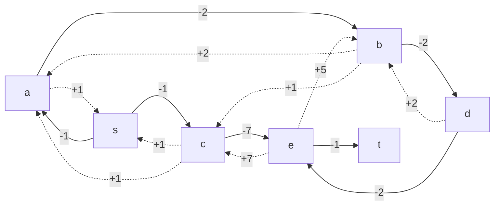
В остаточной сети найден ориентированный цикл отрицательной стоимости s -> a -> b -> c -> s (-1 -2 +1 +1 = -1). 

Найдем минимальный вес ребра в указанном цикле, изображенном **в остаточной сети с указанием величины потока**.
Минимальный вес ребра в цикле 1 - это неиспользованный резерв ребра s -> c.

Удалим найденный цикл - уменьшим на 1 вес всех ребер, входящих в цикл.

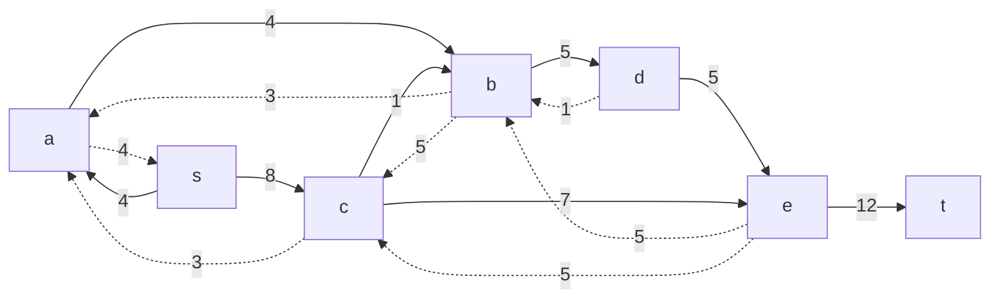
### 5. Проведем повторный поиск цикла отрицательной стоимости в остаточной сети.
Скорректируем остаточную сеть с указанием стоимости транспортировки единицы потока.
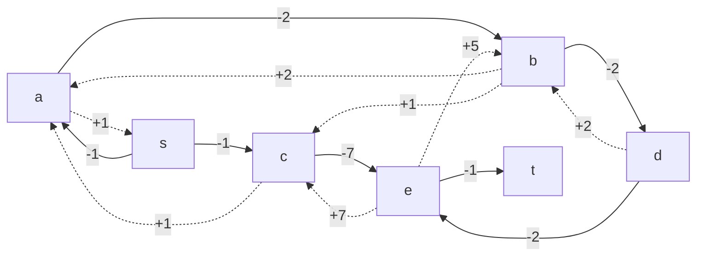

В остаточной сети найден ориентированный цикл отрицательной стоимости b -> c -> e -> b (+1 -7 +5 = -1). 

Найдем минимальный вес ребра в указанном цикле, изображенном **в остаточной сети с указанием величины потока**.  
Минимальный вес ребра в цикле 5 - это неиспользованный резерв ребра c -> b.

Удалим найденный цикл - уменьшим на 5 вес всех ребер, входящих в цикл.
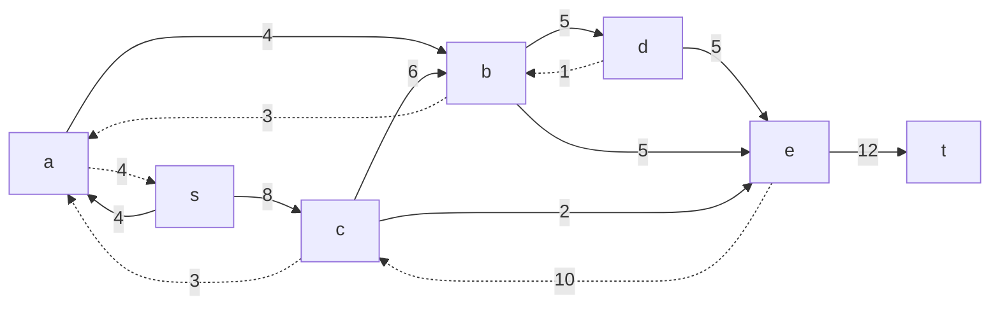
### 6. Проведем повторный поиск цикла отрицательной стоимости в остаточной сети.
Скорректируем остаточную сеть с указанием стоимости транспортировки единицы потока.
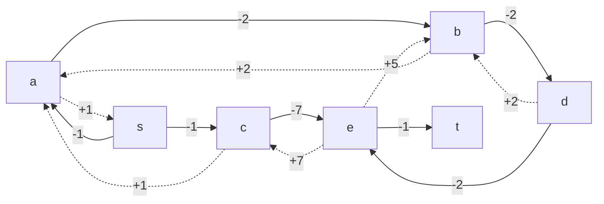

В остаточной сети отсутствуют циклы отрицательной стоимости, следовательно, стоимость потока минимальна.
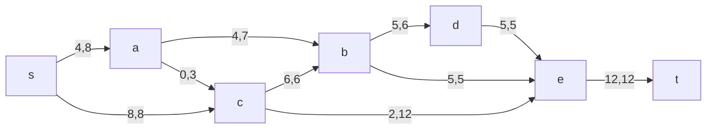

| Дуги                                          | sa | sс | ab | ac | cb | bd | de | be | ce | et | Итого   |
|:----------------------------------------------|:--:|:--:|:--:|:--:|:--:|:--:|:--:|:--:|:--:|:--:|:-------:|
| Пропускная способность p(e)                   | 8  | 8  | 7  | 3  | 6  | 6  | 5  | 5  | 12 | 12 |         |
| Локальный поток f(e)                          | 4  | 8  | 4  | 0  | 6  | 5  | 5  | 5  | 2  | 12 |         |
| Стоимость транспортировки единицы потока c(e) | 1  | 1  | 2  | 1  | 1  | 2  | 2  | 5  | 7  | 1  |         |
| Суммарная стоимость f(e)*c(e)                 | 4  | 8  | 8  | 0  | 6  | 10 | 10 | 25 | 14 | 12 | **97** |

### Ответ:
Максимальный поток в сети равен 12, минимальная стоимость потока 97, она реализуется следующими локальными потоками:

