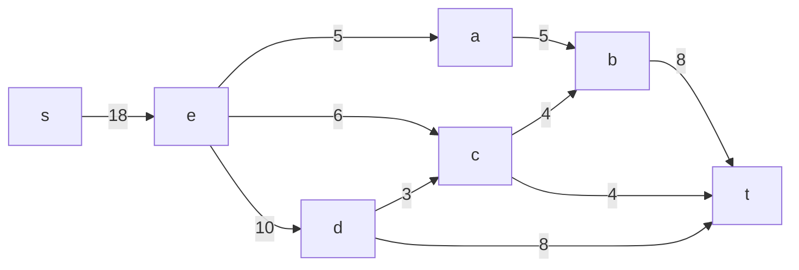
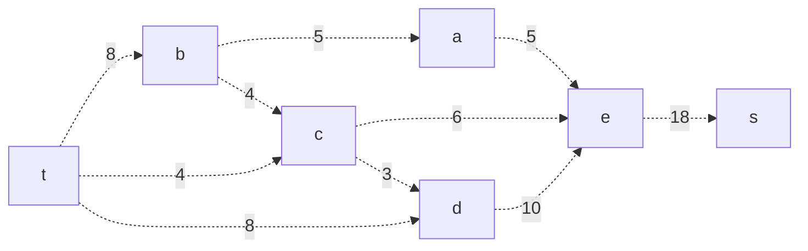
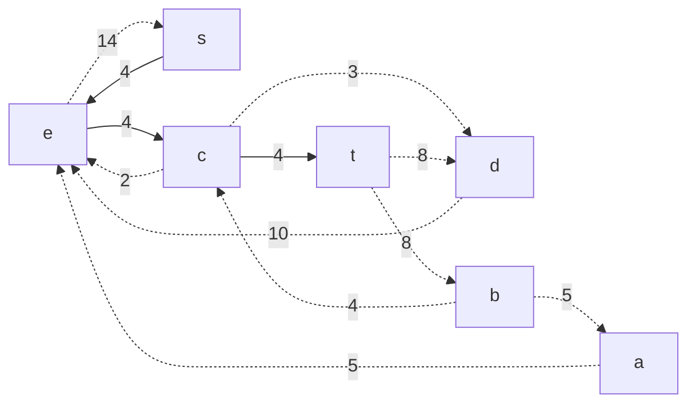
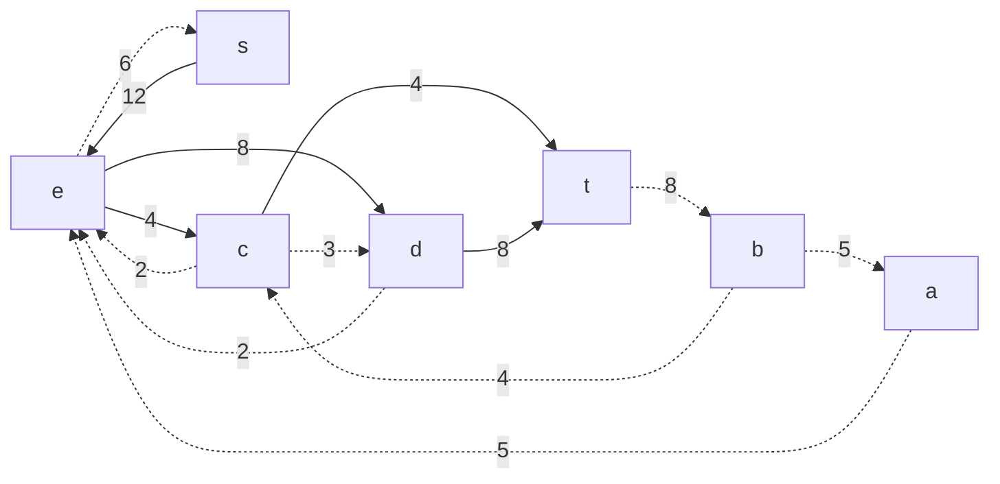
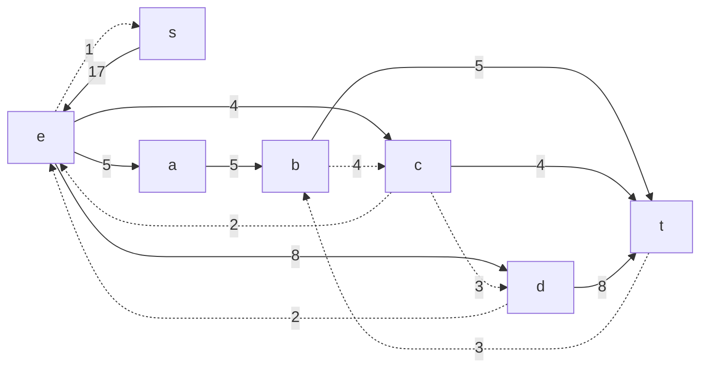
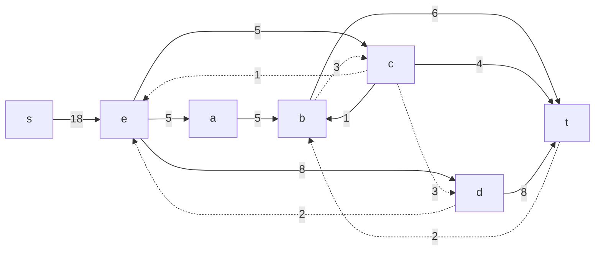
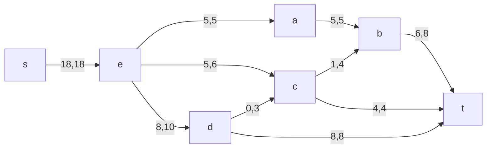
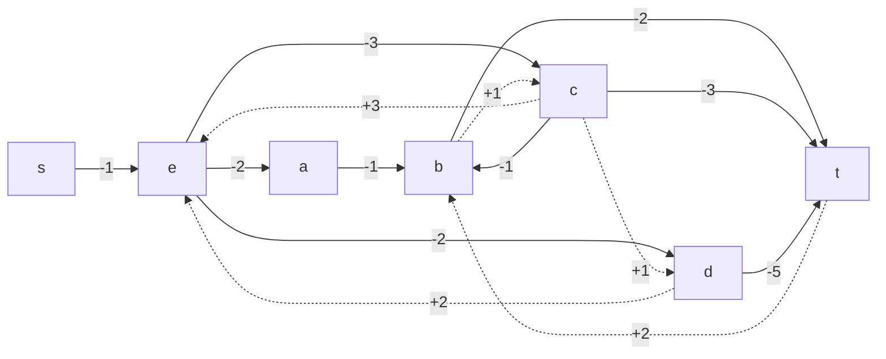
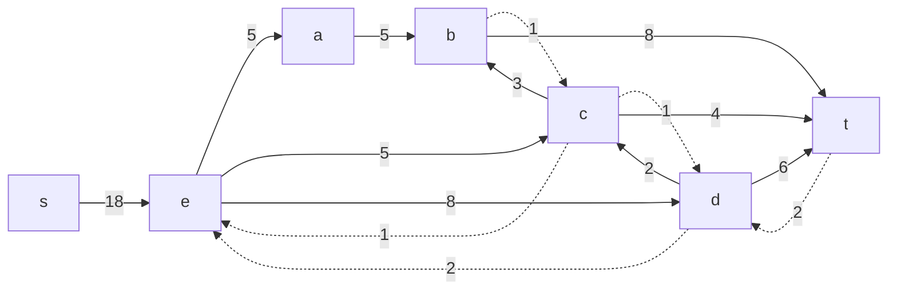
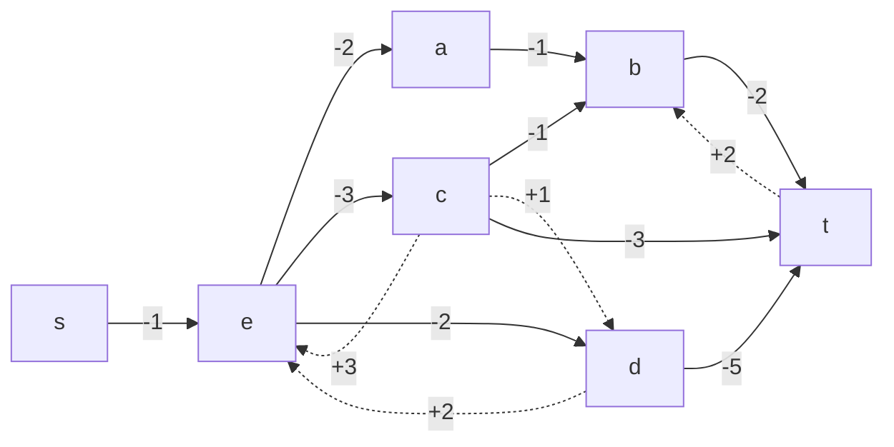

# Задание №15
# Задача о максимальном потоке минимальной стоимости.
## Постановка задачи
1. Дана сеть (взвешенный ориентированный граф) с источником s и стоком t.
2. Для каждой дуги определена пропускная способность и стоимость транспортировки.
3. Необходимо найти для указанной сети максимальный поток минимальной стоимости. 

### Вариант 4: 

| Дуги                      | se | ea | ec | ed | ab | cb | dc | bt | ct | dt |
|:--------------------------|:--:|:--:|:--:|:--:|:--:|:--:|:--:|:--:|:--:|:--:|
| Пропускная способность    | 18 | 5  | 6  | 10 | 5  | 4  | 3  | 8  | 4  | 8  |
| Стоимость транспортировки | 1  | 2  | 3  | 2  | 1  | 1  | 1  | 2  | 3  | 5  |

### 1. Построим сеть с источником **s**, стоком **t** и указанными пропускными способностями дуг для поиска максимального потока.

Построим остаточную сеть

Возьмем увеличивающий путь t->c->e->s. Минимальный вес по пути составляет 4. Вычтем его из пути и составим остаточную сеть

Возьмем увеличивающий путь t->d->e->s. Минимальный вес по пути составляет 8. Вычтем его из пути и составим остаточную сеть

Возьмем увеличивающий путь t->b->a->e->s. Минимальный вес по пути составляет 5. Вычтем его из пути и составим остаточную сеть

Возьмем увеличивающий путь t->b->c->e->s. Минимальный вес составляет по пути 1. Вычтем его из пути и составим остаточную сеть

### 2. Продолжим поиск увеличивающего пути в остаточной сети

В остаточной сети не найдено увеличивающих путей, следовательно, алгоритм завершил работу и найденный поток величиной 8 является максимальным для данной сети.

### 3. Рассчитаем стоимость полученного максимального потока.

| Дуги                                          | se | ea | ec | ed | ab | cb | dc | bt | ct | dt |  Итого  |
|:----------------------------------------------|:--:|:--:|:--:|:--:|:--:|:--:|:--:|:--:|:--:|:--:|:-------:|
| Пропускная способность p(e)                   | 18 | 5  | 6  | 10 | 5  | 4  | 3  | 8  | 4  | 8  |         |
| Локальный поток f(e)                          | 18 | 5  | 5  | 8  | 5  | 1  | 0  | 6  | 4  | 8  |         |
| Стоимость транспортировки единицы потока c(e) | 1  | 2  | 3  | 2  | 1  | 1  | 1  | 2  | 3  | 5  |         |
| Суммарная стоимость f(e)*c(e)                 | 18 | 10 | 15 | 16 | 5  | 1  | 0  | 12 | 12 | 40 | **129** |

### 4. Попробуем уменьшить стоимость потока для чего построим остаточную сеть.
Для каждого ребра остаточной сети укажем стоимость транспортировки единицы потока.

В остаточной сети найден ориентированный цикл отрицательной стоимости d -> t -> b -> c -> d (-5 +2 +1 +1 = -1). 

Найдем минимальный вес ребра в указанном цикле, изображенном **в остаточной сети с указанием величины потока**.
Минимальный вес ребра в цикле 2 - это неиспользованный резерв ребра t -> b.

Удалим найденный цикл - уменьшим на 2 вес всех ребер, входящих в цикл.

### 5. Проведем повторный поиск цикла отрицательной стоимости в остаточной сети.
Скорректируем остаточную сеть с указанием стоимости транспортировки единицы потока.

В остаточной сети отсутствуют циклы отрицательной стоимости, следовательно, стоимость потока минимальна.

| Дуги                                          | se | ea | ec | ed | ab | cb | dc | bt | ct | dt |  Итого  |
|:----------------------------------------------|:--:|:--:|:--:|:--:|:--:|:--:|:--:|:--:|:--:|:--:|:-------:|
| Пропускная способность p(e)                   | 18 | 5  | 6  | 10 | 5  | 4  | 3  | 8  | 4  | 8  |         |
| Локальный поток f(e)                          | 18 | 5  | 5  | 8  | 5  | 3  | 2  | 8  | 4  | 6  |         |
| Стоимость транспортировки единицы потока c(e) | 1  | 2  | 3  | 2  | 1  | 1  | 1  | 2  | 3  | 5  |         |
| Суммарная стоимость f(e)*c(e)                 | 18 | 10 | 15 | 16 | 5  | 3  | 2  | 16 | 12 | 30 | **127** |

### Ответ:
Максимальный поток в сети равен 18, минимальная стоимость потока 127, она реализуется следующим локальными потоками:
