### Вариант 1:

| Дуги                      | sa | sb | sc | ac | ad | ab | bd | ct | dt |
|:--------------------------|:--:|:--:|:--:|:--:|:--:|:--:|:--:|:--:|:--:|
| Пропускная способность    | 10 | 10 | 5  | 7  | 8  | 5  | 8  | 10 | 10 |
| Стоимость транспортировки | 1  | 1  | 1  | 2  | 3  | 1  | 1  | 2  | 1  |
### 1. Построим сеть с источником S, стоком t и указанными пропускными способностями дуг. Найдём максимальный поток.
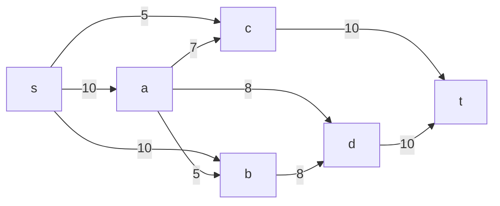
Построим остаточную сеть, так как изначальный поток равен нулю все дуги являются пустыми, соответственно в остаточную сеть необходимо внести обратные дуги с весом, который равен пропускной способности изначальной сети
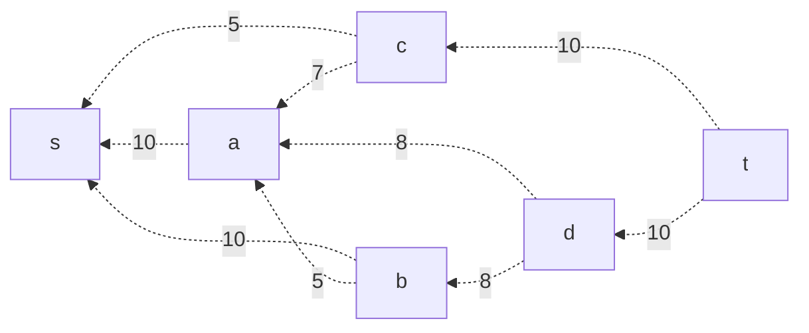
### 2. Найдём увеличивающий путь в остаточной сети.
Возьмём увеличивающий путь t -> d -> b -> a -> s. Минимальная длина дуг на этом пути равна 5. Уменьшим вес дуг на полученном пути. Дуги, который стали нулевыми из остаточной сети удаляем.
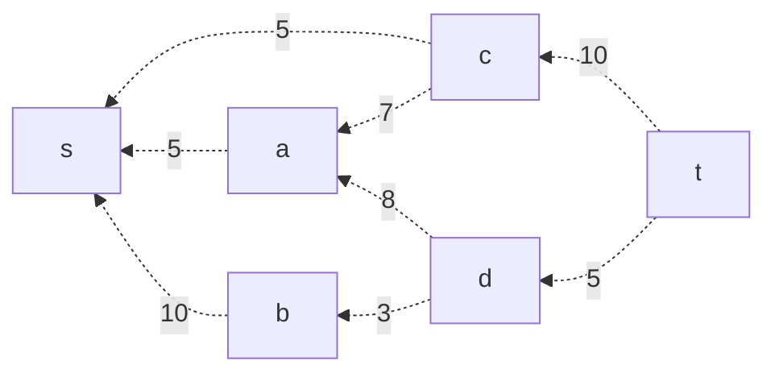
Скорректируем локальные потоки в исходной сети, первое число - локальный поток, второе - пропускная способность.
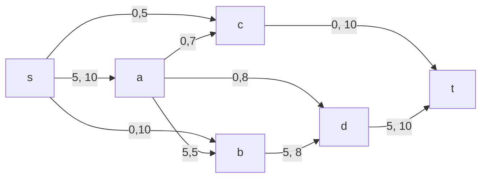
### 3. Продолжим поиск увеличивающего пути в остаточной сети.

Возьмём увеличивающий путь t -> c -> a -> s. Минимальная длина дуг на этом пути равна 5. Уменьшим вес дуг на полученном пути. Дуги, который стали нулевыми из остаточной сети удаляем.
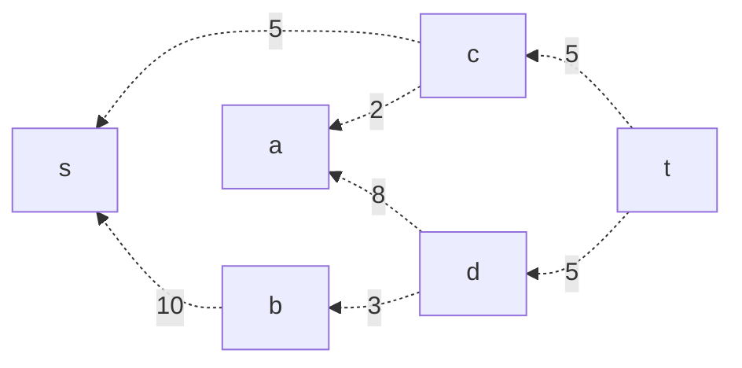
Скорректируем локальные потоки в исходной сети, первое число - локальный поток, второе - пропускная способность.
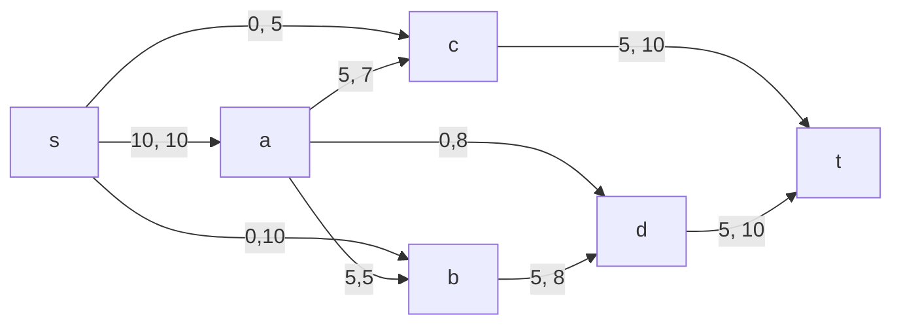
### 4. Продолжим поиск увеличивающего пути в остаточной сети.

Возьмём увеличивающий путь t -> c -> s. Минимальная длина дуг на этом пути равна 5. Уменьшим вес дуг на полученном пути. Дуги, который стали нулевыми из остаточной сети удаляем.
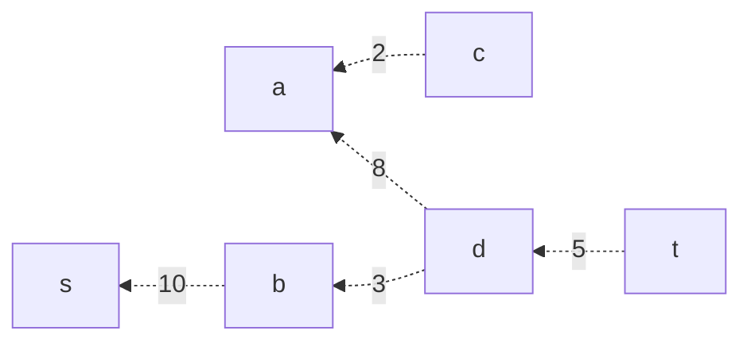
Скорректируем локальные потоки в исходной сети, первое число - локальный поток, второе - пропускная способность.
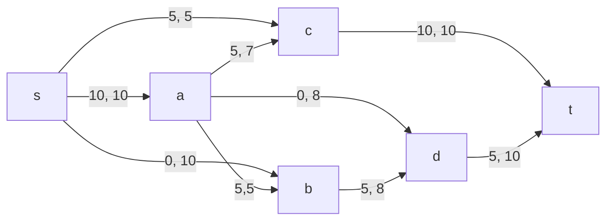
### 5. Продолжим поиск увеличивающего пути в остаточной сети.

Возьмём увеличивающий путь t -> d -> b -> s. Минимальная длина дуг на этом пути равна 3. Уменьшим вес дуг на полученном пути. Дуги, который стали нулевыми из остаточной сети удаляем.
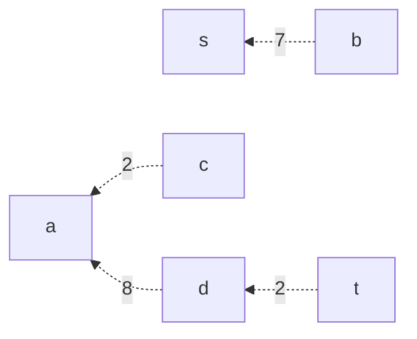
Скорректируем локальные потоки в исходной сети, первое число - локальный поток, второе - пропускная способность.

### 6. Продолжим поиск увеличивающего пути в остаточной сети.
В остаточной сети не найдено увеличивающих путей, следовательно алгоритм завершает работу, найденный поток величиной 18 является максимальным

### 7. Рассчитаем стоимость полученного максимального потока.

| Дуги                                          | sa | sb | sc | ac | ad | ab | bd | ct | dt | Итого  |
|:----------------------------------------------|:--:|:--:|:--:|:--:|:--:|:--:|:--:|:--:|:--:|:------:|
| Пропускная способность p(e)                   | 10 | 10 | 5  | 7  | 8  | 5  | 8  | 10 | 10 |        |
| Локальный поток f(e)                          | 10 | 3  | 5  | 5  | 0  | 5  | 8  | 10 | 8  |        |
| Стоимость транспортировки единицы потока c(e) | 1  | 1  | 1  | 2  | 3  | 1  | 1  | 2  | 1  |        |
| Суммарная стоимость f(e)*c(e)                 | 10 | 3  | 5  | 10 | 0  | 5  | 8  | 20 | 8  | **69** |

### 8. Попробуем уменьшить стоимость потока. Для этого используем остаточную сеть.

Указываем стоимость транспортировки одной единицы потока для каждого ребра остаточной сети.

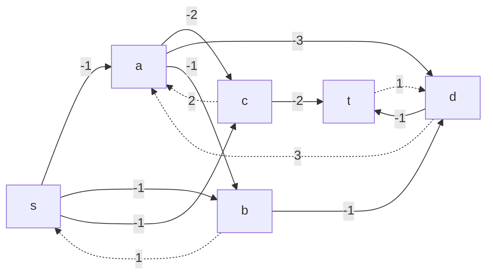
В остаточной сети найдём ориентированный цикл отрицательной стоимости. Таким циклом будет b -> s -> a ->b (-1 + 1 - 1 = -1).
Найдём минимальный вес ребра в данном цикле, изображённом в остаточной сети с указанием величины потока.

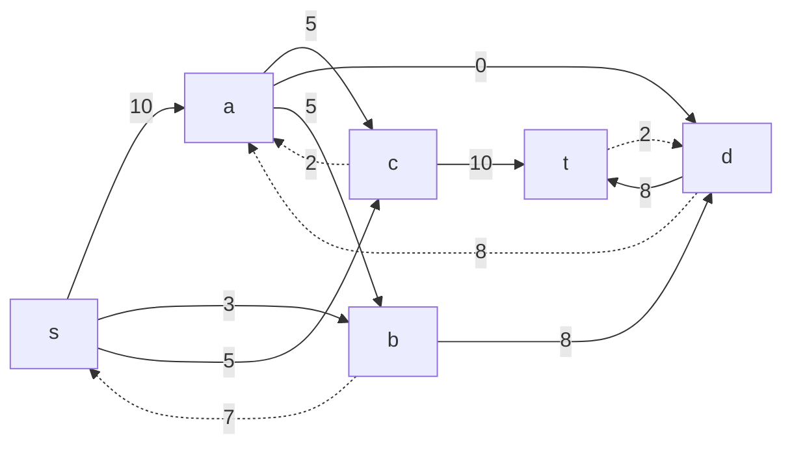

Минимальный вес ребра в цикле равен 5 - это неиспользованный резерв ребра a -> b.
Удалим найденный цикл - уменьшим на 5 вес всех рёбер, входящих в цикл.

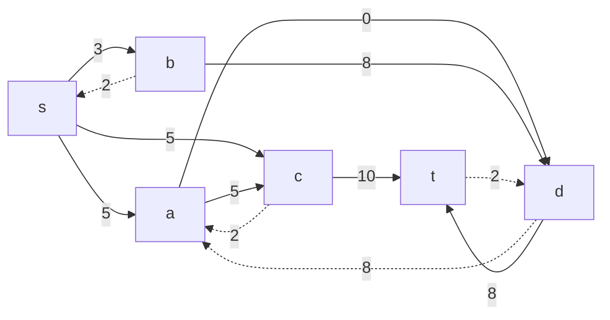
Отобразим полученную остаточную сеть с указанием стоимости перевозки единицы потока.
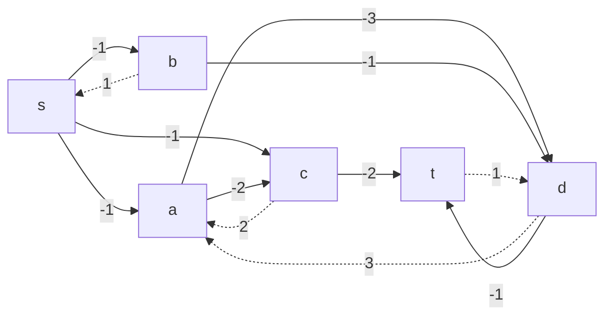
### 9. Проведём повторный поиск цикла отрицательной стоимости в остаточной сети.

В остаточной сети отсутствуют циклы отрицательной стоимости, следовательно стоимость потока минимальна.

### 10. Расчитаем стоимость полученного потока

| Дуги                                          | sa | sb | sc | ac | ad | ab | bd | ct | dt | Итого  |
|:----------------------------------------------|:--:|:--:|:--:|:--:|:--:|:--:|:--:|:--:|:--:|:------:|
| Пропускная способность p(e)                   | 10 | 10 | 5  | 7  | 8  | 5  | 8  | 10 | 10 |        |
| Локальный поток f(e)                          | 10 | 3  | 5  | 5  | 0  | 5  | 8  | 10 | 8  |        |
| Стоимость транспортировки единицы потока c(e) | 1  | 1  | 1  | 2  | 3  | 1  | 1  | 2  | 1  |        |
| Суммарная стоимость f(e)*c(e)                 | 10 | 3  | 5  | 10 | 0  | 5  | 8  | 20 | 8  | **69** |

#### Ответ:
Максимальный поток в сети равен 18, минимальная стоимость потока 69, она реализуется следующими локальными потоками:

