# Задача о максимальном потоке минимальной стоимости.
Для каждого варианта представлены условия задачи, в соответствии с которыми необходимо: 
1. Построить сеть с указанием пропускной способности дуг.
2. Построить остаточную сеть.
3. Определить максимальный поток методом поиска увеличивающих путей в остаточной сети.
4. Минимизировать стоимость максимального потока посредством поиска циклов отрицательной стоимости.
5. Оформить решение задачи по шагам с подробными комментариями, таблицами и диаграммами.
6. В ответе указать максимальную величину потока, минимальную стоимость и сеть с указанием соответствующих локальных потоков.

### Вариант 2:

Пропускная способность дуг сети и стоимость транспортировки указана в таблице.
1. Дана сеть (взвешенный ориентированный граф) с источником s и стоком t.
2. Для каждой дуги определена пропускная способность и стоимость транспортировки.
3. Необходимо найти для указанной сети максимальный поток минимальной стоимости.

| Дуги                      | sa | sb | ad | ab | ac | bc | bd | cd | dt |
|:--------------------------|:--:|:--:|:--:|:--:|:--:|:--:|:--:|:--:|:--:|
| Пропускная способность    | 10 | 10 | 6  | 6  | 5  | 8  | 5  | 10 | 18 |
| Стоимость транспортировки | 1  | 1  | 7  | 1  | 1  | 1  | 5  | 1  | 1  |

### 1. Построим сеть с источником **s**, стоком **t** и указанными пропускными способностями дуг для поиска максимального потока.

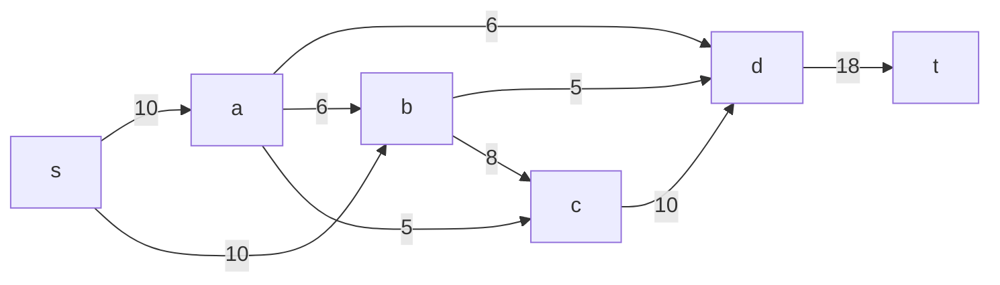
Укажем начальный поток величи   ной 6 **s -> a -> d -> t**. Построим соответствующую остаточную сеть.

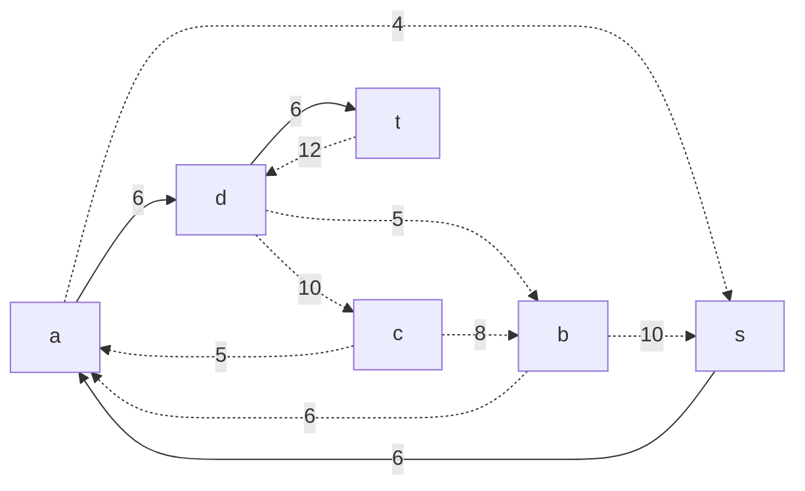

### 2. Проведем поиск увеличивающего пути в остаточной сети
В остаточной сети найден увеличивающий путь t -> d -> c -> b -> s. Минимальный вес дуг на этом пути равен 8.

Уменьшим вес дуг на найденном пути, дуги для которых вес стал нулевым удалим из остаточной сети.

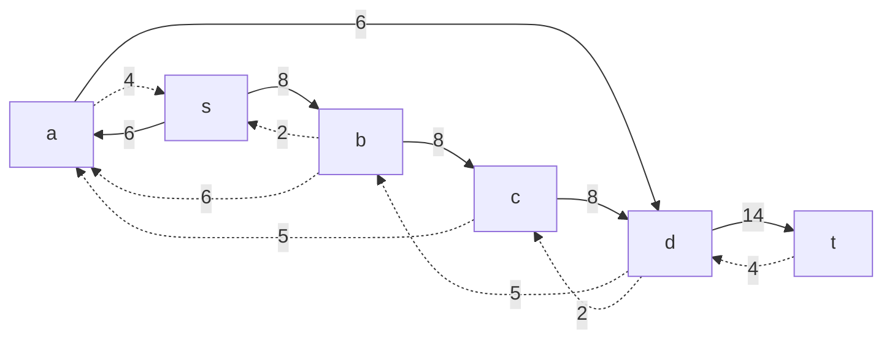

### 3. Продолжим поиск увеличивающего пути в остаточной сети
В остаточной сети найден увеличивающий путь t -> d -> b -> a -> s. Минимальный вес дуг на этом пути равен 4.

Уменьшим вес дуг на найденном пути, дуги для которых вес стал нулевым удалим из остаточной сети.

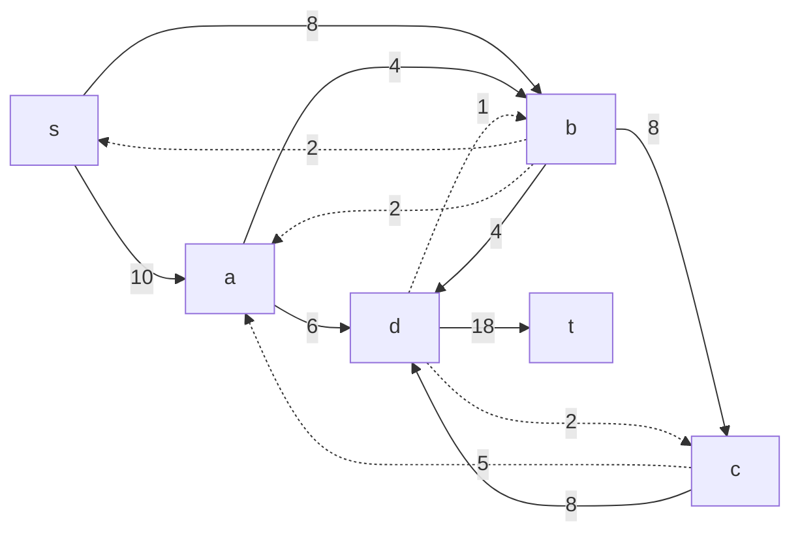

### 4. Продолжим поиск увеличивающего пути в остаточной сети

В остаточной сети не найдено увеличивающих путей, следовательно, алгоритм завершил работу и найденный поток величиной 16 является максимальным для данной сети.

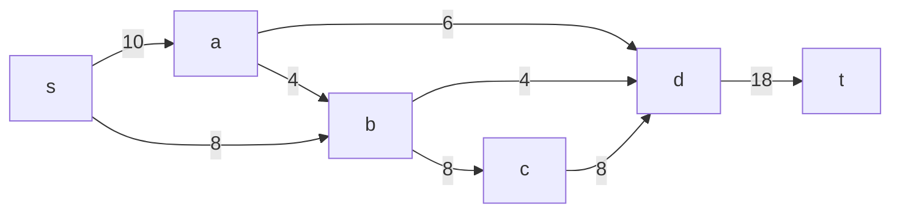

### 5. Рассчитаем стоимость полученного максимального потока.

| Дуги                                          | sa | sb | ad | ab | ac | bc | bd | cd | dt |  Итого  |
|:----------------------------------------------|:--:|:--:|:--:|:--:|:--:|:--:|:--:|:--:|:--:|:-------:|
| Пропускная способность p(e)                   | 10 | 10 | 6  | 6  | 5  | 8  | 5  | 10 | 18 |         |
| Локальный поток f(e)                          | 10 | 8  | 6  | 4  | 0  | 8  | 4  | 8  | 18 |         |
| Стоимость транспортировки единицы потока c(e) | 1  | 1  | 7  | 1  | 1  | 1  | 5  | 1  | 1  |         |
| Суммарная стоимость f(e)*c(e)                 | 10 | 8  | 42 | 4  | 0  | 8  | 20 | 8  | 18 | **118** |

Стоимость полученного потока составляет 118. 

### 6. Попробуем уменьшить стоимость потока для чего построим остаточную сеть.
Для каждого ребра остаточной сети укажем стоимость транспортировки единицы потока.

В остаточной сети найден ориентированный цикл отрицательной стоимости a -> d -> c -> a (- 7 + 1 + 1 = -5). 

Найдем минимальный вес ребра в указанном цикле, изображенном **в остаточной сети с указанием величины потока**.  

Минимальный вес ребра в цикле 2 - это неиспользованный резерв ребра c -> d.

Удалим найденный цикл - уменьшим на 2 вес всех ребер, входящих в цикл.
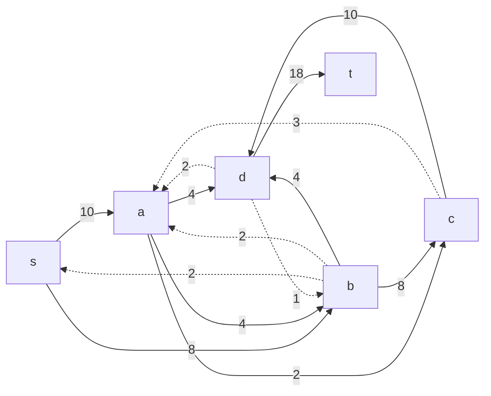
### 6. Проведем повторный поиск цикла отрицательной стоимости в остаточной сети.
Скорректируем остаточную сеть с указанием стоимости транспортировки единицы потока.

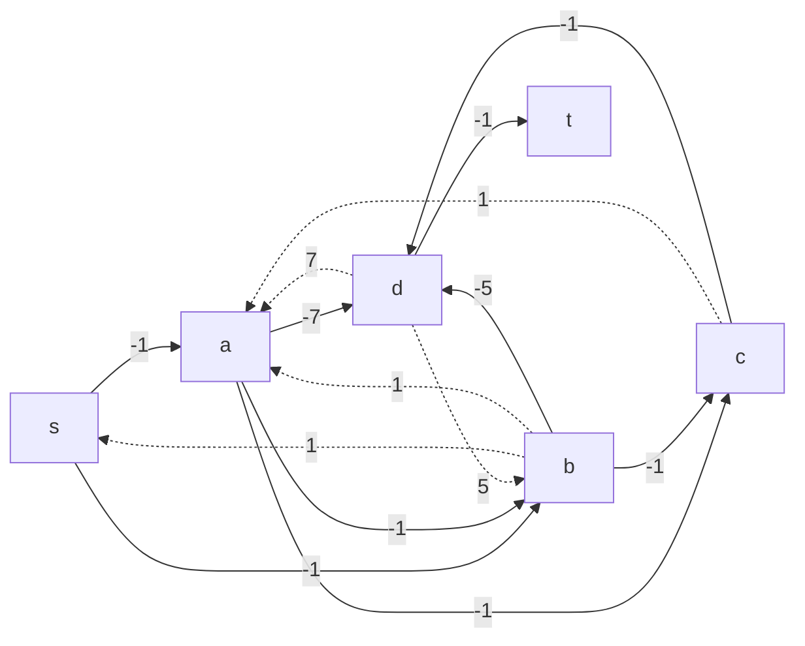

В остаточной сети найден ориентированный цикл отрицательной стоимости a -> b -> c -> a (-1-1+1 = -1). 

Минимальный вес ребра в цикле 3 - это неиспользованный резерв ребра a -> c.

Удалим найденный цикл - уменьшим на 3 вес всех ребер, входящих в цикл.
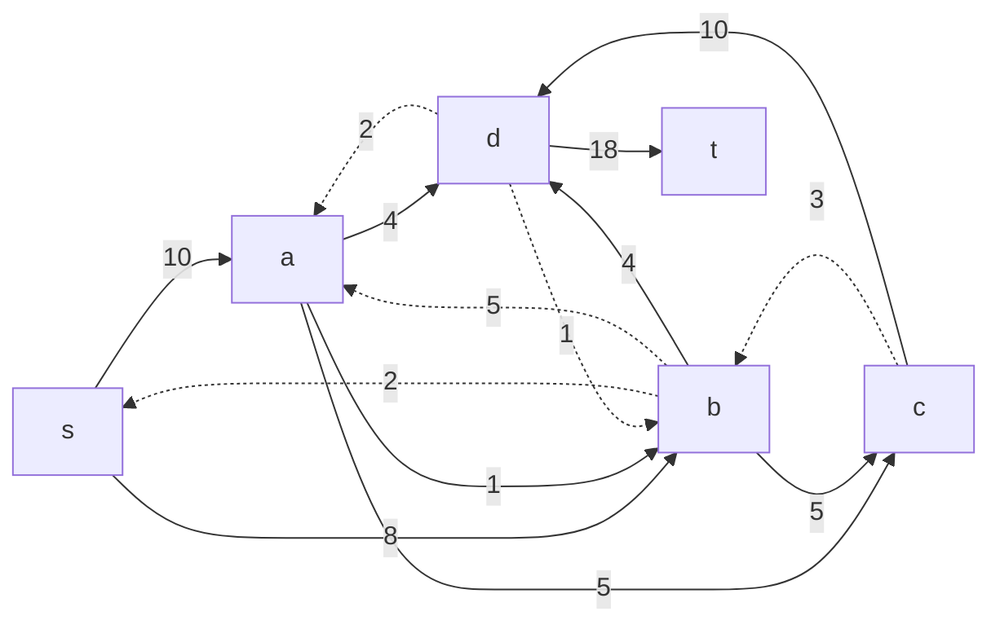

### 6. Проведем повторный поиск цикла отрицательной стоимости в остаточной сети.
Скорректируем остаточную сеть с указанием стоимости транспортировки единицы потока.

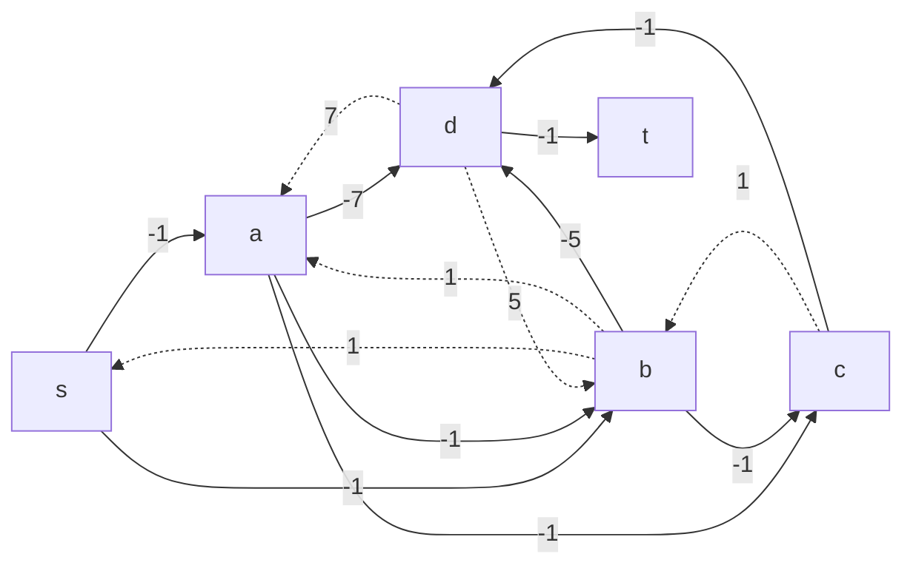

В остаточной сети найден ориентированный цикл отрицательной стоимости a -> b -> s -> a (-1+1-1 = -1). 

Минимальный вес ребра в цикле 1 - это неиспользованный резерв ребра s -> b.

Удалим найденный цикл - уменьшим на 1 вес всех ребер, входящих в цикл.
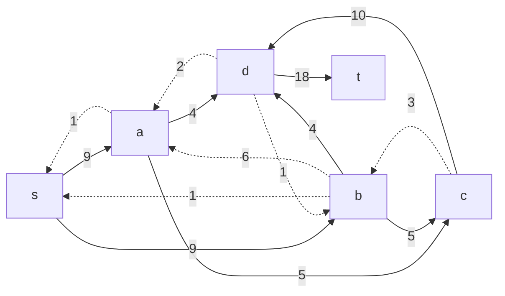

### 7. Проведем повторный поиск цикла отрицательной стоимости в остаточной сети.
Скорректируем остаточную сеть с указанием стоимости транспортировки единицы потока.

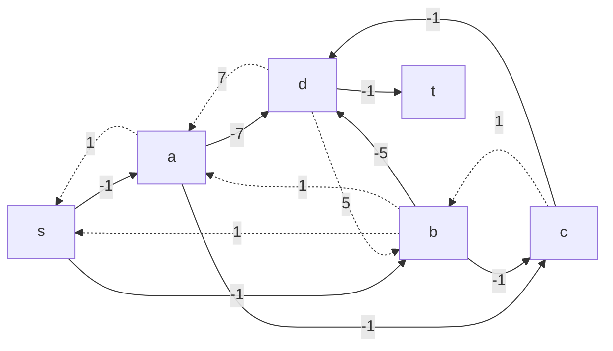

В остаточной сети отсутствуют циклы отрицательной стоимости, следовательно, стоимость потока минимальна.
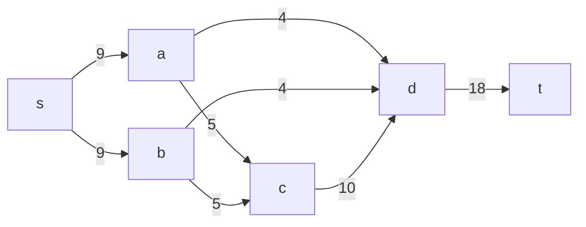

### 5. Рассчитаем стоимость полученного максимального потока.

| Дуги                                          | sa | sb | ad | ab | ac | bc | bd | cd | dt |  Итого  |
|:----------------------------------------------|:--:|:--:|:--:|:--:|:--:|:--:|:--:|:--:|:--:|:-------:|
| Пропускная способность p(e)                   | 10 | 10 | 6  | 6  | 5  | 8  | 5  | 10 | 18 |         |
| Локальный поток f(e)                          | 9  | 9  | 4  | 0  | 5  | 5  | 4  | 10 | 18 |         |
| Стоимость транспортировки единицы потока c(e) | 1  | 1  | 7  | 1  | 1  | 1  | 5  | 1  | 1  |         |
| Суммарная стоимость f(e)*c(e)                 | 9  | 9  | 28 | 0  | 5  | 5  | 20 | 10 | 18 | **104** |

Стоимость полученного потока составляет 104. 

### Ответ:
Максимальный поток в сети равен 10, минимальная стоимость потока 68, она реализуется следующим локальными потоками:
