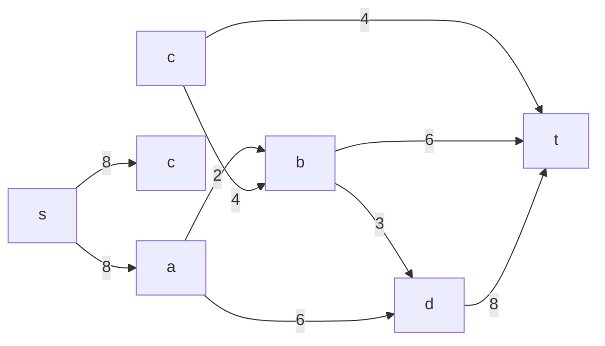
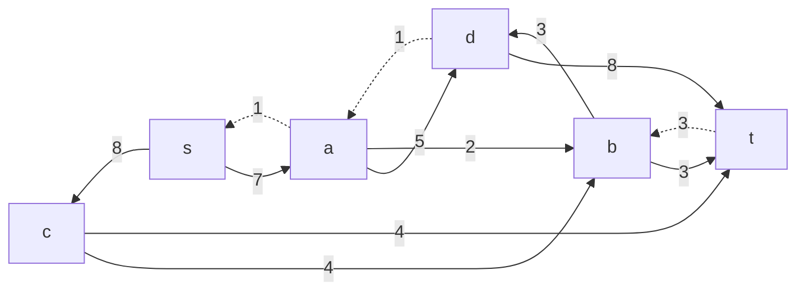
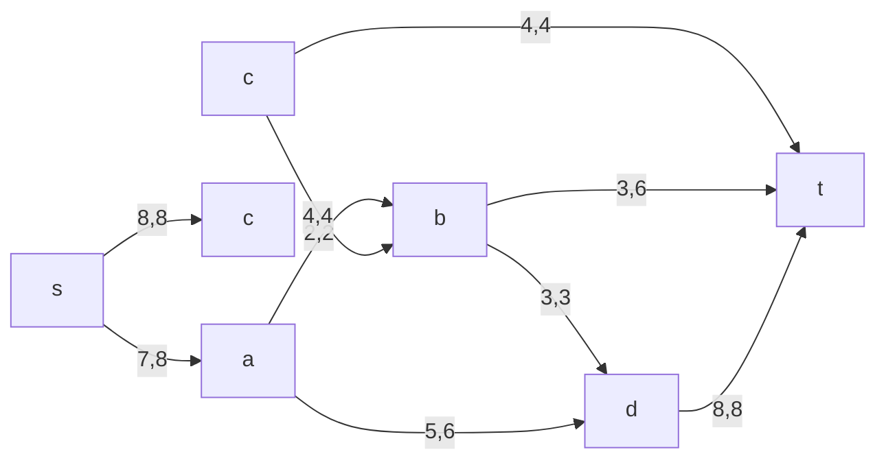
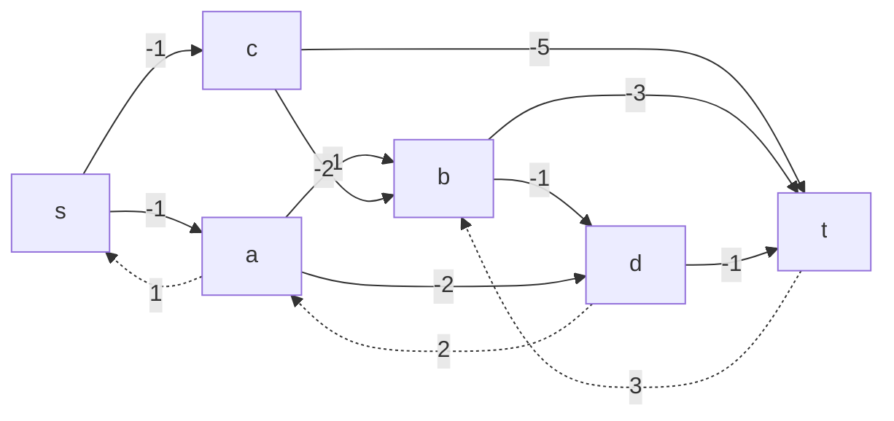
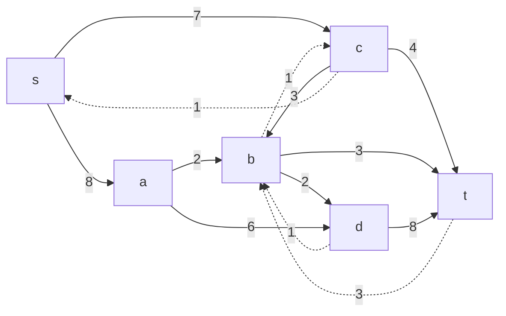
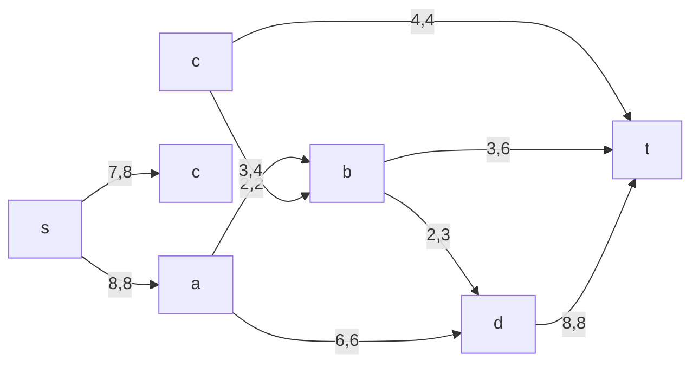

# Задание №15
## Вариант 6:

Пропускная способность дуг сети и стоимость транспортировки указана в таблице.

| Дуги | sa | sc | ab | bd | ad | cb | ct | bt | dt |
|:--------------------------|:--:|:--:|:--:|:--:|:--:|:--:|:--:|:--:|:--😐
| Пропускная способность | 8 | 8 | 2 | 3 | 6 | 4 | 4 | 6 | 8 |
| Стоимость транспортировки | 1 | 1 | 1 | 1 | 2 | 2 | 5 | 3 | 1 |

### 1. Построим сеть с источником **s**, стоком **t** и указанными пропускными способностями дуг для поиска максимального потока.

### 2. Проведем поиск увеличивающего пути в остаточной сети
В остаточной сети найден увеличивающий путь t -> b -> d -> a -> s. Минимальный вес дуг на этом пути равен 3.

Уменьшим вес дуг на найденном пути, дуги для которых вес стал нулевым удалим из остаточной сети. Повторим данную оперпцию и получим:

### 3. Продолжим поиск увеличивающего пути в остаточной сети

В остаточной сети не найдено увеличивающих путей, следовательно, алгоритм завершил работу и найденный поток величиной 15 является максимальным для данной сети.

### 4. Рассчитаем стоимость полученного максимального потока.

| Дуги | sa | se | ab | bd | ad | cb | ct | bt | dt | Итого |
|:----------------------------------------------|:--:|:--:|:--:|:--:|:--:|:--:|:--:|:------😐
| Пропускная способность p(e) | 8 | 8 | 2 | 3 | 6 | 4 | 4 | 6 | 8 | |
| Локальный поток f(e) | 7 | 8 | 2 | 3 | 5 | 4 | 4 | 3 | 8 | |
| Стоимость транспортировки единицы потока c(e) | 1 | 1 | 1 | 1 | 2 | 2 | 5 | 3 | 1 | |
| Суммарная стоимость f(e)*c(e) | 7 | 8 | 2 | 3 | 10 | 8 | 20 | 9 | 8 | **75** |

Стоимость полученного потока составляет 75.

### 5. Попробуем уменьшить стоимость потока для чего построим остаточную сеть.
Для каждого ребра остаточной сети укажем стоимость транспортировки единицы потока.

В остаточной сети найден ориентированный цикл отрицательной стоимости s -> c -> b -> d -> a -> s (- 1 - 2 -1 + 2 + 1 = -1).

Найдем минимальный вес ребра в указанном цикле, изображенном **в остаточной сети с указанием величины потока**.

Минимальный вес ребра в цикле 1 - это неиспользованный резерв ребра a -> d.

Удалим найденный цикл - уменьшим на 1 вес всех ребер, входящих в цикл.

В остаточной сети отсутствуют циклы отрицательной стоимости, следовательно, стоимость потока минимальна.

### 6. Рассчитаем стоимость полученного максимального потока.

| Дуги | sa | se | ab | bd | ad | cb | ct | bt | dt | Итого |
|:----------------------------------------------|:--:|:--:|:--:|:--:|:--:|:--:|:--:|:------😐
| Пропускная способность p(e) | 8 | 8 | 2 | 3 | 6 | 4 | 4 | 6 | 8 | |
| Локальный поток f(e) | 8 | 7 | 2 | 2 | 5 | 3 | 4 | 3 | 8 | |
| Стоимость транспортировки единицы потока c(e) | 1 | 1 | 1 | 1 | 2 | 2 | 5 | 3 | 1 | |
| Суммарная стоимость f(e)*c(e) | 7 | 8 | 2 | 2 | 12 | 6 | 20 | 9 | 8 | **74** |

Стоимость полученного потока составляет 74.

### Ответ:
Максимальный поток в сети равен 15, минимальная стоимость потока 74, она реализуется следующим локальными потоками:

