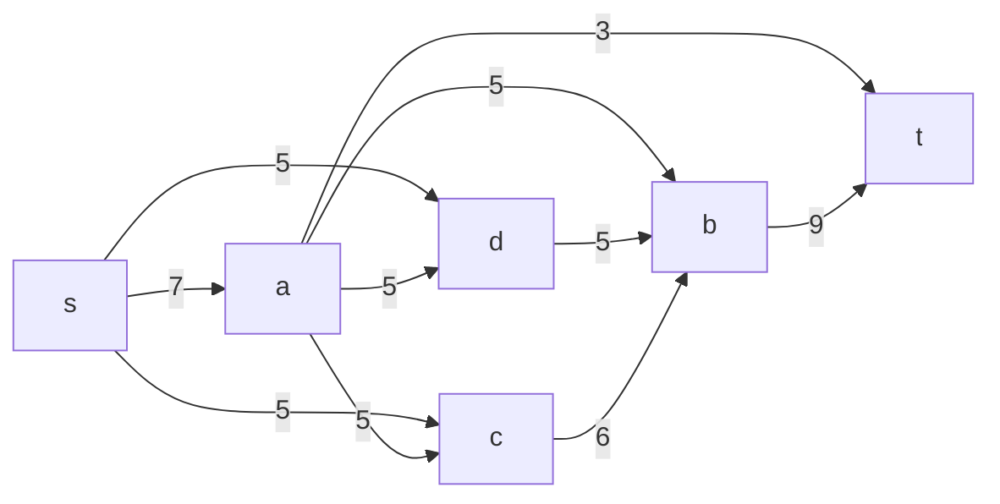
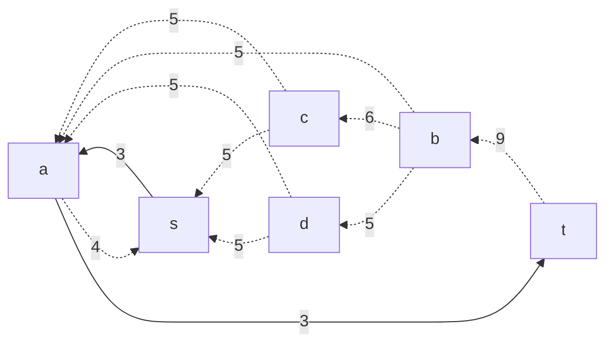
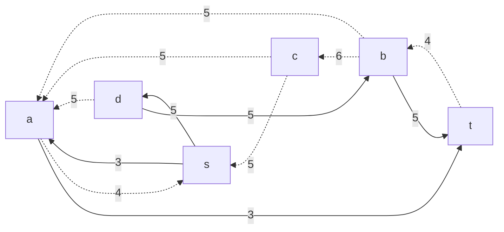
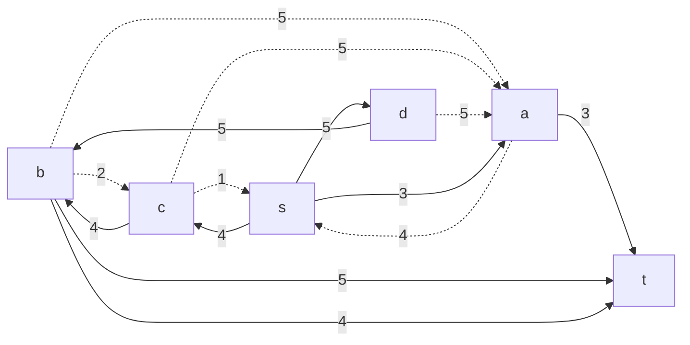
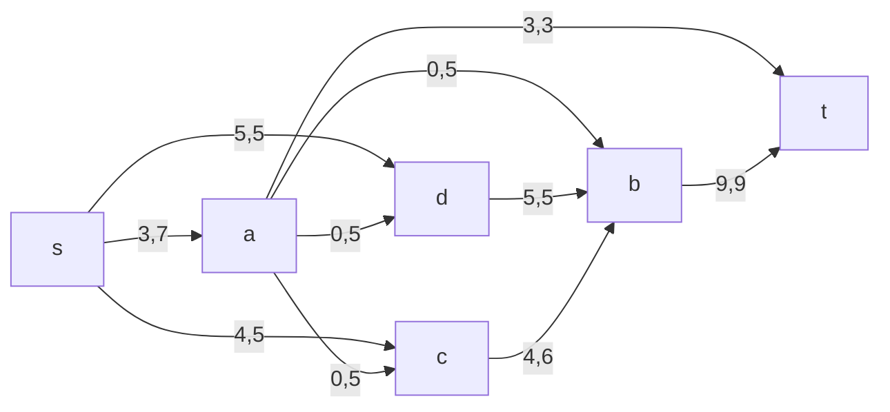
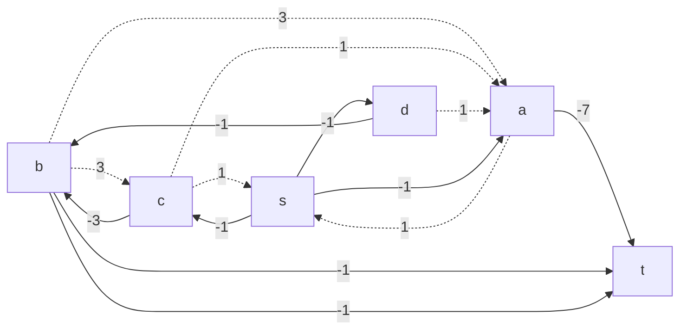

# Задание №15. zacod_dao - Вариант 8.
# Задача о максимальном потоке минимальной стоимости.

## Задание
Для каждого варианта представлены условия задачи, в соответствии с которыми необходимо: 
1. Построить сеть с указанием пропускной способности дуг.
2. Построить остаточную сеть.
3. Определить максимальный поток методом поиска увеличивающих путей в остаточной сети.
4. Минимизировать стоимость максимального потока посредством поиска циклов отрицательной стоимости.
5. Оформить решение задачи по шагам с подробными комментариями, таблицами и диаграммами.
6. В ответе указать максимальную величину потока, минимальную стоимость и сеть с указанием соответствующих локальных потоков.

## Постановка задачи
1. Дана сеть (взвешенный ориентированный граф) с источником s и стоком t.
2. Для каждой дуги определена пропускная способность и стоимость транспортировки.
3. Необходимо найти для указанной сети максимальный поток минимальной стоимости. 

## Решение задачи на поиск максимального потока в сети (вариант 8)

Пропускная способность дуг сети и стоимость транспортировки указана в таблице.

### Вариант 8:

| Дуги                      | sa | sс | sd | ac | ad | ab | db | cb | at | bt |
|:--------------------------|:--:|:--:|:--:|:--:|:--:|:--:|:--:|:--:|:--:|:--:|
| Пропускная способность    | 7  | 5  | 5  | 5  | 5  | 5  | 5  | 6  | 3  | 9  |
| Стоимость транспортировки | 1  | 1  | 1  | 1  | 1  | 3  | 1  | 3  | 7  | 1  |

### 1. Построим сеть с источником **s**, стоком **t** и указанными пропускными способностями дуг для поиска максимального потока.

Укажем начальный поток величиной 3 **s -> a -> t**. Построим соответствующую остаточную сеть.

### 2. Проведем поиск увеличивающего пути в остаточной сети
В остаточной сети найден увеличивающий путь t -> b -> d -> s. Минимальный вес дуг на этом пути равен 5.

Уменьшим вес дуг на найденном пути, дуги для которых вес стал нулевым удалим из остаточной сети.

### 3. Продолжим поиск увеличивающего пути в остаточной сети
В остаточной сети найден увеличивающий путь t -> b -> c -> s. Минимальный вес дуг на этом пути равен 4.

Уменьшим вес дуг на найденном пути, дуги для которых вес стал нулевым удалим из остаточной сети.

### 4. Продолжим поиск увеличивающего пути в остаточной сети

В остаточной сети не найдено увеличивающих путей, следовательно, алгоритм завершил работу и найденный поток величиной 12 является максимальным для данной сети.

### 5. Рассчитаем стоимость полученного максимального потока.

| Дуги                                          | sa | sc | sd | ac | ad | ab | db | cb | at | bt | Итого  |
|:----------------------------------------------|:--:|:--:|:--:|:--:|:--:|:--:|:--:|:--:|:--:|:--:|:------:|
| Пропускная способность p(e)                   | 7  | 5  | 5  | 5  | 5  | 5  | 5  | 6  | 3  | 9  |        |
| Локальный поток f(e)                          | 3  | 4  | 5  | 0  | 0  | 0  | 5  | 4  | 3  | 9  |        |
| Стоимость транспортировки единицы потока c(e) | 1  | 1  | 1  | 1  | 1  | 3  | 1  | 3  | 7  | 1  |        |
| Суммарная стоимость f(e)*c(e)                 | 3  | 4  | 5  | 0  | 0  | 0  | 5  | 12 | 21 | 9  | **59** |

Стоимость полученного потока составляет 59. 

### 6. Попробуем уменьшить стоимость потока для чего построим остаточную сеть.
Для каждого ребра остаточной сети укажем стоимость транспортировки единицы потока.

В остаточной сети отсутствуют циклы отрицательной стоимости, следовательно, стоимость потока минимальна.

### 8. Рассчитаем стоимость полученного максимального потока.

| Дуги                                          | sa | sc | sd | ac | ad | ab | db | cb | at | bt | Итого  |
|:----------------------------------------------|:--:|:--:|:--:|:--:|:--:|:--:|:--:|:--:|:--:|:--:|:------:|
| Пропускная способность p(e)                   | 7  | 5  | 5  | 5  | 5  | 5  | 5  | 6  | 3  | 9  |        |
| Локальный поток f(e)                          | 3  | 4  | 5  | 0  | 0  | 0  | 5  | 4  | 3  | 9  |        |
| Стоимость транспортировки единицы потока c(e) | 1  | 1  | 1  | 1  | 1  | 3  | 1  | 3  | 7  | 1  |        |
| Суммарная стоимость f(e)*c(e)                 | 3  | 4  | 5  | 0  | 0  | 0  | 5  | 12 | 21 | 9  | **59** |

Стоимость полученного потока составляет 59. 

### Ответ:
Максимальный поток в сети равен 12, минимальная стоимость потока 59, она реализуется следующим локальными потоками:

