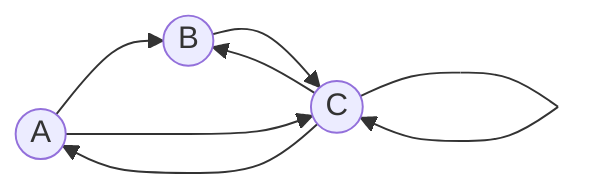

# Задача на взаимную рекурсию (маршруты в треугольнике)

### Вариант 6:
Необходимо:
1. Придумать граф с допустимыми маршрутами для рекуррентного соотношения третьего порядка.
2. Составить систему из 3 рекуррентных соотношений для предложенного графа.
3. Методом исключения свести систему к одному рекуррентному соотношению третьего порядка.

**Решать соотношение не нужно!**

## Вариант 6:
### 1. Придумать граф с допустимыми маршрутами для рекуррентного соотношения третьего порядка.
#### Придуманный граф:

Допустимые маршруты:
- A --> B
- A --> C
- B --> C
- C --> C
- C --> A
- C --> B

### 2. Составить систему из 3 рекуррентных соотношений для предложенного графа:
$$\begin{cases}
A_{n} = C_{n-1} \\ 
B_{n} = A_{n-1} + C_{n-1}  \\
C_{n} = A_{n-1} + B_{n-1}+ C_{n-1}
\end{cases} $$

### 3. Методом исключения свести систему к одному рекуррентному соотношению третьего порядка:
#### Система:
$$\begin{cases}
A_{n} = C_{n-1} \\ 
B_{n} = A_{n-1} + C_{n-1}  \\
C_{n} = A_{n-1} + B_{n-1}+ C_{n-1}
\end{cases} $$

#### Выразим B_{n-1} из второго выражения:
$$
B_{n-1} = A_{n-2} + C_{n-2} 
$$
#### Заменим B_{n-1} из третьего выражения на полученное соотношение:
$$
C_{n} = A_{n-1} + A_{n-2} + C_{n-2} + C_{n-1}
$$
#### Выразим A_{n-1} и A_{n-2} из первого выражения и подставим его в полученное соотношение:
$$
A_{n-1} = C_{n-2} 
$$
$$
A_{n-2} = C_{n-3} 
$$
$$
C_{n} = C_{n-2}  +  C_{n-3}  + C_{n-2} + C_{n-1}
$$
#### Преобразуем и получим соотношение третьего порядка:
$$
C_{n} - C_{n-1} - 2 * C_{n-2}  -  C_{n-3} = 0 
$$

#### Ответ:
$$
C_{n} - C_{n-1} - 2 * C_{n-2}  -  C_{n-3} = 0 
$$