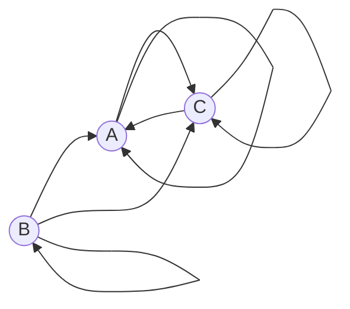

### Вариант 2:

Допустимые маршруты:
- A --> C
- A --> A
- B --> A
- B --> C
- B --> B
- C --> C
- C --> A

Найти формулу расчета количества маршрутов, начинающихся в вершине A и заканчивающихся в вершине A. 

#### I. Составим систему уравнений и выведем рекуррентную формулу вершины A

$$\begin{cases}
a_{n} = c_{n-1} \\ 
c_{n} = c_{n-1} + 2*a_{n-1}  
\end{cases} $$

$c_{n} = a_{n} + 2*a_{n-1} $

$c_{n-1} = a_{n-1} + 2*a_{n-1} $

##### Искомая рекуррентная формула вершины A:
$a_{n} = a_{n-1} + 2*a_{n-1} $

#### II. Составим и решим характеристическое уравнение на основе рекуррентной формулы

$\lambda^2 - \lambda - 2 = 0$

Корни уравнения: $\lambda_{1} = -1 \\ \lambda_{2} = 2$

##### Составим уравнение с получившимися корнями характеристического уравнения для вычисления коэффициентов
$a_{n} = k_{1} * \lambda_{1}^n +  k_{2} * \lambda_{2}^n$ => $a_{n} = k_{1} * -1^n +  k_{2} * 2^n$ 

Из вершины A в вершину A есть один маршрут за 1 ход => $a_{1} = 1$

Из вершины A в вершину A есть два маршрута за 2 хода => $a_{2} = 2$

##### Подставляем все параметры в систему и вычисляем коэффициенты $k_{1}$, $k_{2}$
при n=1:
при n=2:

$$\begin{cases}
1 = -k_{1} + 2 * k_{2} \\ 
2 = k_{1} + 4 * k_{2} 
\end{cases} $$

$3 = 6 * k_{2}$ => $k_{2} = \frac{1}{2} $

$2 = k_{1} + 2$ => $k_{1} = 0 $

#### Ответ: $a_{n} = \frac{1}{2}* 2^n$ = $2^{n-1}$
