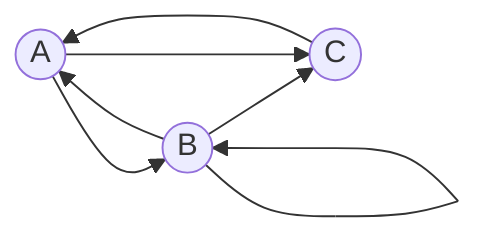

## Задача на взаимную рекурсию (маршруты в треугольнике)

## Задание:
В условиях задачи для каждого варианта указан граф с тремя вершинами. Для решения задачи требуется: 
1. Составить систему из 3 рекуррентных соотношений для предложенного графа.
2. Методом исключения свести систему к одному рекуррентному соотношению.
3. Составить и решить характеристическое уравнение.
4. Вывести формулу общего решения.

### Вариант 1:

Допустимые маршруты:
- A --> B
- B --> A
- B --> B
- B --> C
- C --> A
- A --> C

Найти формулу расчета количества маршрутов, начинающихся в вершине A и заканчивающихся в вершине B.

### 1. Составим систему уравнений для данной задачи:
$$\begin{cases}
A_{n} = C_{n-1} + B_{n-1} \\ 
B_{n} = A_{n-1} + B_{n-1} \\
C_{n} = A_{n-1} + B_{n-1}
\end{cases} $$
#### В условиях данной задачи: C_{n} и B_{n} друг в друга:
$$
A_{n} = 2B_{n-1}
$$

$$
B_{n} = 2B_{n-2} + B_{n-1}
$$

### 2. Составим характеристическое уравнение, основываясь на рекуррентном соотношении, и найдем его корни:
#### Характеристическое уравнение будет иметь следующий вид:
$t^2 - t - 2 = 0 $

$t_{1} = 2  \ t_{2} = -1 $

$t_{1} \neq t_{2} $

#### Основываясь на предыдущих пунктах, выведем формулу общего решения для B_{n}:

$B_n = K_{1}t_{1}^n + K_{2}t_{2}^n $

$B_n = K_{1} * 2^n + K_{2} * (-1)^n $

$B_{1} = 1 $

$B_{2} = 1 $

$$\begin{cases}
1 = 2K_{1} - K_{2} \\ 
1 = 4K_{1} + K_{2} 
\end{cases} $$

$K_{1} = \frac{1}{3} $

$K_{2} = - \frac{1}{3} $

## Ответ:

$B_n = \frac{1}{3} * 2^{n} - \frac{1}{3} * (-1)^{n} $
