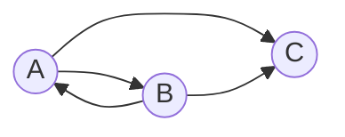

# Задача на взаимную рекурсию (маршруты в треугольнике)

## Задание для вариантов 1 - 4
В условиях задачи для каждого варианта указан граф с тремя вершинами. Для решения задачи требуется: 
1. Составить систему из 3 рекуррентных соотношений для предложенного графа.
2. Методом исключения свести систему к одному рекуррентному соотношению.
3. Составить и решить характеристическое уравнение.
4. Вывести формулу общего решения.

### Вариант 4:

Допустимые маршруты:
- A --> B
- A --> C
- B --> A
- B --> C

Найти формулу расчета количества маршрутов, начинающихся в вершине A и заканчивающихся в вершине C.

### 1. Составим систему уравнений для данной задачи:
$$\begin{cases}
A_{n} = B_{n-1} \\ 
B_{n} = A_{n-1} \\
C_{n} = A_{n-1} + B_{n-1}
\end{cases} $$

#### В условиях данной задачи можно подставить элементы A_{n} и B_{n} друг в друга:
$$
A_{n} = A_{n-2}
$$
$$
B_{n} = B_{n-2}
$$
### 2. Составим характеристическое уравнение, основываясь на рекуррентном соотношении, и найдем его корни:
#### Характеристическое уравнение будет иметь следующий вид:
$$
t^2 - 1 = 0
$$
#### Мы имеем два действительных корня:
$$
t1 = -1
$$
$$
t2 = 1
$$
### 3. Посчитав первый и второй элементы для вершины A, составим систему линейных уравнений из которых получим коэффициенты:
$$
a_{1} = 0
$$
$$
a_{2} = 1
$$

$$\begin{cases}
0 = С_{1} - С_{2} \\ 
1 = С_{1} + С_{2} 
\end{cases} $$

$1 = 2С_{1} $

$C_{1} = 0,5 => C_{2} = -0,5 $

#### Основываясь на предыдущих пунктах, выведем формулу общего решения для a_{n}:
$$
$\a_{n} = С_{1}t_{1}^n + С_{2}t_{2}^n $
$$
$$
$\a_{n} = 0,5 - 0,5*(-1)^n $
$$

### 4. Посчитав первый и второй элементы для вершины B, составим систему линейных уравнений из которых получим коэффициенты:
$$
b_{1} = 1
$$
$$
b_{2} = 0
$$

$$\begin{cases}
1 = С_{1} - С_{2} \\ 
0 = С_{1} + С_{2} 
\end{cases} $$

$1 = 2С_{1} $

$C_{1} = 0,5 => C_{2} = -0,5 $

#### Основываясь на предыдущих пунктах, выведем формулу общего для b_{n}:
$$
$\b_{n} = С_{1}t_{1}^n + С_{2}t_{2}^n $
$$
$$
$\b_{n} = 0,5 - 0,5*(-1)^n $
$$

### 5. Подставим полученные результаты в вершину C и получим рекуррентное соотношение:
$$
с_{n} = 0,5 - 0,5*(-1)^n-1 + 0,5 - 0,5*(-1)^n-1
$$

#### Ответ:
$$
c_{n} = 1 - (-1)^n-1
$$