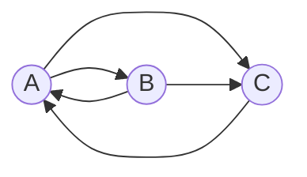

# Задача на взаимную рекурсию (маршруты в треугольнике)

## Задание для варианта 5
В условиях задачи указан граф с тремя вершинами. Для решения задачи требуется:
1. Составить систему из 3 рекуррентных соотношений для предложенного графа.
2. Методом исключения свести систему к одному рекуррентному соотношению третьего порядка.

### Вариант 5:

Допустимые маршруты:
- A --> B
- A --> C
- B --> C
- B --> A
- C --> A

Необходимо:
1. Составить систему из 3 рекуррентных соотношений для предложенного графа.
2. Методом исключения свести систему к одному рекуррентному соотношению третьего порядка.

Рассмотрим все варианты путей, начинающихся в вершине А. Получаем систему:

$$
\begin{cases}
a_{n} = b_{n-1} + c_{n-1} \\
b_{n} = a_{n-1} \\
c_{n} = a_{n-1} + b_{n-1} \\
\end{cases}
$$

Так как 
$b_{n} = a_{n-1} \Rightarrow b_{n-1} = a_{n-2}$

Произведем замену в 3 выражении:
$c_{n} = a_{n-1} + a_{n-2}$

Можем сделать вывод, что 
$c_{n-1} = a_{n-2} + a_{n-3}$

Подставляем в первое выражение:
$a_{n} = a_{n-2} + a_{n-2} + a_{n-3} = 2a_{n-2} + a_{n-3}$

