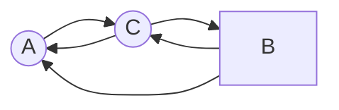

# Задача на взаимную рекурсию (маршруты в треугольнике)

## Задание для варианта 8
Для решения задачи требуется:

Придумать граф с допустимыми маршрутами для рекуррентного соотношения третьего порядка.
Составить систему из 3 рекуррентных соотношений для предложенного графа.
Методом исключения свести систему к одному рекуррентному соотношению третьего порядка.
### Вариант 8:

Допустимые маршруты:
- A --> C
- B --> C
- B --> A
- C --> A
- C --> B

Необходимо:

Придумать граф с допустимыми маршрутами для рекуррентного соотношения третьего порядка.
Составить систему из 3 рекуррентных соотношений для предложенного графа.
Методом исключения свести систему к одному рекуррентному соотношению третьего порядка.

Рассмотрим все варианты путей, начинающихся в вершине А. Получаем систему:

$$
\begin{cases}
a_{n} = b_{n-1} + c_{n-1} \\
b_{n} = c_{n-1} \\
c_{n} = a_{n-1} + b_{n-1} \\
\end{cases}
$$

Так как 
$b_{n} = c_{n-1} \Rightarrow b_{n-1} = c_{n-2}$

Произведем замену в 1 выражении:
$a_{n} = c_{n-2} + c_{n-1}$

Можем сделать вывод, что 
$a_{n-1} = c_{n-3} + c_{n-2}$

Подставляем в 3 выражение:
$c_{n} = c_{n-3} + c_{n-2} + c_{n-2}= 2c_{n-2} + c_{n-3}$