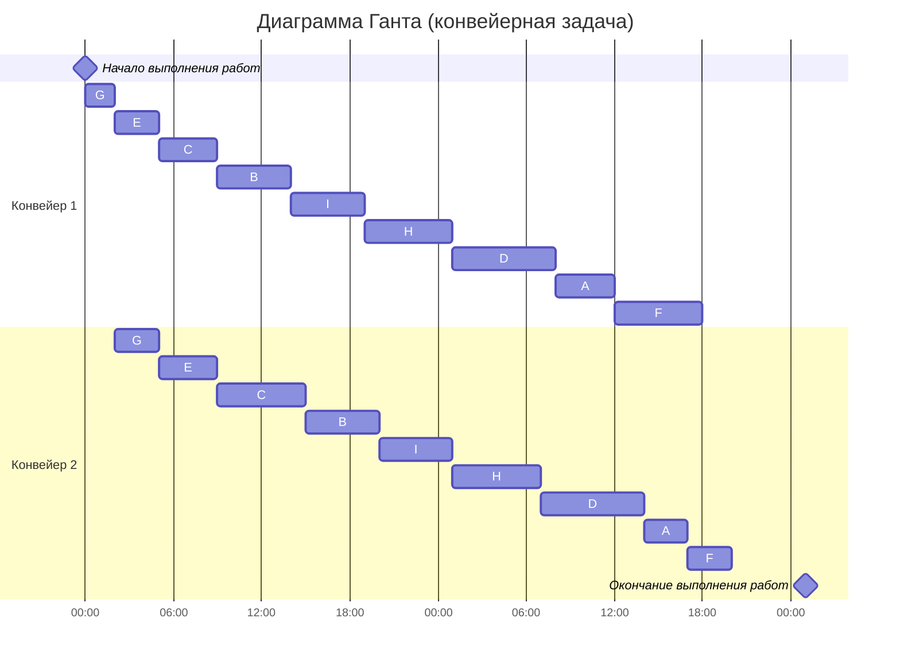

### Вариант 3:
1.  Имеется 9 независимых заданий, каждое из которых состоит из двух последовательных этапов, и 2 исполнителя, исполнитель 1 выполняет только первый этап задания, исполнитель 2 - только второй. Длительность заданий (по этапам): (4, 3), (5, 5), (4, 6), (7, 8), (3, 4), (6, 3), (2, 3), (6, 7), (5, 6).
2.  Имеется 7 независимых заданий и 5 универсальных исполнителей. Длительность заданий: 4, 7, 10, 4, 6, 8, 6.

### 1 задача
Задание:
 Имеется 9 независимых заданий, каждое из которых состоит из двух последовательных этапов, и 2 исполнителя, исполнитель 1 выполняет только первый этап задания, исполнитель 2 - только второй. Длительность заданий (по этапам): (4, 3), (5, 5), (4, 6), (7, 8), (3, 4), (6, 3), (2, 3), (6, 7), (5, 6).

Данная  задача относится к конвейерной и решается с помощью алгоритма Джонсона. Необходимо составить расписание минимальной длительность

#### 1.1 Распределим все задания по двум группам на основе длительностей этапов (В первой группе длительность работы меньше либо равна второй, во второй группе первая длительность работы больше второй):

Пронумеруем список заданий: A (4, 3), B (5, 5), C (4, 6), D (7, 8), E (3, 4), F (6, 3), G (2, 3), H (6, 7),  I(5, 6)

$a$ - длительность 1 этапа
$b$ - длительность 2 этапа
| a <= b  | a > b  |
|---------|--------|
| B (5, 5)  | A (4, 3) |
| C (4, 6)  | F (6, 3) |
| D (7, 8)  | |
| E (3, 4)  | |
| G (2, 3)  | |
| H (6, 7)  | |
| I (5, 6)  | |

#### 1.2 Отсортируем задания в группах (в I группе по возрастанию длительности 1 этапа, во II группе по убыванию длительности 2 этапа):

$a$ - длительность 1 этапа
$b$ - длительность 2 этапа
| a <= b  | a > b  |
|---------|--------|
| G (2, 3)  | A (4, 3) |
| E (3, 4)  | F (6, 3) |
| C (4, 6)  | |
| B (5, 5)  | |
| I (5, 6)  | |
| H (6, 7)  | |
| D (7, 8)  | |

#### 1.3 Диаграмма Ганта:

#### Ответ:  минимальная длительность расписания - 47 часа.

### 2 задача
Задание:
Имеется 7 независимых заданий и 5 универсальных исполнителей. Длительность заданий: 4, 7, 10, 4, 6, 8, 6.

Для решения этой задачи нужно использовать ленточную стратегию. Необходимо составить расписание минимальной длительность.

##### 2.1 Вычислим максимальную длительность задания 

$T_{max} = 10$

$T_{avg} = \frac{4+7+10+4+6+8+6}{5} = \frac{45}{5} = 9$

$T_{opt} = max({9 , 10}  ) = 10$  - максимальная длина расписания

##### 2.2  Cоставим диаграмму Ганта
Для удобства дадим имена задания:
A-4, B-7, C-10, D-4, E-6, F-8, G-6
Отдадим самую длинную работу C-10 исполнителю 1.

```mermaid
gantt
    title Диаграмма Ганта (ленточная стратегия)
    dateFormat  HH:mm    
    axisFormat %H:%M
    Начало выполнения работ : milestone, m1, 00:00, 0h
    section Исполнитель 1
    Задача С         :a1, 00:00, 10h
    section Исполнитель 2
    Задача А         :b1, 00:00, 4h
    Задача E         :b2, after b1, 6h
    section Исполнитель 3
    Задача D         :c1, 00:00, 4h
    Задача G         :c2, after c1, 6h
    section Исполнитель 4
    Задача B         :d1, 00:00, 7h
    Задача F		 :d2, after d1, 3h
    section Исполнитель 5
    Задача F   	     :e1, 00:00, 5h
    
    Окончание выполнения работ : milestone, m2, 10:00, 0h
```

#### Ответ:  минимальная длительность расписания - 10 часов.
