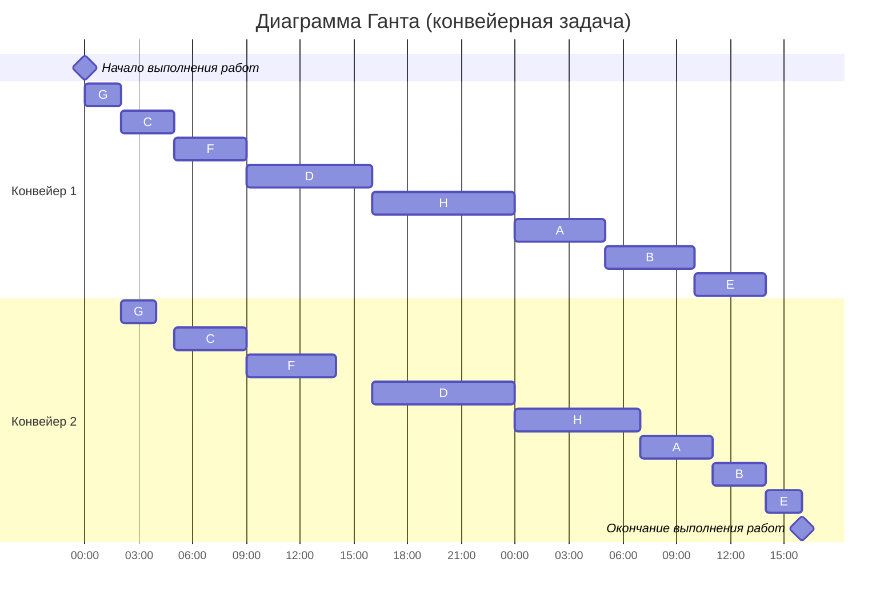

### Вариант 5:
1. Имеется 9 независимых заданий и 4 универсальных исполнителя. Длительность заданий: 5, 7, 10, 5, 6, 8, 6, 12, 17.
2. Имеется 8 независимых заданий, каждое из которых состоит из двух последовательных этапов, и 2 исполнителя, исполнитель 1 выполняет только первый этап задания, исполнитель 2 - только второй. Длительность заданий (по этапам): (5, 4), (5, 3), (3, 5), (8, 8), (4, 1), (5, 6), (2, 2), (8, 7).

#### 1 задача
Для решения этой задачи нужно использовать ленточную стратегию, потому что исполнители универсальны и их количество неизменно, задания независимы, имеют определенную длительность и могут прерываться

##### 1.1 Вычислим максимальную длительность задания - это будет длина ленты (длительность оптимального расписания)

$T_{max} = 17$

$T_{av} = \frac{5+7+10+5+6+8+6+12+17}{4} = \frac{76}{4} = 19$

$T_{opt} = max\{T_{max} , T_{avg}\} = max\{17 , 19} = 19$

##### 1.2 Для удобства дадим имена заданиям и составим диаграмму Ганта

A-5, B-7, C-10, D-5, E-6, F-8, G-6, H-12, I-17

```mermaid
gantt
    title Диаграмма Ганта (ленточная стратегия)
    dateFormat  HH:mm    
    axisFormat %H:%M
    Начало выполнения работ : milestone, m1, 00:00, 0h
    section Исполнитель 1
    Задача A         :a1, 00:00, 5h
    Задача B         :a2, after a1, 7h
    Задача C         :a3, after a2, 7h
    section Исполнитель 2
    Задача C         :b1, 00:00, 3h
    Задача D         :b2, after b1, 5h
    Задача E         :b3, after b2, 6h
    Задача F         :after b3, 5h
    section Исполнитель 3
    Задача F         :c1, 00:00, 3h
    Задача G         :c2, after c1, 6h
    Задача H         :after c2, 10h
    section Исполнитель 4
    Задача H         :d1, 00:00, 2h
    Задача I         :after d1, 17h
    Окончание выполнения работ : milestone, m2, 19:00, 0h
```

##### Ответ: диаграмма Ганта представлена выше, длительность расписания - 19 часов.

#### 2 задача
Из условия известно, что:
- задача состоит из двух зависимых этапов
- количество исполнителей: 2
- сами задания независимы 
- присутствует разделение исполнителей по этапам (неуниверсальные исполнители)
Следовательно, задача относится к конвейерной и решается с помощью алгоритма Джонсона, потому что необходимо составить оптимальное кратчайшее расписание

Список заданий: A-(5, 4), B-(5, 3), C-(3, 5), D-(8, 8), E-(4, 1), F-(5, 6), G-(2, 2), H-(8, 7)

##### 2.1 Распределим задания по группам на основе длительностей этапов

$a_{i}$ - длительность 1 этапа

$b_{i}$ - длительность 2 этапа

I группа $(a_{i} <= b_{i})$:
(3, 5), (8, 8), (5, 6), (2, 2)

II группа $(a_{i} > b_{i})$:
(5, 4), (5, 3), (4, 1), (8, 7)

##### 2.2 Отсортируем задания в группах (в I группе по возрастанию длительности 1 этапа, во II группе по убыванию длительности 2 этапа):

I группа $(a_{i} <= b_{i})$:

(2, 2), (3, 5), (5, 6), (8, 8)

II группа $(a_{i} > b_{i})$:

(8, 7), (5, 4), (5, 3), (4, 1)

##### Ответ: диаграмма Ганта представлена выше, длительность расписания - 40 часов.
