# Вариант 2:
1. Имеется 7 независимых заданий и 4 универсальных исполнителя. Длительность заданий: 4, 7, 4, 4, 6, 8, 7.
2. Имеется 9 независимых заданий, каждое из которых состоит из двух последовательных этапов, и 2 исполнителя, исполнитель 1 выполняет только первый этап задания, исполнитель 2 - только второй. Длительность заданий (по этапам): (5, 6), (4, 3), (2, 5), (8, 6), (5, 8), (3, 1), (5, 3), (2, 2), (6, 7).
## 1 задача
Из-за того, что задания независимы, имеют разную длину и могут прерываться, а исполнители универсальны будет использоваться ленточный метод решения задачи
##### #1 Вычислим максимальную длительность задания 
$K = 4$

$T_{max} = 8$

$T_{avп} = \frac{4+7+4+4+6+8+7}{4} = \frac{40}{4} = 10$

$T_{opt} = max\{T_{max} , T_{avg}\} = max\{8 , 10} = 10$

##### #2 Cоставим диаграмму Ганта и дадим заданиями буквенные обозначения

A -4, B-7, C-4, D-4, E-6, F-8, G-7.

```mermaid
gantt
    title Диаграмма Ганта 
    dateFormat  HH:mm    
    axisFormat %H:%M
    Начало выполнения работ : milestone, m1, 00:00, 0h
    section Исполнитель 1
    A         :a1, 00:00, 4h
    B         :a2, after a1, 6h
    section Исполнитель 2
    B         :b1, 00:00, 1h
    C         :b2, after b1, 4h
    D         :b3, after b2, 4h
    E         :after b3, 1h
    section Исполнитель 3
    E         :c1, 00:00, 5h
    F         :c2, after c1, 5h
    section Исполнитель 4
    F         :d1, 00:00, 3h
    G         :after d1, 7h
    Окончание выполнения работ : milestone, m2, 10:00, 0h
```

##### Ответ: диаграмма Ганта c оптимальным расписанием представлена выше, длительность расписания - 10 часов.

## 2 задача
Задача сводится к конвейерному способу решения, т.к. есть 2 неуниверсальных исполнителя и задачи с двумя этами

Список заданий: A-(5, 6), B-(4, 3), C-(2, 5), D-(8, 6), E-(5, 8), F-(3, 1), G-(5, 3), H-(2, 2), I-(6, 7).

##### #1 Распределим задания по группам на основе длительностей этапов

I группа $(a_{i} <= b_{i})$:
A-(5, 6), C-(2, 5), E-(5, 8), I-(6, 7), H-(2, 2)

II группа $(a_{i} > b_{i})$:
B-(4, 3), D(8, 6), F(3, 1), G(5, 3)

##### #2 Отсортируем задания в группах 

I группа $(a_{i} <= b_{i})$:

H-(2, 2), C-(2, 5), A-(5, 6), E-(5, 8), I-(6, 7)

II группа $(a_{i} > b_{i})$:

D(8, 6), B-(4, 3), G(5, 3), F(3, 1)

##### Ответ: диаграмма Ганта представлена выше, длительность расписания - 43 часa.
