# Оптимальное расписание. Ленточная стратегия/Конвейерная

## Задание:
Для каждой задачи необходимо:
- Выбрать алгоритм решения задачи и обосновать свой выбор.
- Применить выбранный алгоритм, в решении отобразить ход выполнения алгоритма с подробными комментариями.
- В ответе указать длительность полученного расписания.
- В ответе вывести полученное расписание в виде диаграммы Ганта.

**Вариант 9:**

1. Имеется 8 независимых заданий и 5 универсальных исполнителей. Длительность заданий: 4, 6, 5, 6, 8, 9, 11, 16.
2. Имеется 8 независимых заданий, каждое из которых состоит из двух последовательных этапов, и 2 исполнителя, исполнитель 1 выполняет только первый этап задания, исполнитель 2 - только второй. Длительность заданий (по этапам): (6, 4), (6, 3), (3, 5), (8, 7), (4, 1), (5, 6), (2, 2), (9, 7).

### Задание 1

#### Для решения этой задачи выбираем алгоритм, основанный на ленточной стратегии. По причине того, что исполнители универсальны и задачи можно прерывать.
 
| A | B | C  | D | E | F | G | H  |
|---|---|----|---|---|---|---|----|
| 4 | 5 | 6  | 6 | 8 | 9 | 11 | 16 |

1. Найдем сумму длин всех работ:
   
    $T_{общее}$ = 4 + 6 + 5 + 6 + 8 + 9 + 11 + 16 = 65

2. Посчитаем среднюю длину работы и найдем максимальную длину работы, и найдем максимальное из них:
    
    $T_{ср}$ = 65 / 5 = 13

    $T_{max}$ = 16

   T = max(T_${max}$,T_${ср}$) = 16 - длина работ

### Ответ: 

   а)Диаграмма Ганта

```mermaid
gantt
    title Диаграмма Ганта - Ленточная стратегия для 5 исполнителей
    dateFormat  HH:mm    
    axisFormat %H:%M
    Начало выполнения работ : milestone, m1, 00:00, 0h
    section Исполнитель 1
    Задача A            :a1, 00:00, 4h
    Задача B            :a2, after a1, 6h
    Задача C            :a3, after a2, 5h
    Задача D (1)        :a4, after a3, 1h
    section Исполнитель 2
    Задача D (5)        :b1, 00:00, 5h
    Задача E            :b2, after b1, 8h
    Задача F (3)        :b3, after b2, 3h
    section Исполнитель 3
    Задача F (6)        :c1, 00:00, 6h
    Задача G (10)       :c2, after c1, 10h
    section Исполнитель 4
    Задача G (1)        :d1, 00:00, 1h
    Задача H (15)       :d2, after d1, 15h
    section Исполнитель 5
    Задача H (1)        :e1, 00:00, 1h
    Окончание выполнения работ : milestone, m2, 16:00, 0h
```

б) Длительность расписания = 14 часов.

### Задание 2
   
#### Используем алгоритм Джонсона из-за того, что задача сводится к конвейерной и k=2.

1. Дадим наименование работам:
    
    A(6,4), B(6,3), C(3,5), D(8,7), E(4,1), F(5,6), G(2,2), H(9,7)
   
3. Распределим работы по двум группам:
    
| a <= b  | a > b  |
|---------|--------|
| C(3,5)  | H(9,7) |
| F(5,6)  | D(8,7) |
| G(2,2)  | A(6,4) |
|         | B(6,3) |
|         | E(4,1) |

3. Отсортируем работы:
    
| a <= b  | a > b  |
|---------|--------|
| G(2,2)  | H(9,7) |
| C(3,5)  | D(8,7) |
| F(5,6)  | A(6,4) |
|         | B(6,3) |
|         | E(4,1) |

**Порядок следования работ:**

G,C,F,H,D,A,B,E

### Ответ

   а) Диаграмма Ганта:

 б) Длительность расписания = 44 часа.

