#  Вариант 9

1. Имеется 8 независимых заданий и 5 универсальных исполнителей. Длительность заданий: 4, 6, 5, 6, 8, 9, 11, 16.
2. Имеется 8 независимых заданий, каждое из которых состоит из двух последовательных этапов, и 2 исполнителя, исполнитель 1 выполняет только первый этап задания, исполнитель 2 - только второй. Длительность заданий (по этапам): (6, 4), (6, 3), (3, 5), (8, 7), (4, 1), (5, 6), (2, 2), {9, 7}
## 1 задача
Из=за того, что исполнители независими, а задания имеют разную длину и могут прерываться, выберем ленточную стратегию
###  Вычислим длительность оптимального расписания 
$С = 5$

$T_{max} = 16$

$T_{avп} = \frac{4+ 6 + 5 + 6 + 8 + 9 + 11 + 16}{5} = \frac{65}{5} = 13$

$16 > 13$
#### Продожительность расписания - 16

###  Cоставим диаграмму Ганта и дадим заданиями буквенные обозначения

#### A -4, B-6, C-5, D-6, E-8, F-9, G-11, H - 16.

```mermaid
gantt
    title Диаграмма Ганта 
    dateFormat  HH:mm    
    axisFormat %H:%M
    Начало выполнения работ : milestone, m1, 00:00, 0h
    section Исполнитель 1
    A         :a1, 00:00, 4h
    B         :a2, after a1, 6h
    C         :a3, after a2, 5h
    D		  :a4, after a3, 1h
    section Исполнитель 2
    D         :b1, 00:00, 5h
    E         :b2, after b1, 8h
    F         :b3, after b2, 3h
    section Исполнитель 3
    F         :c1, 00:00, 6h
    G         :c2, after c1, 10h
    section Исполнитель 4
    G         :d1, 00:00, 1h
    H         :after d1, 15h
    section Исполнитель 5
    H         :d1, 00:00, 1h

    Окончание выполнения работ : milestone, m2, 10:00, 0h
```

##### Ответ:  Длительность оптимального расписания - 16 часов.

## 2 задача
Задача является конвейерной, так как 2 исполнителя последовательно выполняют этапы задачи.

Список заданий:  A - (6, 4), B - (6, 3), C - (3, 5), D - (8, 7), E - (4, 1), F -(5, 6), G-(2, 2)

#####   Распределим задания по группам на основе длительностей этапов

I группа $(a_{i} <= b_{i})$:
C - {3, 5},  F - {5, 6}, G - {2, 2}

II группа $(a_{i} > b_{i})$:
A - {6, 4}, B-(6, 3), D(8, 7), E(4, 1), H{9, 7}

#####   Отсортируем задания в группах 

I группа $(a_{i} <= b_{i})$:

G  {2, 2}, C {3,5}, F  {5,6}

II группа $(a_{i} > b_{i})$:

H {9,7}, D{8, 7}, A{6, 4}, B{6, 3}, E{4, 1}
#### Получаем порядок - G,C,F,H,D,A,B,E

##### Ответ: Длительность расписания - 44 часа
