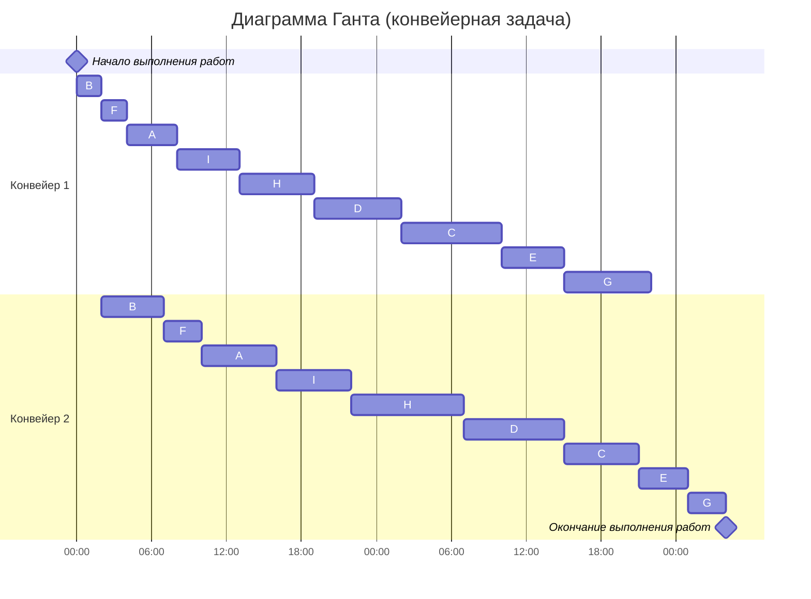

### Вариант 1:
1. Имеется 9 независимых заданий, каждое из которых состоит из двух последовательных этапов, и 2 исполнителя, исполнитель 1 выполняет только первый этап задания, исполнитель 2 - только второй. Длительность заданий (по этапам): (4, 6), (2, 5), (8, 6), (7, 8), (5, 4), (2, 3), (7, 3), (6, 9), (5, 6).
2. Имеется 6 независимых заданий и 4 универсальных исполнителя. Длительность заданий: 3, 7, 7, 4, 6, 9. 

#### 1 задача
Из условия известно, что:
- задача состоит из двух последовательных этапов
- количество исполнителей: 2
- сами задания независимы 
- присутствует разделение исполнителей по этапам (неуниверсальные исполнители)
Следовательно, задача относится к конвейерной и решается с помощью алгоритма Джонсона, потому что необходимо составить оптимальное кратчайшее расписание

Список заданий: A (4, 6), B (2, 5), C (8, 6), D (7, 8), E (5, 4), F (2, 3), G (7, 3), H (6, 9), I (5, 6)

##### 1.1 Распределим задания по группам на основе длительностей этапов

$a_{i}$ - длительность 1 этапа

$b_{i}$ - длительность 2 этапа

I группа $(a_{i} <= b_{i})$:
A (4, 6), B (2, 5), D (7, 8), F (2, 3), H (6, 9), I (5, 6)

II группа $(a_{i} > b_{i})$:
C (8, 6), E (5, 4), G (7, 3)

##### 1.2 Отсортируем задания в группах (в I группе по возрастанию длительности 1 этапа, во II группе по убыванию длительности 2 этапа):

I группа $(a_{i} <= b_{i})$:

B (2, 5), F (2, 3), A (4, 6), I (5, 6), H (6, 9), D (7, 8)   

(2, 2), (3, 5), (5, 6), (8, 8)

II группа $(a_{i} > b_{i})$:

C (8, 6), E (5, 4), G (7, 3)



##### Ответ: диаграмма Ганта представлена выше, длительность расписания - 52 часа.


#### 2 задача
Для решения этой задачи нужно использовать ленточную стратегию, потому что исполнители универсальны и их количество неизменно, задания независимы, имеют определенную длительность и могут прерываться

##### 2.1 Вычислим максимальную длительность задания - это будет длина ленты (длительность оптимального расписания)

$T_{max} = 9$

$T_{av} = \frac{3+7+7+4+6+9}{4} = \frac{36}{4} = 9$

$T_{opt} = max\{T_{max} , T_{avg}\} = max\{9 , 9} = 9$

##### 2.2 Для удобства дадим имена заданиям и составим диаграмму Ганта

A-3, B-7, C-7, D-4, E-6, F-9

```mermaid
gantt
    title Диаграмма Ганта (ленточная стратегия)
    dateFormat  HH:mm    
    axisFormat %H:%M
    Начало выполнения работ : milestone, m1, 00:00, 0h
    section Исполнитель 1
    Задача A         :a1, 00:00, 3h
    Задача B         :a2, after a1, 6h
    section Исполнитель 2
    Задача B         :b1, 00:00, 1h
    Задача C         :b2, after b1, 7h
    Задача D         :b3, after b2, 1h
    section Исполнитель 3
    Задача D         :c1, 00:00, 3h
    Задача E         :c2, after c1, 6h
    section Исполнитель 4
    Задача F         :d1, 00:00, 9h
    Окончание выполнения работ : milestone, m2, 9:00, 0h
```
##### Ответ: диаграмма Ганта представлена выше, длительность расписания - 9 часов.