### Вариант 6:
1. Имеется 8 независимых заданий и 4 универсальных исполнителя. Длительность заданий: 5, 7, 9, 5, 6, 7, 6, 11.
2. Имеется 8 независимых заданий, каждое из которых состоит из двух последовательных этапов, и 2 исполнителя, исполнитель 1 выполняет только первый этап задания, исполнитель 2 - только второй. Длительность заданий (по этапам): (6, 4), (2, 3), (6, 5), (3, 8), (4, 1), (4, 6), (3, 2), (9, 7).

### Задание 1:
1. Для начала отсортируем работы в порядке возрастания длин работ и дадим им наименования:
 
| A | B | C  | D | E | F | G | H  |
|---|---|----|---|---|---|---|----|
| 5 | 5 | 6  | 6 | 7 | 7 | 9 | 11 |

2. Для начала необходимо определить длительность работ для исполнителей, для начала найдем сумму длин всех работ:
   
    T(общее) = 5 + 7 + 9 + 5 + 6 + 7 + 6 + 11 = 56
3. Затем посчитаем среднюю длину работы и найдем максимальную длину работы, и найдем максимальное из них:
    
    T(ср) = 56 / 4 = 14

    T(max) = 11

   T = max(T(max),T(ср)) = 14 - длина работ

4. Ответ 
   
   а):Диаграмма Ганта

```mermaid
gantt
    title Диаграмма Ганта - Ленточная стратегия для 4 исполнителей
    dateFormat  HH:mm    
    axisFormat %H:%M
    Начало выполнения работ : milestone, m1, 00:00, 0h
    section Исполнитель 1
    Задача A            :a1, 00:00, 5h
    Задача B            :a2, after a1, 5h
    Задача C (4)        :a3, after a2, 4h
    section Исполнитель 2
    Задача C (2)        :b1, 00:00, 2h
    Задача D            :b2, after b1, 6h
    Задача E (6)        :b3, after b2, 6h
    section Исполнитель 3
    Задача E (1)        :c1, 00:00, 1h
    Задача F            :c2, after c1, 7h
    Задача G (3)        :after c2, 6h
    section Исполнитель 4
    Задача G            :d1, 00:00, 3h
    Задача H            :after d1, 11h
    Окончание выполнения работ : milestone, m2, 14:00, 0h
```

   б) Длительность расписания = 14 часов
### Задание 2:
   
#### Для решения этой задачи используем алгоритм Джонсона

1. Для начала дадим наименование работам:
    
    A(6,4), B(2,3), C(6,5), D(3,8), E(4,1), F(3,2), G(9,7)
2. Далее распределим работы по двум группам. В первой первая фаза работы меньше либо равна второй, во второй группе первая фаза больше второй. Первую группу отсортировать по возрастанию первой фазы, вторую группу по убыванию второй:
    
| a <= b  | a > b  |
|---------|--------|
| B(2,3)  | G(9,7) |
| D(3,8)  | C(6,5) |
|         | A(6,4) |
|         | F(3,2) |
|         | E(4,1) |

3. Порядок в таблице определяет порядок следования работ:
    
    B, D, G, C, A, F, E

4. Ответ

   а) Диаграмма Ганта:

 б) Длительность расписания = 34 часа