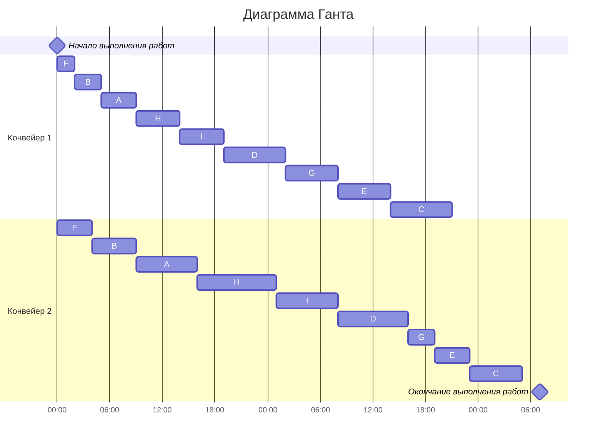

# Оптимальное расписание. Ленточная стратегия/Конвейерная задача
## Задание
Для каждого варианта представлены условия для двух задач. Для каждой задачи необходимо: 
1. Выбрать алгоритм решения задачи и обосновать свой выбор.
2. Применить выбранный алгоритм, в решении отобразить ход выполнения алгоритма с подробными комментариями.
3. В ответе указать длительность полученного расписания.
4. В ответе вывести полученное расписание в виде диаграммы Ганта.

## Варианты:

### Вариант 7:
1. Имеется 9 независимых заданий и 4 универсальных исполнителя. Длительность заданий: 5, 5, 17, 6, 7, 6, 11, 6, 9.
2. Имеется 9 независимых заданий, каждое из которых состоит из двух последовательных этапов, и 2 исполнителя, исполнитель 1 выполняет только первый этап задания, исполнитель 2 - только второй. Длительность заданий (по этапам): (4, 7), (3, 5), (7, 6), (7, 8), (6, 4), (2, 4), (6, 3), (5, 9), (5, 7).

# Задание 1

## Условия задачи

<table>
    <tr>
        <th>A</th>
        <th>B</th>
        <th>C</th>
         <th>D</th>
         <th>E</th>
         <th>F</th>
         <th>G</th>
         <th>H</th>
         <th>I</th>
    </tr>
    <tr>
        <th>5</th>
        <th>5</th>
        <th>17</th>
         <th>6</th>
         <th>7</th>
         <th>6</th>
         <th>11</th>
         <th>6</th>
         <th>9</th>
    </tr>
</table>

- 4 исполнителя(k)
- Независимые испытания

## Решение 

1. Найти Т общее и T оптимальное и сравнить с максимальным

T(общ) = 5 +  5 + 17 + 6 + 7 + 6 + 11 + 6 + 9 = 72

T опт = T(общ) / k = 72 / 4 = 18 - длительность работ

T(max) =  17 

T(max) < T(опт)

2. Теперь нужно разделить работу на 4 равные части и построить диаграмму Ганта

```mermaid
gantt
    title Диаграмма Ганта 
    dateFormat  HH:mm    
    axisFormat %H:%M
    Начало выполнения работ : milestone, m1, 00:00, 0h
    section Исполнитель 1
    A         :a1, 00:00, 5h
    B         :a2, after a1, 5h
    C         :a3, after a2, 8h
    section Исполнитель 2
    C         :b1, 00:00, 9h
    D         :b2, after b1, 6h
    E         :b3, after b2, 3h
    section Исполнитель 3
    E        :c1, 00:00, 4h
    F        :c2, after c1, 6h
    G        :c3, after c2, 8h
    section Исполнитель 4
    G         :d1, 00:00, 3h
    H         :d2, after d1, 6h
    I         :d3, after d2, 9h
    Окончание выполнения работ : milestone, m2, 18:00, 0h
```

Ответ: 18 часов

# Задание 2

(4, 7), (3, 5), (7, 6), (7, 8), (6, 4), (2, 4), (6, 3), (5, 9), (5, 7).

<table>
    <tr>
        <th>A</th>
        <th>B</th>
        <th>C</th>
         <th>D</th>
         <th>E</th>
         <th>F</th>
         <th>G</th>
         <th>H</th>
         <th>I</th>
    </tr>
    <tr>
        <th>4</th>
        <th>3</th>
        <th>7</th>
         <th>7</th>
         <th>6</th>
         <th>2</th>
         <th>6</th>
         <th>5</th>
         <th>5</th>
    </tr>
<tr>
        <th>7</th>
        <th>5</th>
        <th>6</th>
         <th>8</th>
         <th>4</th>
         <th>4</th>
         <th>3</th>
         <th>9</th>
         <th>7</th>
    </tr>
</table>

-  2 исполнителя исполнитель
- 1 выполняет только первый этап задания, исполнитель 2 - только второй.

## Решение 

1. Разделить на группы - где больше первое и где больше 2

1 <= 2: A,B,D,F,H,I

1 > 2: C, E, G 

2. Сортируем элементы 1 группы по длительности 1 этапа

F,B,A,H,I,D

3. Сортируем элементы 2 группы по длительности 2 этапа

G,E,C

4. Строим диаграмму Ганта

Ответ: 55 часов