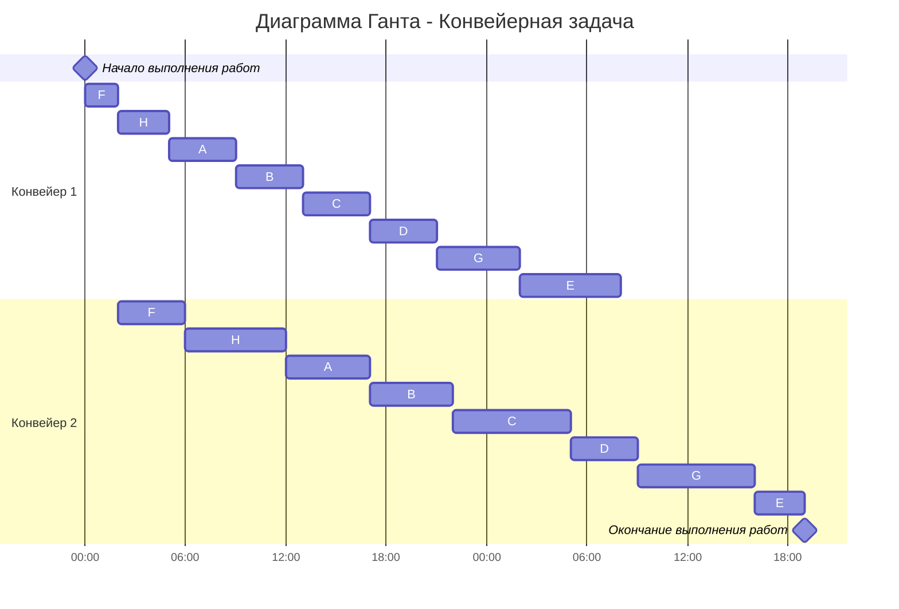

### Вариант 4:
1. Имеется 8 независимых заданий, каждое из которых состоит из двух последовательных этапов, и 2 исполнителя, исполнитель 1 выполняет только первый этап задания, исполнитель 2 - только второй. Длительность заданий (по этапам): (4, 5), (4, 5), (4, 7), (4, 4), (6, 3), (2, 4), (5, 7), (3, 6).
2. Имеется 9 независимых заданий и 5 универсальных исполнителей. Длительность заданий: 4, 7, 10, 5, 6, 8, 6, 12, 17.

### Задание 1:
   
#### Был выбран алгоритм Джонсона, так как он оптимален для нахождеия кратчайшкго расписания в задачах, где есть поэтапное выполение заданий, заданния не зависимы друг от друга, 2 неуниверсальных исполнителя.

1. Проименнуем работы:
    
    A(4, 5), B(4, 5), C(4, 7), D(4, 4), E(6, 3), F(2, 4), G(5, 7), H(3, 6)
2. Далее распределим работы по двум группам. В первой первая фаза работы меньше либо равна второй, во второй группе первая фаза больше второй. Первую группу отсортировать по возрастанию первой фазы, вторую группу по убыванию второй:
    
| a <= b | a > b  |
|--------|--------|
| A(4,5) | E(6,3) |
| B(4,5) |        |
| C(4,7) |        |
| D(4,4) |        |
| F(2,4) |        |
| G(5,7) |        |
| H(3,6) |        |

3. Порядок следования работ:
    
    A,B,C,D,F,G,H,E
    перестроим:
    F,H,A,B,C,D,G,E

4. Ответ

   а) Диаграмма Ганта:

 б) Длительность расписания = 43 часа.

### Задание 2:

#### Для решения этой задачи есть эффективный алгоритм, основанный на ленточной стратегии. Ленточная стратегия используется, т.к. исполнители универсальны и задачи можно прерывать (не более k - 1 раз, k - кол-во исполнителей)
 
| A | B | C  | D | E | F | G | H  | I  |
|---|---|----|---|---|---|---|----|----|
| 4 | 7 | 10 | 5 | 6 | 8 | 6 | 12 | 17 |


1. Находим сумму длительности всех работ:
   
    T(общее) = 4 + 7 + 10 + 5 + 6 + 8 + 6 + 12 + 17 = 75

2. Найдём среднее и максимальнов среднее время и сравним их, чтобы выбрать длину рабочего дня:
    
    T(ср) = 75 / 5 = 15

    T(max) = 17

   T = max(T(max),T(ср)) = 17 - длина работ

3. Ответ: 
   
   а):Диаграмма Ганта
```mermaid
gantt
    title Диаграмма Ганта - Ленточная стратегия для 5 исполнителей
    dateFormat  HH:mm    
    axisFormat %H:%M
    Начало выполнения работ : milestone, m1, 00:00, 0h
    section Исполнитель 1
    Задача A            :a1, 00:00, 4h
    Задача B            :a2, after a1, 7h
    Задача C (6)        :a3, after a2, 6h
    section Исполнитель 2
    Задача C (4)        :b1, 00:00, 4h
    Задача D            :b2, after b1, 5h
    Задача E (6)        :b3, after b2, 6h
    Задача F (2)        :b4, after b3, 2h
    section Исполнитель 3
    Задача F (6)        :c1, 00:00, 6h
    Задача G            :c2, after c1, 6h
    Задача H (5)        :c3, after c2, 5h
    section Исполнитель 4
    Задача H            :d1, 00:00, 7h
    Задача I            :d2 after d1, 10h
    section Исполнитель 5
    Задача I            :e1, 00:00, 7h
    Окончание выполнения работ : milestone, m2, 17:00, 0h
```
б) Длительность расписания = 17 часов.
