### Вариант 8:
1. Имеется 7 независимых заданий и 5 универсальных исполнителей. Длительность заданий: 5, 5, 6, 7, 6, 11, 15.
2. Имеется 10 независимых заданий, каждое из которых состоит из двух последовательных этапов, и 2 исполнителя, исполнитель 1 выполняет только первый этап задания, исполнитель 2 - только второй. Длительность заданий (по этапам): (4, 7), (4, 5), (8, 6), (6, 8), (5, 5), (6, 4), (2, 4), (6, 3), (4, 9), (5, 8).

### Задание 1:

#### Для решения этой задачи есть эффективный алгоритм, основанный на ленточной стратегии. Ленточная стратегия используется, т.к. исполнители универсальны и задачи можно прерывать (не более k - 1 раз, k - кол-во исполнителей)
 
| A | B | C  | D | E | F  | G  | 
|---|---|----|---|---|----|----|
| 5 | 5 | 6  | 7 | 6 | 11 | 15 |

1. Для начала необходимо определить длительность работ для исполнителей, для начала найдем сумму длин всех работ:
   
    T(общее) = 5 + 5 + 6 + 7 + 6 + 11 + 15 = 55
2. Затем посчитаем среднюю длину работы и найдем максимальную длину работы, и найдем максимальное из них:
    
    T(ср) = 55 / 5 = 11

    T(max) = 15

   T = max(T(max),T(ср)) = 15 - длина работ

3. Ответ: 
   
   а):Диаграмма Ганта

```mermaid
gantt
    title Диаграмма Ганта - Ленточная стратегия для 5 исполнителей
    dateFormat  HH:mm    
    axisFormat %H:%M
    Начало выполнения работ : milestone, m1, 00:00, 0h
    section Исполнитель 1
    Задача A            :a1, 00:00, 5h
    Задача B            :a2, after a1, 5h
    Задача C (5)        :a3, after a2, 5h
    section Исполнитель 2
    Задача C (1)        :b1, 00:00, 1h
    Задача D            :b2, after b1, 7h
    Задача E            :b3, after b2, 6h
    Задача F (1)        :b4, after b3, 1h
    section Исполнитель 3
    Задача F (10)       :c1, 00:00, 10h
    Задача G (5)        :c2, after c1, 5h
    section Исполнитель 4
    Задача G (10)       :d1, 00:00, 10h
    Окончание выполнения работ : milestone, m2, 15:00, 0h
```

   б) Длительность расписания = 15 часов.
### Задание 2:
   
#### Т.к. количество исполнителей равно двум и задача сводится к конвейерной, то необходимо использовать алгоритм Джонсона, т.к. доказана его эффективность

1. Для начала дадим наименование работам:
    
    A(4,7), B(4,5), C(8,6), D(6,8), E(5,5), F(6,4), G(2,4) H(6,3) I(4,9) J(5,8)
2. Далее распределим работы по двум группам. В первой первая фаза работы меньше либо равна второй, во второй группе первая фаза больше второй. Первую группу отсортировать по возрастанию первой фазы, вторую группу по убыванию второй:
    
| a <= b  | a > b  |
|---------|--------|
| G(2,4)  | C(8,6) |
| B(4,5)  | F(6,4) |
| A(4,7)  | H(6,3) |
| I(4,9)  |        |
| E(5,5)  |        |
| J(5,8)  |        |
| D(6,8)  |        |

3. Порядок в таблице определяет порядок следования работ:
    
    G, B, A, I, E, J, D, C, F, H

4. Ответ

   а) Диаграмма Ганта:

 б) Длительность расписания = 34 часа.
