### Вариант 1: 
-   Стратегия: лексикографическая
-   Количество задач: 15
-   Количество транзитивных ребер: 0

### 1. Постановка задачи
> Составить расписание выполнения в кратчайшие сроки 13 заданий двумя идентичными исполнителями. Все задания имеют единичную длительность, а зависимость между ними задана таблицей (задания обозначены буквами A, B, C, …, M):

#### Таблица зависимостей:

| Предшествующее задание | J | K | L | L | L | M | N | N | O | O | E | E | F | G | G | H | I |
|------------------------|---|---|---|---|---|---|---|---|---|---|---|---|---|---|---|---|---|
| Последующее задание    | E | F | E | G | H | H | I | F | H | D | A | C | B | B | D | C | B |

### 2. Решение задачи
#### Граф зависимостей:

#### Граф зависимостей с приоритетами:

#### Диаграмма Ганта

```mermaid
gantt
    dateFormat HH:mm    
    axisFormat %H:%M
    Начало выполнения работ : milestone, m1, 00:00, 0h
    section 1
    L       :l, 00:00, 1h
    K       :k, after l, 1h
    O       :o, after k, 1h
    G       :g, after o, 1h
    F       :f, after g, 1h
    H       :h, after f, 1h
    B       :b, after h, 1h
    A       :a, after b, 1h
    section 2
    N       :n, 00:00, 1h
    J       :j, after n, 1h
    M       :m, after j, 1h
    I       :i, after m, 1h
    E       :e, after i, 1h
    D       :d, after e, 1h
    C       :c, after d, 1h
    Окончание выполнения работ : milestone, m2, 08:00, 0h
```

> **Минимальное время**: 8 