### Вариант 10: 
- Стратегия: уровневая
- Количество задач: 13
- Количество исполнителей: 2
- Количество деревьев: 1

### Постановка задачи:
#### Составить расписание выполнения в кратчайшие сроки 13 заданий двумя идентичными исполнителями. Все задания имеют единичную длительность, а зависимость между ними задана таблицей (задания обозначены буквами A, B, C, …, M). Ответ дать в виде диаграммы Ганта.

|Предшествующее задание| B | C | D | E | F | G | H | I | J | K | L | M |
|----------------------|---|---|---|---|---|---|---|---|---|---|---|---|
|Последующее задание   | E | B | A | A | B | L | L | C | C | D | D | L |

Для решения этой задачи будет использоваться или уровневая стратегия, или лексикографическая, т.к. задания одинаковой длительности, зависят друг от друга и не могут прерываться, а исполнители универсальны.
Применение стратегии будет зависеть от вида графа.

### Решение:
#### Построим граф на основе таблицы зависимостей

Граф представляет собой дерево, которое ориентированно к корню, значит используем уровневую стратегию

#### Назначим приоритеты вершинами графа
Назначение приоритетов начинается со стоков графа, а в дальнейшем на основе потомков с наименьшим приоритетом

#### Построим диаграмму Ганта
Задания выполняются по убыванию приоритета

```mermaid
gantt
    title Диаграмма Ганта
    dateFormat  HH:mm    
    axisFormat %H:%M
    Начало выполнения работ : milestone, m1, 00:00, 0h
    section Исполнитель 1
    J            :a1, 00:00, 1h
    F            :a1, 01:00, 1h
    H            :a1, 02:00, 1h
    M            :a1, 03:00, 1h
    L            :a1, 04:00, 1h
    E            :a1, 05:00, 1h
    A            :a1, 06:00, 1h
    section Исполнитель 2
    I            :b1, 00:00, 1h
    C            :b1, 01:00, 1h
    G            :b1, 02:00, 1h
    B            :b1, 03:00, 1h
    K            :b1, 04:00, 1h
    D            :b1, 05:00, 1h
    
    Окончание выполнения работ : milestone, m2, 07:00, 0h
```

### Ответ: диаграмма Ганта представлена выше, длительность расписания - 7 часов
