### Вариант 6: 
- Стратегия: уровневая
- Количество задач: 15
- Количество исполнителей: 2
- Количество деревьев: 2

### Постановка задачи:
#### Составить расписание выполнения в кратчайшие сроки 15 заданий двумя идентичными исполнителями. Все задания имеют единичную длительность, а зависимость между ними задана таблицей (задания обозначены буквами A, B, C, …, O). Ответ дать в виде диаграммы Ганта.

|Предшествующее задание| A | B | C | D | E | G | H | J | K | L | M | N | O |
|----------------------|---|---|---|---|---|---|---|---|---|---|---|---|---|
|Последующее задание   | E | G | K | E | O | I | M | M | O | G | F | I | F |

### Решение:
#### Построим граф на основе таблицы зависимостей

Граф представляет собой два дерева, которые ориентированы к корню. Используем уровневую стратегию

#### Назначим приоритеты вершинами графа
Назначение приоритетов начинается со стоков графа, а в дальнейшем на основе потомков с наименьшим приоритетом

#### Построим диаграмму Ганта
Задания выполняются по убыванию приоритета

```mermaid
gantt
    title Диаграмма Ганта
    dateFormat  HH:mm    
    axisFormat %H:%M
    Начало выполнения работ : milestone, m1, 00:00, 0h
    section Исполнитель 1
    C            :a1, 00:00, 1h
    A            :a1, 01:00, 1h
    B            :a1, 02:00, 1h
    H            :a1, 03:00, 1h
    E            :a1, 04:00, 1h
    G            :a1, 05:00, 1h
    O            :a1, 06:00, 1h
    F            :a1, 07:00, 1h
    section Исполнитель 2
    D            :b1, 00:00, 1h
    L            :b1, 01:00, 1h
    J            :b1, 02:00, 1h
    K            :b1, 03:00, 1h
    N            :b1, 04:00, 1h
    M            :b1, 05:00, 1h
    I            :b1, 06:00, 1h
    
    Окончание выполнения работ : milestone, m2, 08:00, 0h
```

### Ответ: диаграмма Ганта представлена выше, длительность расписания - 8 часов