# Оптимальное расписание. Ленточная стратегия/Конвейерная задача
## Задание
Для каждого варианта необходимо придумать и решить задачу для указанной стратегии с указанными ограничениями: 
1. Сформулировать условия задачи согласно теме и указанным ограничениям.
2. Оформить решение задачи по шагам с подробными комментариями.
3. Граф зависимостей для задачи и модификацию данного графа в ходе решения оформлять в виде диаграммы.
4. В ответе указать длительность полученного расписания.
5. В ответе вывести полученное расписание **в виде диаграммы Ганта**.

### Вариант 8: 
- Стратегия: уровневая
- Количество задач: 14
- Количество исполнителей: 3 
- Количество деревьев: 3

#### Условия задачи:
Составить расписание выполнения в кратчайшие сроки 14 заданий тремя идентичными исполнителями. Все задания имеют единичную длительность, а зависимость между ними задана таблицей (задания обозначены буквами A, B, C, …, M):
**Таблица зависимостей**

| A | K | C | E | I | B | J | F | H | D | L |
|---|---|---|---|---|---|---|---|---|---|---|
| F | B | B | G | M | N | G | N | L | I | I |

#### Решение задачи:

#### Используем уровневую стратегию

Расставим приоритеты

### Ответ:
1. Диаграмма Ганта

```mermaid
gantt
    title Диаграмма Ганта - Ленточная стратегия для 4 исполнителей
    dateFormat  HH:mm    
    axisFormat %H:%M
    Начало выполнения работ : milestone, m1, 00:00, 0h
    section Исполнитель 1
    Задача H            :a1, 00:00, 1h
    Задача L            :a1, 01:00, 1h
    Задача I            :a1, 02:00, 1h
    Задача B            :a1, 03:00, 1h
    Задача G            :a1, 04:00, 1h
    section Исполнитель 2
    Задача D            :b1, 00:00, 1h
    Задача C            :b1, 01:00, 1h
    Задача J            :b1, 02:00, 1h
    Задача F            :b1, 03:00, 1h
    Задача N            :b1, 04:00, 1h
    section Исполнитель 3
    Задача K            :c1, 00:00, 1h
    Задача A            :c1, 01:00, 1h
    Задача E            :c1, 02:00, 1h
    Задача M            :c1, 03:00, 1h
    
    Окончание выполнения работ : milestone, m2, 05:00, 0h
```

2. Длительность расписания 5 часов. 
