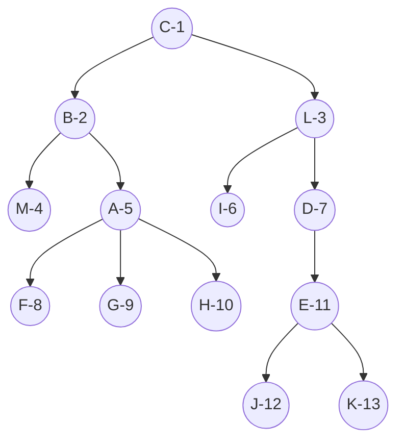
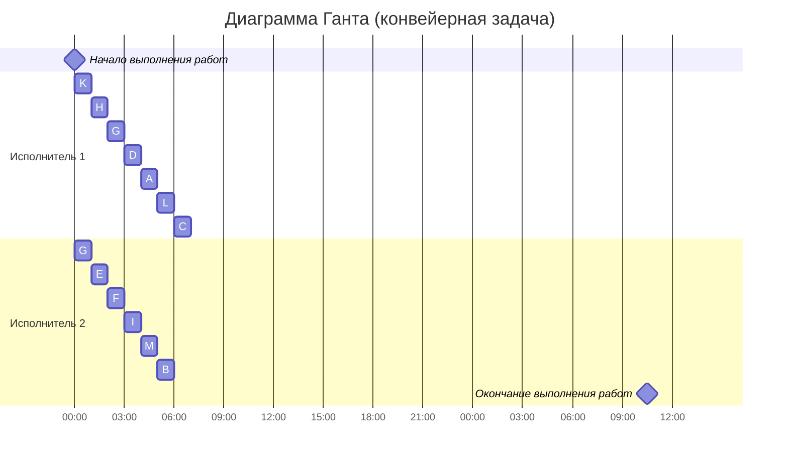

## Вариант 10: 
- Стратегия: уровневая
- Количество задач: 13
- Количество исполнителей: 2
- Количество деревьев: 1
### Критерии для использования уровневой стратегии:
1. количество заданий произвольно;
2. все задания имеют одинаковую длительность;
3. задания зависимы, причём граф зависимостей имеет вид дерева, 
ориентированного к корню (или ориентированного леса);
4. запрещены прерывания при выполнении заданий;
5. количество работников произвольно;
6. работники универсальны;
7. производительность работников, размеры оплаты из труда и т.д. не учитываются;

#### Исходя из этого составим таблицу зависимостей работ:
|Пред.|  A  |  B  |  D  |  E  |  F  |  G  |  H  |  I  |  J  |  K  |  L  |  M  |
|-----|-----|-----|-----|-----|-----|-----|-----|-----|-----|-----|-----|-----|
|След.|  B  |  C  |  L  |  D  |  A  |  A  |  A  |  L  |  E  |  E  |  C  |  B  |

### Изобразим граф, который отображает зависимости из таблицы

#### Мы видим, что получилось дерево, ориентированное к корню C, не имеющему потомков. Раздадим приоритеты, основываясь на том, какие приоритеты имеют потомки каждой задачи.
#####  Получаем (C -1, B -2, L - 3, M-4, A -5, I-6, D- 7, F - 8, G - 9, H - 10, E -11, J-12, K-13)
### Построим диаграму Ганта для 2 исполнителей, основываясь на наших приоритетах

#### Ответ - работы по оптимальному расписанию займут 7 часов.
