# Задание №9
# Оптимальное расписание. Лексикографическая стратегия/Уровневая стратегия

**Для выполнения задания рекомендуется установить [Плагин отображения диаграмм Mermaid для Pycharm](https://plugins.jetbrains.com/plugin/20146-mermaid)**

## Задание
Для каждого варианта необходимо придумать и решить задачу для указанной стратегии с указанными ограничениями: 
1. Сформулировать условия задачи согласно теме и указанным ограничениям.
2. Оформить решение задачи по шагам с подробными комментариями.
3. Граф зависимостей для задачи и модификацию данного графа в ходе решения оформлять в виде диаграммы.
4. В ответе указать длительность полученного расписания.
5. В ответе вывести полученное расписание **в виде диаграммы Ганта**.
 
Диаграмму Ганта и граф зависимостей можно оформить с помощью плагина Mermaid, образцы оформления диаграмм представлены в данном файле, в описании алгоритмов.

Условия для каждого варианта расположены в файле task_9/task.md в ветке main репозитория manual_tasks. 

Решение задачи нужно оформить в формате Markdown в отдельном файле с названием <название_команды>.md, который добавить в каталог task_9 данного репозитория.

## Информация по Markdown разметке:
[Рисуем диаграммы Mermaid.js в README-файлах GitHub](https://habr.com/ru/articles/652867/)

[Gantt diagrams (диаграммы Ганта)](https://yo.yonote.ru/share/manuals/doc/gantt-diagrams-diagrammy-ganta-L9O9hWeYiK)

[Плагин отображения диаграмм Mermaid для Pycharm](https://plugins.jetbrains.com/plugin/20146-mermaid)

## Для выполнения задания необходимо:
1. Обновить ветку main в локальном репозитории (git pull).
2. От ветки main создать ветвь с названием <название_команды>_task_9, заменив <название_команды> на название команды.
3. В созданной ветке в каталог task_9 добавить файл с решением задачи с названием <название_команды>.md.
4. Зафиксировать изменения на ветке (git commit).
5. Отравить ветку с изменениями в репозиторий на Github (git push).
6. Создать на Github запрос на слияние (pull request), указав в качестве base-ветки main, в качестве compare-ветки <название_команды>_task_9.

## Уровневая стратегия
### Постановка задачи:
1. количество заданий произвольно;
2. все задания имеют одинаковую длительность;
3. задания зависимы, причём граф зависимостей имеет вид дерева, 
ориентированного к корню (или ориентированного леса);
4. запрещены прерывания при выполнении заданий;
5. количество работников произвольно;
6. работники универсальны;
7. производительность работников, размеры оплаты из труда и т.д. не учитываются;

*Требуется построить расписание выполнения всех заданий для заданного 
количества исполнителей в кратчайшие сроки.*
### Алгоритм решения задачи
Для построения расписания необходимо назначить приоритет для каждой задачи. В первую очередь приоритеты 1, 2, 3, ... назначаются стокам графа (вершины, из которых нет исходящих ребер). Если приоритеты 1, 2, 3, ..., t уже назначены, то приоритет (t + 1) назначается заданию, у которого прямой потомок имеет наименьший приоритет.

После того как приоритеты для всех задач назначены, задачи добавляются в расписание в соответствии с их приоритетом. В каждый момент времени выбираются задачи готовые к выполнению (для которых все предшествующие задачи выполнены к началу момента времени) из них для добавления в расписание выбирается задача с наибольшим приоритетом.

## Лексикографическая стратегия
### Постановка задачи:
1. количество заданий произвольно;`
2. все задания имеют одинаковую длительность;
3. задания зависимы, причём **граф зависимостей не должен содержать транзитивных ребер**;
4. запрещены прерывания при выполнении заданий;
5. количество **работников строго 2**;
6. работники универсальны;
7. производительность работников, размеры оплаты из труда и т.д. не учитываются;

*Требуется построить расписание выполнения всех заданий для заданного 
количества исполнителей в кратчайшие сроки.*
### Алгоритм решения задачи
Перед выполнением алгоритма необходимо удалить из графа зависимостей транзитивные ребра.

Для построения расписания необходимо назначить приоритет для каждой задачи. В первую очередь приоритеты 1, 2, 3, ... назначаются стокам графа (вершины, из которых нет исходящих ребер). 

Для заданий, все прямые потомки которых уже имеют приоритеты, составляется строка из приоритетов прямых потомков, записанных в убывающем порядке. Приоритет (t + 1) назначается заданию, у которого строка из приоритетов является лексикографически наименьшей.

После того как приоритеты для всех задач назначены, задачи добавляются в расписание в соответствии с их приоритетом. В каждый момент времени выбираются задачи готовые к выполнению (для которых все предшествующие задачи выполнены к началу момента времени) из них для добавления в расписание выбирается задача с наибольшим приоритетом.
### Таблица зависимостей

| Предшествующее задание | A | A | C | C | D | E | F | G | G | H | H | I | I | L |
|------------------------|---|---|---|---|---|---|---|---|---|---|---|---|---|---|
| Последующее задание    | B | J | E | F | E | H | H | J | K | A | G | H | L | G |

### Граф зависимостей

### Граф зависимостей с приоритетами
Приоритет - #
Строка приоритетов прямых потомков - <>

### Диаграмма Ганта

```mermaid
gantt
    title Диаграмма Ганта
    dateFormat HH:mm    
    axisFormat %H:%M
    Начало выполнения работ : milestone, m1, 00:00, 0h
    section Исполнитель 1
    C         :c, 00:00, 1h
    I         :i, after c, 1h    
    E         :e, after i, 1h    
    H         :h, after e, 1h
    A         :a, after h, 1h
    B         :b, after a, 1h
    K         :k, after b, 1h
    section Исполнитель 2
    D         :d, 00:00, 1h
    F         :f, after d, 1h
    L         :l, after f, 1h
    G         :g, after h, 1h
    J         :j, after g, 1h
    Окончание выполнения работ : milestone, m2, 07:00, 0h
```

