### Вариант 4: 
- Стратегия: уровневая
- Количество задач: 14 
- Количество исполнителей: 3
- Количество деревьев: 2

#### 1. Постановка задачи
#### Составить расписание выполнения в кратчайшие сроки 14 заданий тремя идентичными исполнителями. Все задания имеют единичную длительность, а зависимость между ними задана таблицей (задания обозначены буквами A, B, C, …, M):
#### Таблица зависимостей:
| A | C | D | E | F | G | H | J | K | L | M | N | I |
|---|---|---|---|---|---|---|---|---|---|---|---|---|
| B | D | F | M | J | D | A | B | M | H | H | M | J |

#### 2. Решение задачи:
Для решения этой задачи необходимо построить граф, который будет отображать зависимости задач друг от друга, основываясь на виде графа необходимо выбрать стратегию для решения поставленной задачи

Т.к. граф, который мы построили, является деревом, ориентированным к корню, работники универесальны и задания одинаковой длительности, то мы можем использовать уровневую стратегию, которая является эффективной.

Для начала необходимо задать приоритеты для задач, основываясь на приоритете их потомков, т.е. приоритет получит раньше та задача, чей потомок обладает наименьшим приоритетом, задача B в нашем случае получит приоритет 1, т.к. является стоком (не имеет потомков)

Дерево с расставленными приоритетами приведено ниже:

#### 3. Ответ:
1. Диаграмма Ганта

```mermaid
gantt
    title Диаграмма Ганта - Ленточная стратегия для 3 исполнителей
    dateFormat  HH:mm    
    axisFormat %H:%M
    Начало выполнения работ : milestone, m1, 00:00, 0h
    section Исполнитель 1
    Задача G            :a1, 00:00, 1h
    Задача K            :a1, 01:00, 1h
    Задача M            :a1, 02:00, 1h
    Задача H            :a1, 03:00, 1h
    Задача A            :a1, 04:00, 1h
    Задача B            :a1, 05:00, 1h
    section Исполнитель 2
    Задача C            :b1, 00:00, 1h
    Задача E            :b1, 01:00, 1h
    Задача L            :b1, 02:00, 1h
    section Исполнитель 3
    Задача N            :c1, 00:00, 1h
    Задача D            :c1, 01:00, 1h
    Задача F            :c1, 02:00, 1h
    Задача I            :c1, 03:00, 1h
    Задача J            :c1, 04:00, 1h
    
    Окончание выполнения работ : milestone, m2, 06:00, 0h
```

2. Длительность расписания 6 часов. 
