# Оптимальное расписание. Ленточная стратегия/Конвейерная задача
## Задание
Для каждого варианта необходимо придумать и решить задачу для указанной стратегии с указанными ограничениями: 
1. Сформулировать условия задачи согласно теме и указанным ограничениям.
2. Оформить решение задачи по шагам с подробными комментариями.
3. Граф зависимостей для задачи и модификацию данного графа в ходе решения оформлять в виде диаграммы.
4. В ответе указать длительность полученного расписания.
5. В ответе вывести полученное расписание **в виде диаграммы Ганта**.

### Вариант 7: 
- Стратегия: лексикографическая
- Количество задач: 15
- Количество транзитивных ребер: 1

# Условие задания
### Постановка задачи:
1. количество заданий 15;`
2. все задания имеют одинаковую длительность;
3. задания зависимы, причём **граф зависимостей не должен содержать транзитивных ребер**;
4. запрещены прерывания при выполнении заданий;
5. количество **работников строго 2**;
6. работники универсальны;
7. производительность работников, размеры оплаты из труда и т.д. не учитываются;

### Таблица зависимостей

| Предшествующее задание | A | A | A | A | B | C | C | D | E | E | F | F | G | H | I | J | J | K | K |
|------------------------|---|---|---|---|---|---|---|---|---|---|---|---|---|---|---|---|---|---|---|
| Последующее задание    | D | B | C | E | E | F | G | F | H | I | I | J | K | L | L | M | N | N | O | 

### Граф зависимостей

# Решение

### Убираем транзитивные ветви - в нашем случае AE и получаем новый график зависимостей

### Распределяем приоритеты

Приоритеты стоков L,M,N,O - 1, 2, 3, 4

#### 1 уровень
H(1) - 5

I(1) - 6

J(3;2) - 7

K(4;3) - 8

#### 2 уровень
E(6;5) - 9

F(7;6) - 10

G(8) - 11

#### 3 уровень
B(9) - 12

D(10) - 13

C(11;10) - 14

#### 4 уровень
A(14;13;12) - 15

### Строим граф с приоритетами

### Cтроим диаграмму Ганта

```mermaid
gantt
    title Диаграмма Ганта
    dateFormat HH:mm    
    axisFormat %H:%M
    Начало выполнения работ : milestone, m1, 00:00, 0h
    section Исполнитель 1
    A         :a, 00:00, 1h
    C         :c, after a, 1h    
    B         :b, after c, 1h    
    E         :e, after b, 1h
    K         :k, after e, 1h
    I         :i, after k, 1h
    O         :o, after i, 1h
    M         :m, after o, 1h
    section Исполнитель 2
    D         :d, 01:00, 1h
    F         :f, after d, 1h
    G         :g, after f, 1h
    J         :j, after g, 1h
    H         :h, after j, 1h
    N         :n, after h, 1h
    L         :l, after n, 1h
    Окончание выполнения работ : milestone, m2, 08:00, 0h
```

# Ответ: 8 часов