### Вариант 5: 
- Стратегия: лексикографическая
- Количество задач: 13
- Количество транзитивных ребер: 2

### 1. Постановка задачи
 Необходимо составить рассписания для 13 задач, выполлняемых 2мя неуникальными исполнителями, длительность задачидентична, зависимость между задачами показана в таблицей ниже.
#### Таблица зависимостей:
| A | A | B | B | B | C | D | F | F | G | G | H | H | I | K | L | L |
|---|---|---|---|---|---|---|---|---|---|---|---|---|---|---|---|---|
| F | G | J | M | O | B | G | H | L | H | K | B | C | B | C | B | J |

### 2. Решение задачи:
Необходимо построить граф для того, чтобы понять, какой алгоритм будет оптимален для решения этой задачи.
Ребра H --> B и L --> J транзитивны, убираем их из графа зависимостей.

Таким образом, оптимальным является лексикографический алгоритм, так как граф не является деревом(ориентированным к корню).

Расставляем приоритеты: ставим приоритеты стокам графа: 
J,M,O(1,2,3)
Затем поднимаемся вверх по графу, расставляя приоритеты в лексикографическом порядке(t+1).
B(4) 
C,I,L(5,6,7)
H,K(8,9)
F,G(10,11)
A,D(12,13)
Дерево с расставленными приритетами:

### 3. Ответ:
1. Диаграмма Ганта

```mermaid
gantt
    title Диаграмма Ганта - Ленточная стратегия для 2 исполнителей
    dateFormat  HH:mm    
    axisFormat %H:%M
    Начало выполнения работ : milestone, m1, 00:00, 0h
    section Исполнитель 1
    Задача D           :a1, 00:00, 1h
    Задача G            :a1, 01:00, 1h
    Задача K            :a1, 02:00, 1h
    Задача L            :a1, 03:00, 1h
    Задача C            :a1, 04:00, 1h
    Задача O            :a1, 06:00, 1h
    Задача J            :a1, 07:00, 1h
    section Исполнитель 2
    Задача A            :b1, 00:00, 1h
    Задача F            :b1, 01:00, 1h
    Задача H            :b1, 02:00, 1h
    Задача I            :b1, 03:00, 1h
    Задача B            :b1, 05:00, 1h
    Задача M            :b1, 06:00, 1h
    
    Окончание выполнения работ : milestone, m2, 08:00, 0h
```

2. Длительность расписания 8 часов. 
