# Оптимальное расписание. Ленточная стратегия/Конвейерная задача
## Задание
Для каждого варианта необходимо придумать и решить задачу для указанной стратегии с указанными ограничениями: 
1. Сформулировать условия задачи согласно теме и указанным ограничениям.
2. Оформить решение задачи по шагам с подробными комментариями.
3. Граф зависимостей для задачи и модификацию данного графа в ходе решения оформлять в виде диаграммы.
4. В ответе указать длительность полученного расписания.
5. В ответе вывести полученное расписание **в виде диаграммы Ганта**.


### Вариант 3: 
- Стратегия: лексикографическая
- Количество задач: 14
- Количество транзитивных ребер: 1

# Условие задания
### Постановка задачи:
1. количество заданий 14;
2. все задания имеют одинаковую длительность;
3. задания зависимы, причём **граф зависимостей не должен содержать транзитивных ребер**;
4. запрещены прерывания при выполнении заданий;
5. количество **работников строго 2**;
6. работники универсальны;
7. производительность работников, размеры оплаты из труда и т.д. не учитываются;

### Таблица зависимостей

| Предшествующее задание | A | A | A | B | B | C | C | D | E | E | F | F | G | H | I | J | J | K |
|------------------------|---|---|---|---|---|---|---|---|---|---|---|---|---|---|---|---|---|---|
| Последующее задание    | D | B | C | E | G | G | K | F | H | I | I | J | K | L | L | M | N | N |

### Граф зависимостей


# Решение

### Убираем транзитивные ветви - в нашем случае CK и получаем новый график зависимостей
```mermaid
graph TB
A((A))-->B((B))
A-->D((D))
A-->C((C))
B --> E((E))
B --> G((G))
C --> G(
D --> F((F))
E --> H((H))
E --> I((I))
F --> I
F --> J((J))
G --> K((K))
H --> L((L))
I --> L
J --> M((M))
J --> N((N))
K --> N
```
### Распределяем приоритеты

Приоритеты стоков L,M,N - 1, 2, 3

#### 1 уровень
H(1) - 4

I(1) - 5

J(3;2) - 6

K(3) - 7


#### 2 уровень
E(5;4) - 8

F(6;5) - 9

G(7) - 10


#### 3 уровень
B(8;10) - 11

D(9) - 12

C(10;) - 13


#### 4 уровень
A(13;12;11) - 14

### Строим граф с приоритетами


### Cтроим диаграмму Ганта

```mermaid
gantt
    title Диаграмма Ганта
    dateFormat HH:mm    
    axisFormat %H:%M
    Начало выполнения работ : milestone, m1, 00:00, 0h
    section Исполнитель 1
    A         :a, 00:00, 1h
    C         :c, after a, 1h    
    B         :b, after c, 1h    
    G         :g, after b, 1h
    K         :k, after g, 1h
    I         :i, after k, 1h
    N         :n, after i, 1h
    L         :l, after n, 1h
    section Исполнитель 2
    D         :d, 01:00, 1h
    F         :f, after d, 1h
    E         :e, after f, 1h
    J         :j, after e, 1h
    H         :h, after j, 1h
    M         :m, after h, 1h
    Окончание выполнения работ : milestone, m2, 08:00, 0h
```


# Ответ: 8 часов